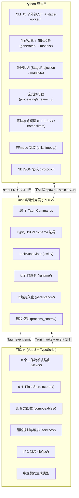
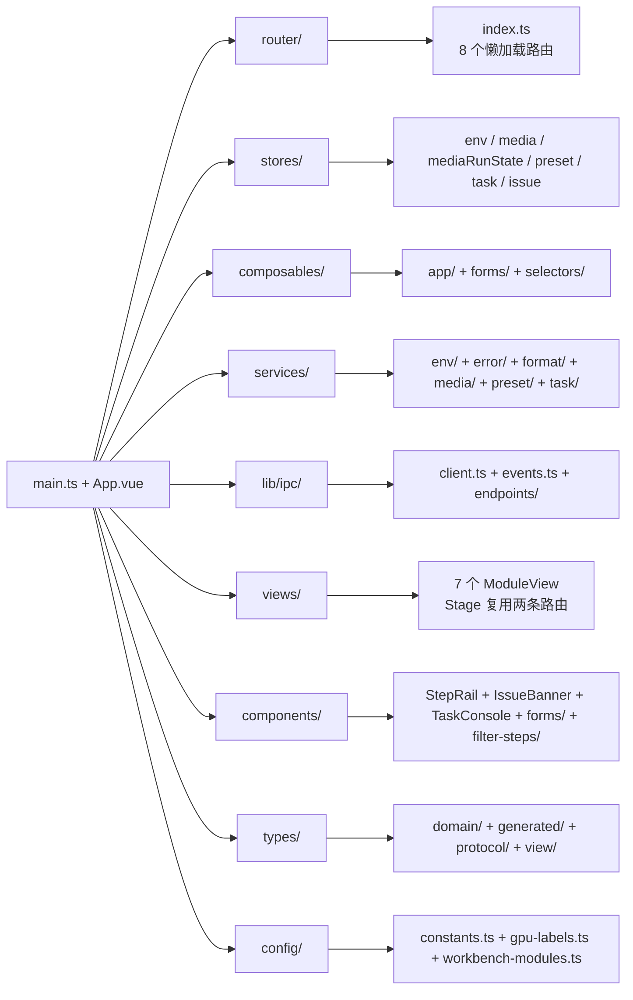
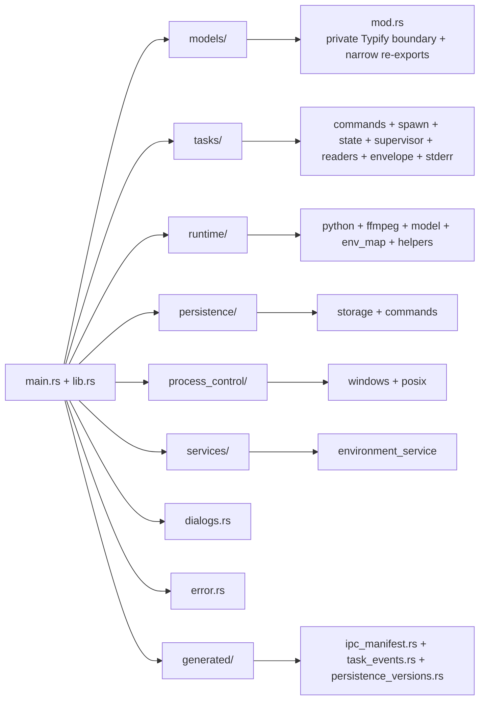
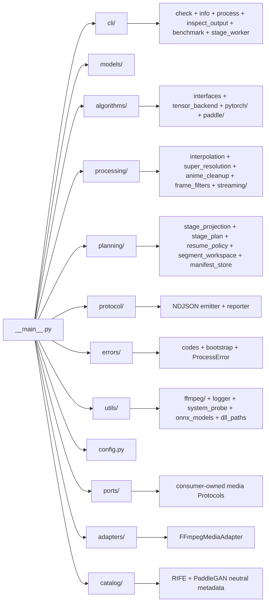

# 总体架构概览

## 项目定位

VP Workbench 是一款基于 Tauri v2 的桌面视频处理工作台，面向需要补帧、超分辨率和可组合帧滤镜的用户。应用采用经典的三层架构，前端负责交互与配置，Rust 桌面外壳负责 IPC 桥接与进程调度，Python 后端负责算法推理与 FFmpeg 流式处理。

## 技术栈

| 层级 | 技术 | 版本 | 用途 |
|------|------|------|------|
| 前端 UI | Vue 3 + TypeScript | ^3.5 | 用户界面与交互 |
| 前端状态 | Pinia | ^3.0 | 全局状态管理 |
| 前端路由 | Vue Router | ^4.6 | 工作流视图切换 |
| 前端构建 | Vite | ^8.0.16 | 开发与生产构建 |
| 前端测试 | Vitest | ^4.1.8 | 单元测试 |
| 桌面外壳 | Tauri (Rust) | ^2.11.1 | 窗口管理、IPC、进程调度 |
| Rust 异步 | Tokio | ^1.48 | 异步运行时 |
| 后端算法 | Python | 3.12+ | 算法推理与流式处理 |
| 后端配置 | Pydantic v2 | 2.9.2 | 配置校验与类型安全 |
| 后端推理 | ONNX Runtime GPU | >=1.18.0 | ONNX 模型推理（CUDA/TensorRT） |
| 媒体处理 | FFmpeg | — | 编解码、格式转换、音频处理 |

## 三层架构

## 各层职责边界

### 前端层（Vue 3）

- 负责全部用户界面渲染与交互
- 通过 Pinia 管理跨组件状态
- 通过 `@tauri-apps/api` 调用 Rust commands 和监听事件
- **不直接感知 Python 后端的存在**

### Rust 桌面外壳层（Tauri）

- 作为前端的唯一后端接口（IPC 网关）
- 解析运行时资源路径（Python、FFmpeg、模型等）
- 管理 Python 子进程的生命周期（启动、取消、暂停、恢复）
- 解析 Python stdout 的 NDJSON 输出，转换为 Tauri 事件推送给前端
- 提供本地持久化（环境缓存、工作台预设）
- **不执行任何算法逻辑**

### Python 算法层

- 作为纯 CLI 工具被 Rust 层通过子进程调用
- 接收 JSON 配置，执行视频处理流水线
- 通过 stdout NDJSON 向 Rust 层上报进度和状态
- 所有算法逻辑、FFmpeg 编排和媒体文件 I/O 均在此层完成

## 关键技术特征

### 1. NDJSON 行协议

Rust 与 Python 之间的通信不通过 HTTP 或 gRPC，而是通过子进程 stdout 的 **NDJSON（Newline Delimited JSON）** 行协议。Python 每输出一行 JSON 对象，Rust 的 stdout reader 即时解析并转换为 Tauri 事件推送给前端。这种设计避免了网络栈的开销，同时保持了结构化通信的能力。

### 2. 中立契约与类型同步

根目录 `contracts/` 中的 JSON Schema 2020-12 文档定义配置、IPC、NDJSON、错误码与持久化边界。`scripts/generate_contracts.py` 生成严格的聚合边界 schema、Python Pydantic 模型、单一 TypeScript 绑定以及命令/事件适配器；Rust 通过 Typify 直接消费同一聚合 schema。生成文件禁止手工修改，CI 逐字节检查 freshness。非 schema 14 的环境缓存会被隔离并重新探测。

源 schema 通过本地外部 `$ref` 复用结构，并为每个对象显式声明 `additionalProperties`。生成器会先用
JSON Schema 2020-12 校验 schema、引用目标、IPC manifest 和错误码子集，再把依赖内联到
`boundary.schema.json`。Python 绑定由 `datamodel-code-generator` 生成，TypeScript 绑定由
`json-schema-to-typescript` 生成；Rust 编译期的 Typify、前端 invoke 映射和 Rust/TS 事件适配器
都消费同一份生成结果。

### 3. stage-worker 流式处理

Python 后端通过 `pipeline_preflight` 规划 stage plan，再由 `pipeline_dispatch` 选择 rawvideo stage-worker chain 或 stage-file pipeline。rawvideo 路径中 stage-worker 子进程负责解码与算法 stage 链，主进程只维护 `encode_queue` 和 `encoder_worker`；编码线程、worker 与 segment writer 共享单个不可变 runtime config，帧数据不经过临时帧目录，显著减少磁盘 I/O。

### 4. 断点续传（filesystem-as-state）

通过 `SegmentManifest` 将续传状态写入文件系统本身：最终输出 `output.mp4` 的 sidecar 是同目录下
的 `output.mp4.vp_segments/`。其中的 v3 `manifest.json` 保存运行身份，自描述片段名保存实际进度，
例如 `chunk-0001-out00000000-00000499-src00000500.mp4`。崩溃后只扫描连续片段前缀，无需数据库。
版本不匹配或损坏的 sidecar 会整体改名隔离，不会被迁移或回退读取。

### 5. 编译期协议一致性

前端使用生成类型保持协议一致：

- `TASK_EVENT_NAMES`、`TaskEventName` 和 payload 映射由 `ipc-manifest.json` 一次生成，Rust 使用同一清单生成的枚举
- 完整错误码集合由中立 schema 生成的 `TaskErrorCode` union 表示；`TASK_ERROR_CODES` 只为生产代码实际分支的错误码提供运行时别名
- `ipc-manifest.json` 与生成 freshness 门禁同时校验命令参数、结果和事件面

### 6. 错误码按生产者分层

`backend-error-codes.schema.json` 只包含 Python 可发出的错误，`shell-error-codes.schema.json` 只包含 Rust 壳错误；前端使用二者的完整联合。CI 和 pre-commit 运行 `generate_contracts.py --check`，禁止手写枚举漂移。

## 工作流视图映射

应用围绕 8 个工作流模块构建，用户按顺序完成配置：

| 序号 | 模块 | 路径 | 职责 |
|------|------|------|------|
| 1 | home | `/home` | 启动探测、能力缓存与运行时概览 |
| 2 | input | `/input` | 批量导入素材 |
| 3 | decode | `/decode` | 解码方案与硬件设备 |
| 4 | preprocess | `/preprocess` | 解码后帧级滤镜链（含 Anime 清理） |
| 5 | enhance | `/enhance` | 补帧 / 超分 |
| 6 | postprocess | `/postprocess` | 增强后帧级滤镜链（含 Anime 清理） |
| 7 | encode | `/encode` | 编码器与输出配置 |
| 8 | render | `/render` | 批处理队列与任务日志 |

8 个模块路由全部采用 Vue Router 懒加载；preprocess 与 postprocess 复用同一个
`StageModuleView`，因此共有 7 个视图组件。首屏仅下载 `HomeModuleView` 和共享 chunk。

## 模块目录结构

### 前端目录

### Rust 目录

### Python 目录

## 核心文件索引

### 前端关键文件

| 文件 | 职责 |
|------|------|
| [`frontend/src/main.ts`](../frontend/src/main.ts) | 应用入口，挂载 Vue 实例 |
| [`frontend/src/App.vue`](../frontend/src/App.vue) | 根组件，外壳布局 + 启动编排 |
| [`frontend/src/router/index.ts`](../frontend/src/router/index.ts) | 8 个模块路由配置 |
| [`frontend/src/lib/ipc/client.ts`](../frontend/src/lib/ipc/client.ts) | `safeInvoke` + `InvokeError` |
| [`frontend/src/composables/app/useBootstrap.ts`](../frontend/src/composables/app/useBootstrap.ts) | 4 步启动编排 |
| [`frontend/src/services/task/events.ts`](../frontend/src/services/task/events.ts) | 纯函数 reducer，任务状态变换 |

### Rust 关键文件

| 文件 | 职责 |
|------|------|
| [`frontend/src-tauri/src/lib.rs`](../frontend/src-tauri/src/lib.rs) | Tauri Builder + 命令注册 + 集成测试 |
| [`contracts/ipc-manifest.json`](../contracts/ipc-manifest.json) | 命令与事件清单单一真相源 |
| [`frontend/src-tauri/src/tasks/state.rs`](../frontend/src-tauri/src/tasks/state.rs) | `Idle / Starting / Running / Cancelling` 与 task-bound 启动租约 |
| [`frontend/src-tauri/src/tasks/controller.rs`](../frontend/src-tauri/src/tasks/controller.rs) | `TaskSupervisor`、有界控制、Watchdog 与终态仲裁 |
| [`frontend/src-tauri/src/runtime/mod.rs`](../frontend/src-tauri/src/runtime/mod.rs) | 运行时资源解析 |

### Python 关键文件

| 文件 | 职责 |
|------|------|
| [`backend/app/__main__.py`](../backend/app/__main__.py) | CLI 入口，双层异常兜底 |
| [`backend/app/processing/streaming/pipeline.py`](../backend/app/processing/streaming/pipeline.py) | stage-worker 流式流水线入口 |
| [`backend/app/protocol/__init__.py`](../backend/app/protocol/__init__.py) | 集中的 NDJSON emitter |
| [`backend/app/planning/stage_projection.py`](../backend/app/planning/stage_projection.py) | 唯一步骤顺序、输出帧数和 FPS 投影 |
| [`backend/app/planning/manifest.py`](../backend/app/planning/manifest.py) | 恢复策略、workspace 与 repository 的协调器 |
| [`backend/app/algorithms/interfaces.py`](../backend/app/algorithms/interfaces.py) | 单帧、帧对与帧序列窄算法协议 |
