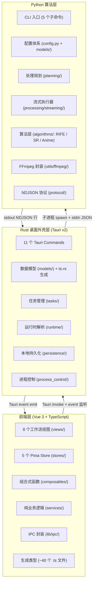
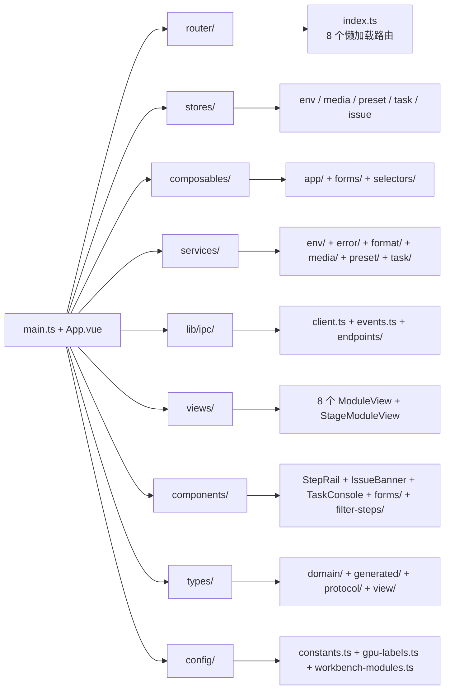
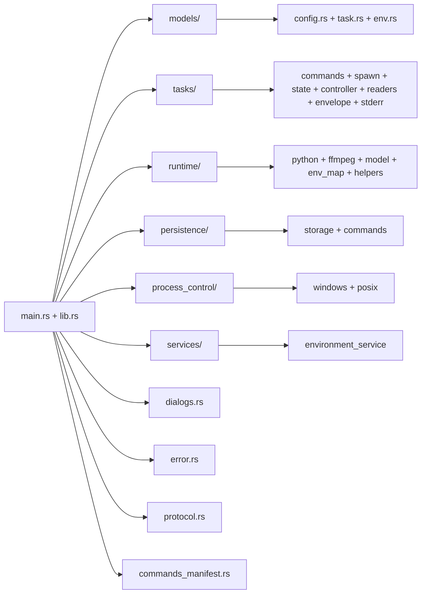
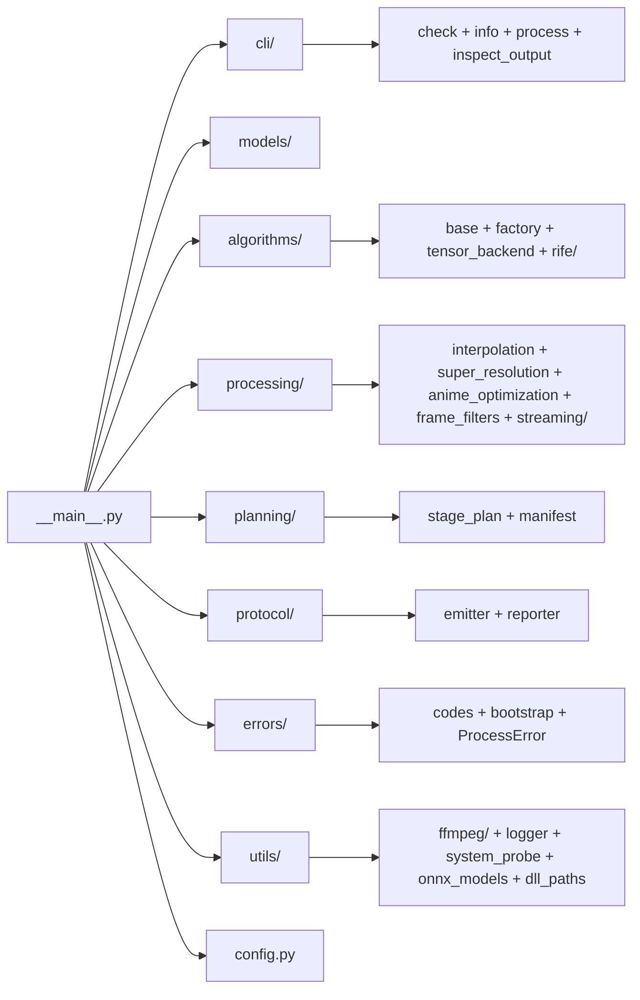

# 总体架构概览

## 项目定位

VP Workbench 是一款基于 Tauri v2 的桌面视频处理工作台，面向需要补帧、超分辨率、动漫优化等视频增强算法的用户。应用采用经典的三层架构，前端负责交互与配置，Rust 桌面外壳负责 IPC 桥接与进程调度，Python 后端负责算法推理与 FFmpeg 流式处理。

## 技术栈

| 层级 | 技术 | 版本 | 用途 |
|------|------|------|------|
| 前端 UI | Vue 3 + TypeScript | ^3.5 | 用户界面与交互 |
| 前端状态 | Pinia | ^3.0 | 全局状态管理 |
| 前端路由 | Vue Router | ^4.6 | 工作流视图切换 |
| 前端构建 | Vite | ^8.0 | 开发与生产构建 |
| 前端测试 | Vitest | ^3.2 | 单元测试 |
| 桌面外壳 | Tauri (Rust) | ^2.10 | 窗口管理、IPC、进程调度 |
| Rust 异步 | Tokio | ^1.48 | 异步运行时 |
| 后端算法 | Python | 3.12+ | 算法推理与流式处理 |
| 后端配置 | Pydantic v2 | ^2.9 | 配置校验与类型安全 |
| 后端推理 | ONNX Runtime GPU | ^1.18 | ONNX 模型推理（CUDA/TensorRT） |
| 媒体处理 | FFmpeg | — | 编解码、格式转换、音频处理 |

## 三层架构

## 各层职责边界

### 前端层（Vue 3）

- 负责全部用户界面渲染与交互
- 通过 Pinia 管理跨组件状态
- 通过 `@tauri-apps/api` 调用 Rust commands 和监听事件
- **不直接感知 Python 后端的存在**

### Rust 桌面外壳层（Tauri）

- 作为前端的唯一后端接口（IPC 网关）
- 解析运行时资源路径（Python、FFmpeg、模型等）
- 管理 Python 子进程的生命周期（启动、取消、暂停、恢复）
- 解析 Python stdout 的 NDJSON 输出，转换为 Tauri 事件推送给前端
- 提供本地持久化（环境缓存、工作台预设）
- **不执行任何算法逻辑**

### Python 算法层

- 作为纯 CLI 工具被 Rust 层通过子进程调用
- 接收 JSON 配置，执行视频处理流水线
- 通过 stdout NDJSON 向 Rust 层上报进度和状态
- 所有算法逻辑、FFmpeg 编排、文件 I/O 均在此层完成

## 关键技术特征

### 1. NDJSON 行协议

Rust 与 Python 之间的通信不通过 HTTP 或 gRPC，而是通过子进程 stdout 的 **NDJSON（Newline Delimited JSON）** 行协议。Python 每输出一行 JSON 对象，Rust 的 stdout reader 即时解析并转换为 Tauri 事件推送给前端。这种设计避免了网络栈的开销，同时保持了结构化通信的能力。

### 2. ts-rs 类型同步

Rust 模型使用 `#[derive(TS)]` 宏，编译时自动生成 TypeScript 类型定义到 `frontend/src/types/generated/`（约 40 个文件）。前端代码禁止直接深路径引用这些生成文件，而是通过 `types/protocol/index.ts` 统一 re-export。这确保了 Rust 与前端之间的类型一致性。

### 3. 三线程流式处理

Python 后端采用三线程流水线架构：`decoder_worker`（FFmpeg rawvideo 解码）→ `processor_worker`（算法推理）→ `encoder_worker`（FFmpeg 编码）。三者通过 `queue.Queue` 解耦，帧数据全部在内存中流转，不经过临时帧目录，显著减少磁盘 I/O。

### 4. 断点续传（filesystem-as-state）

通过 `SegmentManifest` 将续传状态写入文件系统本身：输出目录下的 `.vp_segments/` 子目录包含自描述的片段文件名和 `manifest.json`。片段文件名编码了帧范围信息（如 `chunk-0001-out0-499-src500.mp4`），崩溃后可通过扫描文件系统重建续传状态，无需外部数据库。

### 5. 编译期协议一致性

前端使用 TypeScript 的 `satisfies` 约束确保事件名和错误码的完整性：

- `TASK_EVENT_NAMES`（[`frontend/src/types/protocol/events.ts`](../frontend/src/types/protocol/events.ts)）使用 `as const satisfies Record<string, TaskEventName>` —— 若 Rust 新增事件名但未同步到前端，编译失败
- `TASK_ERROR_CODES`（[`frontend/src/types/protocol/errors.ts`](../frontend/src/types/protocol/errors.ts)）同理
- `_contract_check.ts` 对核心 IPC 类型做形状反向锁

### 6. 错误码三层同步

Python `TaskErrorCode`、Rust `TaskErrorCode`、TypeScript `TASK_ERROR_CODES` 三者通过 snake_case 字符串保持一致。`test_schema_drift.py` 测试自动比对字符串枚举值，CI 和 pre-commit 均执行该检查，防止三层漂移。

## 工作流视图映射

应用围绕 8 个工作流模块构建，用户按顺序完成配置：

| 序号 | 模块 | 路径 | 职责 |
|------|------|------|------|
| 1 | home | `/home` | 启动探测、能力缓存与运行时概览 |
| 2 | input | `/input` | 批量导入素材 |
| 3 | decode | `/decode` | 解码方案与硬件设备 |
| 4 | preprocess | `/preprocess` | 解码后帧级滤镜链 |
| 5 | enhance | `/enhance` | 补帧 / 超分 / 动漫优化 |
| 6 | postprocess | `/postprocess` | 增强后帧级滤镜链 |
| 7 | encode | `/encode` | 编码器与输出配置 |
| 8 | render | `/render` | 批处理队列与任务日志 |

8 个视图全部采用 Vue Router 懒加载，首屏仅下载 `HomeModuleView` 和共享 chunk。

## 模块目录结构

### 前端目录

### Rust 目录

### Python 目录

## 核心文件索引

### 前端关键文件

| 文件 | 职责 |
|------|------|
| [`frontend/src/main.ts`](../frontend/src/main.ts) | 应用入口，挂载 Vue 实例 |
| [`frontend/src/App.vue`](../frontend/src/App.vue) | 根组件，外壳布局 + 启动编排 |
| [`frontend/src/router/index.ts`](../frontend/src/router/index.ts) | 8 个模块路由配置 |
| [`frontend/src/lib/ipc/client.ts`](../frontend/src/lib/ipc/client.ts) | `safeInvoke` + `InvokeError` |
| [`frontend/src/composables/app/useBootstrap.ts`](../frontend/src/composables/app/useBootstrap.ts) | 4 步启动编排 |
| [`frontend/src/services/task/events.ts`](../frontend/src/services/task/events.ts) | 纯函数 reducer，任务状态变换 |

### Rust 关键文件

| 文件 | 职责 |
|------|------|
| [`frontend/src-tauri/src/lib.rs`](../frontend/src-tauri/src/lib.rs) | Tauri Builder + 命令注册 + 集成测试 |
| [`frontend/src-tauri/src/commands_manifest.rs`](../frontend/src-tauri/src/commands_manifest.rs) | 命令清单单一真相源 |
| [`frontend/src-tauri/src/tasks/state.rs`](../frontend/src-tauri/src/tasks/state.rs) | `TaskStatePhase` 三阶段状态机 |
| [`frontend/src-tauri/src/tasks/controller.rs`](../frontend/src-tauri/src/tasks/controller.rs) | 任务控制器 + Watchdog |
| [`frontend/src-tauri/src/runtime/mod.rs`](../frontend/src-tauri/src/runtime/mod.rs) | 运行时资源解析 |

### Python 关键文件

| 文件 | 职责 |
|------|------|
| [`backend/app/__main__.py`](../backend/app/__main__.py) | CLI 入口，双层异常兜底 |
| [`backend/app/processing/streaming/pipeline.py`](../backend/app/processing/streaming/pipeline.py) | 三线程流式流水线入口 |
| [`backend/app/protocol/__init__.py`](../backend/app/protocol/__init__.py) | `NdjsonEmitter` 单例 |
| [`backend/app/planning/manifest.py`](../backend/app/planning/manifest.py) | `SegmentManifest` 断点续传 |
| [`backend/app/algorithms/base.py`](../backend/app/algorithms/base.py) | `IAlgorithm` 抽象接口 |
