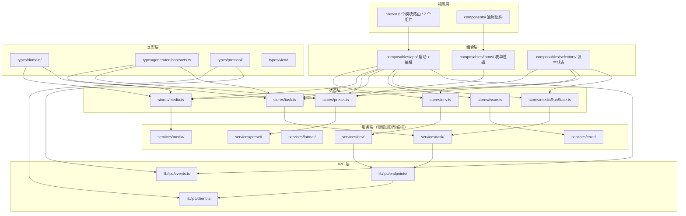
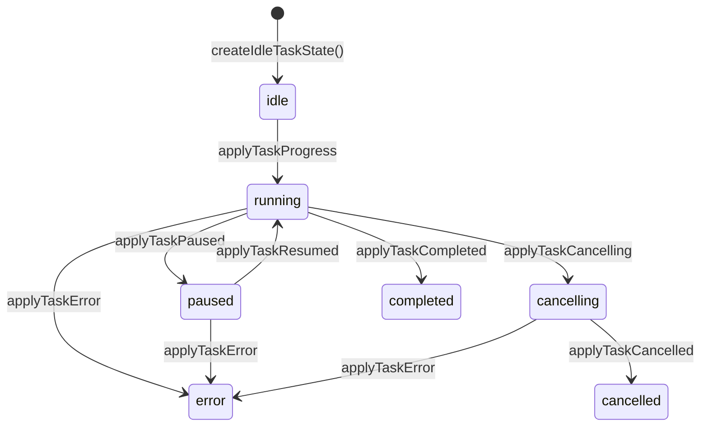
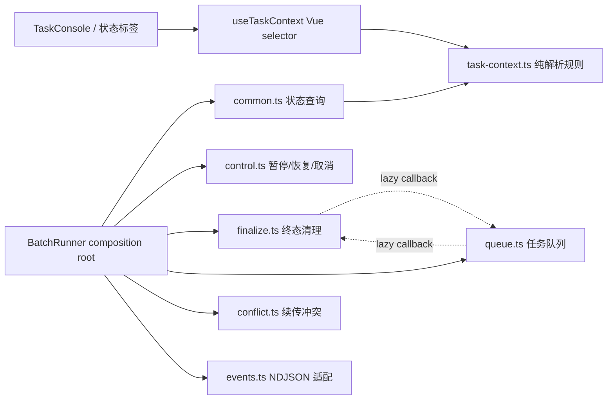
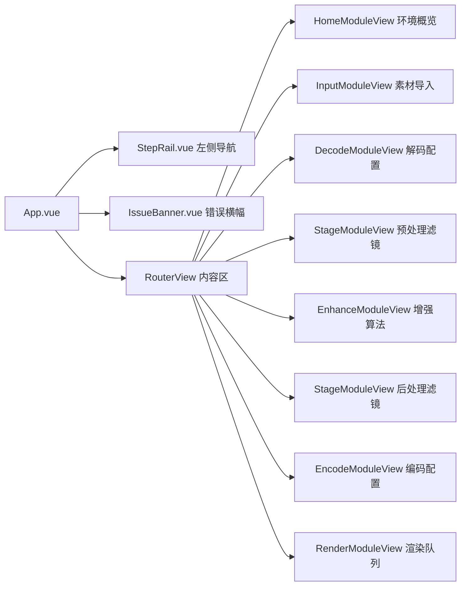

# 前端架构

## 技术栈

| 技术 | 版本 | 用途 |
|------|------|------|
| Vue | ^3.5.32 | 框架与响应式系统 |
| Vite | ^8.0.16 | 构建工具 |
| TypeScript | ~6.0.2 | 类型系统 |
| Pinia | ^3.0.3 | 状态管理 |
| Vue Router | ^4.6.3 | 路由与懒加载 |
| @tauri-apps/api | ^2.11.0 | Tauri 前端 API |
| Vitest | ^4.1.8 | 单元测试 |

## 目录结构与模块依赖



## Pinia Store 设计

使用 Composition API 风格（`reactive` + `ref`），共 6 个 store：

| Store | 文件 | 职责 |
|-------|------|------|
| `useEnvStore` | [`stores/env.ts`](../frontend/src/stores/env.ts) | 环境探测状态（是否探测中、探测结果、错误） |
| `useMediaStore` | [`stores/media.ts`](../frontend/src/stores/media.ts) | 媒体列表（增删改查、选中状态、激活项和配置快照） |
| `useMediaRunState` | [`stores/mediaRunState.ts`](../frontend/src/stores/mediaRunState.ts) | 按媒体 ID 保存任务状态和最近输出路径 |
| `usePresetStore` | [`stores/preset.ts`](../frontend/src/stores/preset.ts) | 预设草稿（解码/编码/工作流/输出配置的编辑状态） |
| `useTaskStore` | [`stores/task.ts`](../frontend/src/stores/task.ts) | 批处理任务队列（运行状态、暂停、冲突、进度统计） |
| `useIssueStore` | [`stores/issue.ts`](../frontend/src/stores/issue.ts) | 全局操作错误横幅（按 scope 管理） |

**设计要点：**
- `useMediaStore` 是核心，管理媒体项列表和每个项的配置快照
- `useMediaRunState` 独立保存逐媒体运行状态，避免任务事件写入污染媒体实体
- `useTaskStore` 只管理批处理运行时状态，不直接持有媒体数据
- `useIssueStore` 从 `mediaStore` 中分离出来，避免测试依赖耦合

App 顶栏和 StepRail 通过 `useCurrentTaskStatusLabel()` 读取同一任务状态投影。selector 先用
`useMediaStore.findItem(batch.currentId)` 校验当前媒体，再组合 `useTaskStore` 与
`useMediaRunState`，确保失效的 current ID 不会读取遗留运行状态。

## 表单类型边界

`BaseSelect` 向视图和 binding 统一提供字符串值。领域类型收窄只发生在实际写回配置的 setter
边界，例如 Enhance option setter 和 Encode rate-control binding；纯 option service 只构造
显示选项，不导出没有运行时校验语义的 identity cast helper。具有真实转换行为并被多个表单
复用的数值转换仍由共享 service 提供。

## IPC 调用层

### safeInvoke 与 InvokeError

[`frontend/src/lib/ipc/client.ts`](../frontend/src/lib/ipc/client.ts) 封装所有 Tauri `invoke()` 调用：

```typescript
export type IpcCommand = keyof IpcCommandArgs

export class InvokeError extends Error {
  readonly code: string
  readonly details: Record<string, unknown> | null
  // ...
}

export async function safeInvoke<C extends IpcCommand>(
  command: C,
  ...args: IpcInvokeArgs<C> extends undefined ? [] : [args: IpcInvokeArgs<C>]
): Promise<IpcInvokeResult<C>>
```

- 生成的 `contract.ts` 精确声明 10 个命令的参数与返回类型，endpoint 调用按命令名自动推导
- `isTauriRuntime()` 检测 `window.__TAURI_INTERNALS__`，区分桌面运行和浏览器预览模式
- `normalizeInvokeError()` 处理 Rust 序列化的 `{ code, message }`，包装为 `InvokeError`
- Tauri 权限拒绝错误（`not allowed` / `Command not found`）会附加开发者提示

### 按领域分组的端点

[`frontend/src/lib/ipc/endpoints/`](../frontend/src/lib/ipc/endpoints/) 按业务领域组织：

| 文件 | 职责 |
|------|------|
| `env.ts` | `check_environment` |
| `media.ts` | `pick_inputs` / `inspect_video` |
| `preset.ts` | `load_workbench_preset` / `save_workbench_preset` / `pick_output_directory` |
| `task.ts` | `start_task` / `control_task`（`pause | resume | cancel`）/ `check_resume_state` / `open_output_location` |

### 事件监听

[`frontend/src/lib/ipc/events.ts`](../frontend/src/lib/ipc/events.ts) 提供 `listenTaskEvents(handlers)`，订阅 Tauri 推送的任务事件：

| 事件名 | 来源 | 说明 |
|--------|------|------|
| `task-progress` | IPC manifest | 进度更新 |
| `task-completed` | IPC manifest | 任务完成 |
| `task-error` | IPC manifest | 任务错误 |
| `task-cancelled` | IPC manifest | 任务取消（区分 User / Stalled） |
| `task-log` | IPC manifest | 日志输出 |
| `task-resume-status` | IPC manifest | 续传状态 |

事件名及 payload 映射由 [`contracts/ipc-manifest.json`](../contracts/ipc-manifest.json) 生成到 [`frontend/src/types/protocol/events.ts`](../frontend/src/types/protocol/events.ts)；Rust 枚举来自同一清单。

## 任务状态机（纯函数 Reducer）

[`frontend/src/services/task/events.ts`](../frontend/src/services/task/events.ts) 将 IPC payload 映射为 `MediaTaskState` 变换。这是一个纯函数 reducer，不依赖 Vue/Pinia/Tauri：



关键变换函数：
- `applyTaskProgress` — 将空闲任务推进为运行中，不覆盖暂停或取消中状态
- `applyTaskPaused` / `applyTaskResumed` / `applyTaskCancelling` — 更新控制状态
- `applyTaskCompleted` / `applyTaskError` / `applyTaskCancelled` — 仅写入终态
- `appendTaskLog` — 追加日志并折叠连续阶段进度行（保留最近 300 条）
- `applyTaskResumeStatus` — 保存续传进度元数据

## 批处理编排

### BatchRunner 组合模式

[`frontend/src/services/task/batch-runner.ts`](../frontend/src/services/task/batch-runner.ts) 是唯一组合根，直接装配生命周期操作、冲突处理和事件适配：



`task-context.ts` 是纯任务上下文 SSOT：先确认媒体项存在，再用该媒体项的 ID 读取
`MediaRunState`。batch lifecycle 的 `common.ts` 与 Vue 的 `useTaskContext` selector 共同调用它；
当 `currentId` 已失效时，current context 不携带孤立 run-state，console context 会整体回退到
active item。conflict、events、control 和 finalize 每次操作只读取一次 context。

单项开始时的 `resetItemRunState()` 固定清空日志，批次终结时的
`resetItemsRunState()` 固定保留各项日志。两种语义由 `mediaRunState` 的两个明确命令表达。

`conflict.ts` 和 `events.ts` 只接收各自需要的 lifecycle capability；内部 queue/finalize 方法不会成为 BatchRunner 的公共返回字段。

`ResumeInspectionResult` 只存在于 IPC 边界。进入任务状态前，`resume-classifier.ts` 将它或运行时 error details 投影为 `{ kind, outputPath, progress }`；对话框不保存输入路径、pipeline kind、sidecar 标记等未消费 wire 字段。

`BatchRunnerDeps` 由 `TaskCommandPort`、`MediaItemPort`、`MediaRunStatePort`、
`BatchStatePort`、`TaskIssuePort`、`OutputLocationPort` 和 `TaskRequestFactory` 等窄 capability
组合而成。每个 lifecycle 模块再用 `Pick` 只接收自己消费的方法；只有
`batch-runner.ts` composition root 看见完整依赖集合。

### 控制请求的 owner-attempt 语义

`BatchState.controlPending` 保存当前 `pause | resume | cancel` 请求。`control.ts` 为请求分配单调
token，并记录开始时的 `currentId`；回复只有在 token、任务 ID、运行态和 `controlPending`
仍匹配时才能提交。这样过期回复既不能覆盖新任务状态，也不能清掉更新的控制请求。控制按钮在
请求未决时禁用，失败回滚也只由该请求的 owner 执行。

### Task orchestrator runtime 单例

[`frontend/src/composables/app/taskOrchestratorRuntime.ts`](../frontend/src/composables/app/taskOrchestratorRuntime.ts) 缓存 `BatchRunner` 并连接 Pinia、IPC 与事件监听。`useBootstrap()` 直接负责监听器注册和卸载；`useTaskOrchestrator()` 只投影 Render 页消费的状态并把启动、取消、暂停、恢复和冲突处理命令发送给同一 runner，不暴露 listener lifecycle 或 console 专用读模型。`TaskConsole` 直接消费 task/media stores 与 `useConsoleTaskContext()`。

[`frontend/src/composables/selectors/useTaskConsoleState.ts`](../frontend/src/composables/selectors/useTaskConsoleState.ts)
是 TaskConsole 的唯一视图投影，统一日志格式、续传 banner 和批次完成百分比。模型指标展示统一由
[`frontend/src/components/ModelMetricGrid.vue`](../frontend/src/components/ModelMetricGrid.vue) 渲染；
[`frontend/src/components/forms/BaseToggle.vue`](../frontend/src/components/forms/BaseToggle.vue) 使用
`BaseField` 的 toggle 模式，因此表单语义只保留一个外层 `label`。

### 预设持久化可见性与 latest-wins

[`frontend/src/composables/app/usePresetSync.ts`](../frontend/src/composables/app/usePresetSync.ts) 为每次
debounced save 分配 generation。只有最新 generation 的成功或失败能清理或设置 `preset` issue，
过期回复不会覆盖较新的结果。损坏或版本不匹配的预设会重置为默认值，并通过 App 根部的全局
`IssueBanner` 显示；随后立即保存 schema 2 默认替代，成功也保留本次不兼容提示。替代写入或
后续保存失败会在同一可见错误面显示具体持久化错误。

## 视图与路由

[`frontend/src/router/index.ts`](../frontend/src/router/index.ts) 使用 `createWebHashHistory`。
8 个模块路由全部懒加载，其中 preprocess/postprocess 复用 `StageModuleView`：



| 视图 | 核心职责 |
|------|---------|
| `HomeModuleView` | 环境探测仪表盘，GPU/FFmpeg 能力概览 |
| `InputModuleView` | 批量导入素材，拖放支持，素材列表管理 |
| `DecodeModuleView` | 解码器配置（硬件加速、解码模式等） |
| `StageModuleView` (`stage=preprocess`) | 预处理滤镜链配置 |
| `EnhanceModuleView` | 超分辨率、补帧算法配置 |
| `StageModuleView` (`stage=postprocess`) | 后处理滤镜链配置 |
| `EncodeModuleView` | 编码器、码率控制、输出格式配置 |
| `RenderModuleView` | 批量渲染控制，输出目录，任务执行 |

## 类型生成机制

### JSON Schema 自动生成

根目录 [`contracts/`](../contracts/) 是 JSON Schema 2020-12 中立边界。源 schema 通过外部 `$ref`
复用公共结构；生成器验证引用目标和每个对象显式的 `additionalProperties`，再生成聚合
`boundary.schema.json`。Python 使用 `datamodel-code-generator`，TypeScript 使用
`json-schema-to-typescript`，Rust 在编译期通过 Typify 消费聚合 schema；同一生成器还产出
IPC 命令与事件适配器。`python scripts/generate_contracts.py --check` 对所有跟踪生成物执行
逐字节 freshness 检查。

### 类型扩展层

生成文件禁止前端代码直接深路径引用。`types/protocol/index.ts` 统一 re-export 所有 generated 类型：

```typescript
export type {
  DecodeConfig,
  EncodeConfig,
  TaskRequest,
} from '@/types/generated/contracts'
```

前端自定义领域模型在 `types/domain/` 中定义（如 `MediaItem`、`BatchState`、`OperationIssue`），与生成类型互补。

## 编译期协议一致性

这是前端最重要的设计决策之一：名称和 payload 关系直接由清单生成，避免手写镜像。

### 事件名覆盖检查

[`frontend/src/types/protocol/events.ts`](../frontend/src/types/protocol/events.ts) 是生成文件：

```typescript
export const TASK_EVENT_NAMES = {
  TaskProgress: 'task-progress',
  TaskCompleted: 'task-completed',
  TaskError: 'task-error',
  TaskCancelled: 'task-cancelled',
  TaskLog: 'task-log',
  TaskResumeStatus: 'task-resume-status',
} as const

export type TaskEventName =
  (typeof TASK_EVENT_NAMES)[keyof typeof TASK_EVENT_NAMES]

export interface TaskEventPayloadMap {
  'task-progress': TaskProgressPayload
  // ...
}
```

修改事件时只编辑 `ipc-manifest.json`，然后重新生成；freshness 门禁拒绝任何漏生成或手改。

### 错误码类型检查

完整错误码集合由中立 schema 生成的 `TaskErrorCode` union 提供；运行时代码只为实际需要比较或构造的错误码维护别名：

```typescript
export const TASK_ERROR_CODES = {
  ProcessFailed: 'process_failed',
  ResumeConflict: 'resume_conflict',
  IoError: 'io_error',
  SchemaMismatch: 'schema_mismatch',
  PersistenceFailed: 'persistence_failed',
} as const satisfies Record<string, TaskErrorCode>
```

完整性由 `generate_contracts.py --check` 与架构门禁负责；运行时别名表不复制未被前端消费的枚举成员。

## 依赖方向与静态门禁

组件和视图只进入 composables 与 stores；composition-root composables 将 stores、纯 services
和 IPC adapter 组合起来。stores 可以消费纯 services，但不编排 IPC；`services` 与 `lib/ipc`
是互不依赖的叶子层，前者不依赖 Vue、Pinia 或 Tauri。组件和视图只能经
`@/types/protocol` 公共入口使用生成协议。Python 架构门禁维护层级规则，前端图扫描只负责全图
环检测，避免两套规则源漂移。`npm run check` 顺序执行 ESLint、生产/测试 typecheck、依赖环
检测、Knip 未使用导出/依赖检查，以及零阈值 jscpd 克隆扫描。
