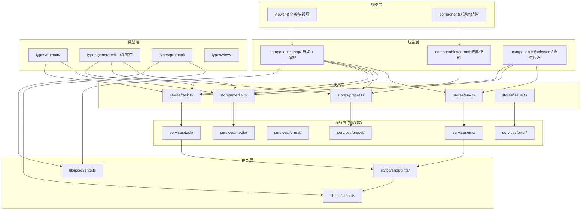
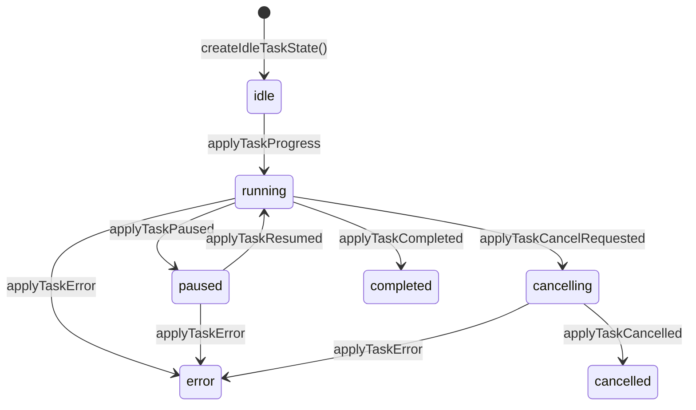
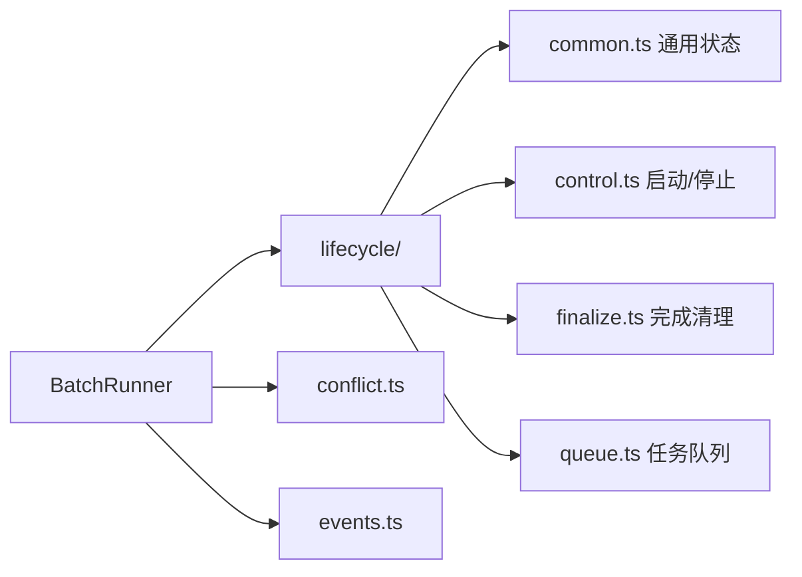
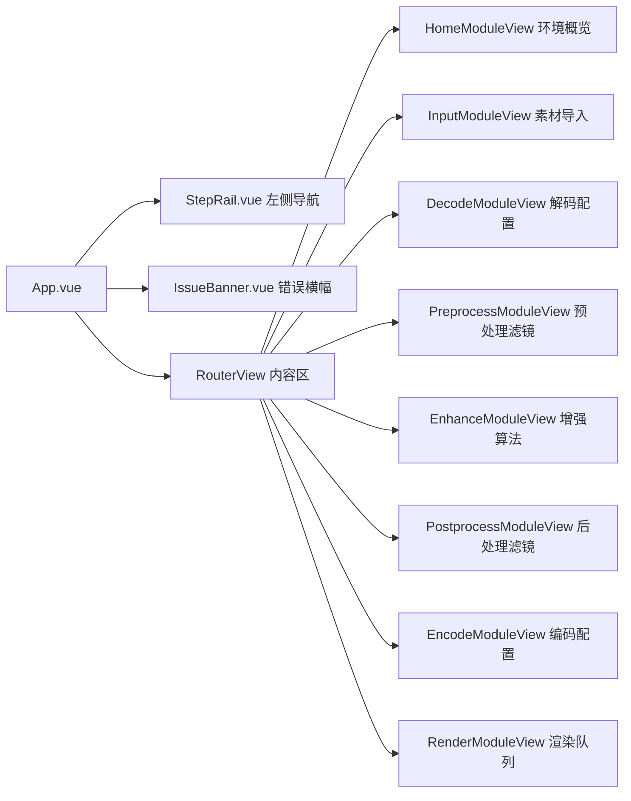

# 前端架构

## 技术栈

| 技术 | 版本 | 用途 |
|------|------|------|
| Vue | ^3.5.32 | 框架与响应式系统 |
| Vite | ^8.0.9 | 构建工具 |
| TypeScript | ~6.0.2 | 类型系统 |
| Pinia | ^3.0.3 | 状态管理 |
| Vue Router | ^4.6.3 | 路由与懒加载 |
| @tauri-apps/api | ^2.10.1 | Tauri 前端 API |
| Vitest | ^3.2.4 | 单元测试 |

## 目录结构与模块依赖



## Pinia Store 设计

使用 Composition API 风格（`reactive` + `ref`），共 5 个 store：

| Store | 文件 | 职责 |
|-------|------|------|
| `useEnvStore` | [`stores/env.ts`](../frontend/src/stores/env.ts) | 环境探测状态（是否探测中、探测结果、错误） |
| `useMediaStore` | [`stores/media.ts`](../frontend/src/stores/media.ts) | 媒体列表（增删改查、选中状态、激活项、任务状态） |
| `usePresetStore` | [`stores/preset.ts`](../frontend/src/stores/preset.ts) | 预设草稿（解码/编码/工作流/输出配置的编辑状态） |
| `useTaskStore` | [`stores/task.ts`](../frontend/src/stores/task.ts) | 批处理任务队列（运行状态、暂停、冲突、进度统计） |
| `useIssueStore` | [`stores/issue.ts`](../frontend/src/stores/issue.ts) | 全局操作错误横幅（按 scope 管理） |

**设计要点：**
- `useMediaStore` 是核心，管理媒体项列表和每个项的配置快照
- `useTaskStore` 只管理批处理运行时状态，不直接持有媒体数据
- `useIssueStore` 从 `mediaStore` 中分离出来，避免测试依赖耦合

## IPC 调用层

### safeInvoke 与 InvokeError

[`frontend/src/lib/ipc/client.ts`](../frontend/src/lib/ipc/client.ts) 封装所有 Tauri `invoke()` 调用：

```typescript
export class InvokeError extends Error {
  readonly code: string
  readonly details: Record<string, unknown> | null
  // ...
}

export async function safeInvoke<T>(command: string, args?: Record<string, unknown>): Promise<T>
```

- `isTauriRuntime()` 检测 `window.__TAURI_INTERNALS__`，区分桌面运行和浏览器预览模式
- `normalizeInvokeError()` 处理 Rust 序列化的 `{ code, message }`，包装为 `InvokeError`
- Tauri 权限拒绝错误（`not allowed` / `Command not found`）会附加开发者提示

### 按领域分组的端点

[`frontend/src/lib/ipc/endpoints/`](../frontend/src/lib/ipc/endpoints/) 按业务领域组织：

| 文件 | 职责 |
|------|------|
| `env.ts` | `check_environment` |
| `media.ts` | `pick_inputs` / `inspect_video` |
| `preset.ts` | `load_workbench_preset` / `save_workbench_preset` / `pick_output_directory` |
| `task.ts` | `start_task` / `cancel_task` / `control_task`（`kind: "pause" | "resume"`）/ `check_resume_state` / `open_output_location` |

### 事件监听

[`frontend/src/lib/ipc/events.ts`](../frontend/src/lib/ipc/events.ts) 提供 `listenTaskEvents(handlers)`，订阅 Tauri 推送的任务事件：

| 事件名 | 来源 | 说明 |
|--------|------|------|
| `task-progress` | Rust `protocol.rs` | 进度更新 |
| `task-completed` | Rust `protocol.rs` | 任务完成 |
| `task-error` | Rust `protocol.rs` | 任务错误 |
| `task-cancelled` | Rust `protocol.rs` | 任务取消（区分 User / Stalled） |
| `task-log` | Rust `protocol.rs` | 日志输出 |
| `task-resume-status` | Rust `protocol.rs` | 续传状态 |

事件名定义在 [`frontend/src/types/protocol/events.ts`](../frontend/src/types/protocol/events.ts)，使用 `satisfies` 约束确保覆盖 Rust `TaskEventName` 的所有 variant。

## 任务状态机（纯函数 Reducer）

[`frontend/src/services/task/events.ts`](../frontend/src/services/task/events.ts) 将 IPC payload 映射为 `MediaTaskState` 变换。这是一个纯函数 reducer，不依赖 Vue/Pinia/Tauri：



关键变换函数：
- `applyTaskProgress` — 更新进度、阶段、metrics
- `applyTaskCompleted` — 标记完成，记录输出路径和处理帧数
- `applyTaskError` — 记录错误码和消息
- `applyTaskCancelled` — 标记取消原因（User / Stalled）
- `applyTaskLog` — 追加日志，自动折叠连续进度行（保留最近 300 条）

## 批处理编排

### BatchRunner 组合模式

[`frontend/src/services/task/batch-runner.ts`](../frontend/src/services/task/batch-runner.ts) 是批处理门面，组合三个子模块：



- `lifecycle/` — 任务生命周期管理（启动、停止、完成、队列）
- `conflict.ts` — 续传冲突解析与分类
- `events.ts` — NDJSON 事件到 store 状态的归一化映射

### useTaskOrchestrator 模块级单例

[`frontend/src/composables/app/useTaskOrchestrator.ts`](../frontend/src/composables/app/useTaskOrchestrator.ts) 内部缓存 `BatchRunner` 实例。5 处调用者（启动、取消、暂停、恢复、冲突处理）操作的是同一个 runner，保证状态一致性。

## 视图与路由

[`frontend/src/router/index.ts`](../frontend/src/router/index.ts) 使用 `createWebHashHistory`，8 个模块视图全部懒加载：



| 视图 | 核心职责 |
|------|---------|
| `HomeModuleView` | 环境探测仪表盘，GPU/FFmpeg 能力概览 |
| `InputModuleView` | 批量导入素材，拖放支持，素材列表管理 |
| `DecodeModuleView` | 解码器配置（硬件加速、解码模式等） |
| `PreprocessModuleView` | 预处理滤镜链配置 |
| `EnhanceModuleView` | 超分辨率、补帧算法配置 |
| `PostprocessModuleView` | 后处理滤镜链配置 |
| `EncodeModuleView` | 编码器、码率控制、输出格式配置 |
| `RenderModuleView` | 批量渲染控制，输出目录，任务执行 |

## 类型生成机制

### ts-rs 自动生成

Rust 模型在 [`frontend/src-tauri/src/models/`](../frontend/src-tauri/src/models/) 中定义，使用 `#[derive(TS)]` + `#[ts(export)]` 宏。`cargo build` 时自动生成 TypeScript 类型到 `frontend/src/types/generated/`（约 40 个文件）。

示例（[`frontend/src-tauri/src/models/task.rs`](../frontend/src-tauri/src/models/task.rs)）：

```rust
#[derive(Debug, Clone, Deserialize, Serialize, JsonSchema, TS)]
#[serde(rename_all = "camelCase")]
#[ts(export, export_to = "../../src/types/generated/")]
pub struct TaskRequest {
    pub input_path: String,
    pub decode_config: DecodeConfig,
    // ...
}
```

### 类型扩展层

生成文件禁止前端代码直接深路径引用。`types/protocol/index.ts` 统一 re-export 所有 generated 类型：

```typescript
export * from '@/types/generated/DecodeConfig'
export * from '@/types/generated/EncodeConfig'
// ... 约 40 个文件
```

前端自定义领域模型在 `types/domain/` 中定义（如 `MediaItem`、`BatchState`、`OperationIssue`），与生成类型互补。

## 编译期协议一致性

这是前端最重要的设计决策之一。通过 TypeScript 类型系统实现零运行时成本的协议覆盖检查：

### 事件名覆盖检查

[`frontend/src/types/protocol/events.ts`](../frontend/src/types/protocol/events.ts):

```typescript
export const TASK_EVENT_NAMES = {
  TaskProgress: 'task-progress',
  TaskCompleted: 'task-completed',
  TaskError: 'task-error',
  TaskCancelled: 'task-cancelled',
  TaskLog: 'task-log',
  TaskResumeStatus: 'task-resume-status',
} as const satisfies Record<string, TaskEventName>

// 编译期校验：必须覆盖所有 variant
type _VariantsCovered = TaskEventName extends _ValuesOf<typeof TASK_EVENT_NAMES> ? true : never
const _COVERAGE_CHECK: _VariantsCovered = true
```

- 若 Rust 新增 `TaskEventName` variant 但未同步到 `TASK_EVENT_NAMES`，`_VariantsCovered` 变为 `never`，`tsc` 报错
- 若 `TASK_EVENT_NAMES` 的值不是合法的 `TaskEventName`（如 typo），`satisfies` 直接报错

### 错误码覆盖检查

[`frontend/src/types/protocol/errors.ts`](../frontend/src/types/protocol/errors.ts) 采用相同模式：

```typescript
export const TASK_ERROR_CODES = {
  MissingFfmpeg: 'missing_ffmpeg',
  // ... 14 个错误码
} as const satisfies Record<string, TaskErrorCode>
```

### 形状反向锁

[`frontend/src/types/protocol/_contract_check.ts`](../frontend/src/types/protocol/_contract_check.ts) 对核心 IPC 类型做额外的形状校验，防止字段增删导致的类型漂移。
