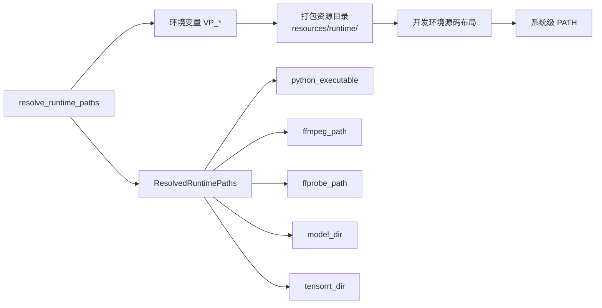
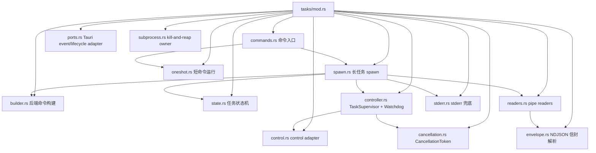
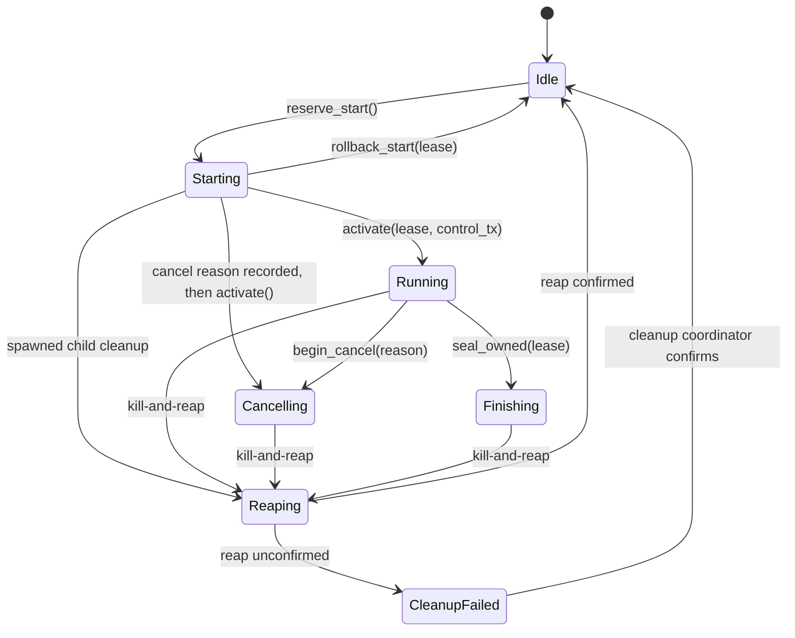
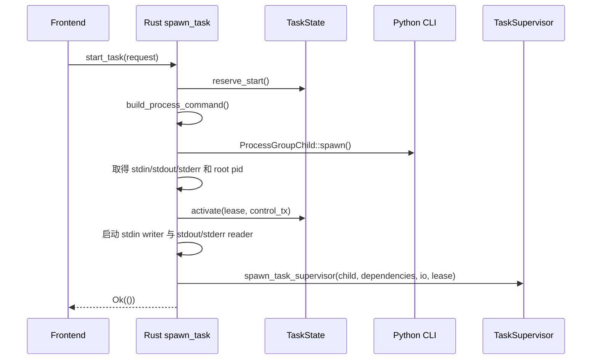
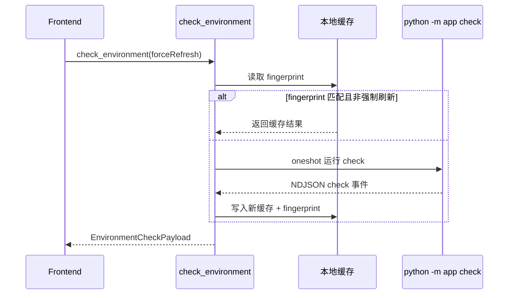

# Rust 桌面外壳架构

## Tauri Command 面

Rust 层通过 `#[tauri::command]` 暴露 10 个命令，前端通过 `@tauri-apps/api/core` 的 `invoke()` 调用。

Rust crate 对外源码面只保留 `run()`、`models::config` 和 `models::task`。Tauri 命令及
`tasks`、`runtime`、`persistence`、`services`、`process_control`、`error` 和环境探测模型均为
crate 内部接口；命令是否可由前端调用由 Tauri handler 与权限清单决定，不依赖 Rust `pub` 可见性。

配置、任务和环境边界类型由 `models` 内的私有 Typify 模块从 `contracts/boundary.schema.json` 生成；`models::config`、`models::task` 只精确 re-export 对外 schema，环境与壳内部类型保持 `pub(crate)`。

### Command 清单

| Command | 签名 | 职责 | 实现文件 |
|---------|------|------|---------|
| `pick_inputs` | `() -> Result<Vec<String>, ShellError>` | 打开原生文件对话框，多选视频文件 | [`dialogs.rs`](../frontend/src-tauri/src/dialogs.rs) |
| `pick_output_directory` | `() -> Result<Option<String>, ShellError>` | 打开原生目录对话框 | [`dialogs.rs`](../frontend/src-tauri/src/dialogs.rs) |
| `check_environment` | `(forceRefresh: bool) -> Result<EnvironmentCheckPayload, ShellError>` | 执行或读取环境检查（带 fingerprint 缓存） | [`services/environment_service.rs`](../frontend/src-tauri/src/services/environment_service.rs) |
| `load_workbench_preset` | `() -> Result<Option<WorkbenchPreset>, ShellError>` | 从本地加载工作台预设 | [`persistence/commands.rs`](../frontend/src-tauri/src/persistence/commands.rs) |
| `save_workbench_preset` | `(preset: WorkbenchPreset) -> Result<(), ShellError>` | 保存工作台预设（原子写） | [`persistence/commands.rs`](../frontend/src-tauri/src/persistence/commands.rs) |
| `inspect_video` | `(inputPath: String) -> Result<VideoInfo, ShellError>` | 探测输入视频元数据 | [`tasks/commands.rs`](../frontend/src-tauri/src/tasks/commands.rs) |
| `check_resume_state` | `(request: TaskRequest) -> Result<ResumeInspectionResult, ShellError>` | 预检查输出文件和续传 sidecar 状态 | [`tasks/commands.rs`](../frontend/src-tauri/src/tasks/commands.rs) |
| `start_task` | `(request: TaskRequest) -> Result<(), ShellError>` | 启动 Python 处理子进程 | [`tasks/commands.rs`](../frontend/src-tauri/src/tasks/commands.rs) |
| `control_task` | `(kind: TaskControlKind) -> Result<(), ShellError>` | 统一暂停、恢复或取消当前任务 | [`tasks/commands.rs`](../frontend/src-tauri/src/tasks/commands.rs) |
| `open_output_location` | `(path: String) -> Result<(), ShellError>` | 用系统默认程序打开输出目录 | [`dialogs.rs`](../frontend/src-tauri/src/dialogs.rs) |

所有命令体均为 `async fn`；对话框命令使用 `rfd::AsyncFileDialog` 避免阻塞 tokio runtime。

### 命令契约清单

根目录 `contracts/ipc-manifest.json` 是命令名、参数、返回值和事件名的唯一清单。生成脚本产出 Rust build manifest 与前端类型化 invoke 映射；架构门禁再与 `generate_handler!` 和 Tauri permissions 比对。

manifest v6 还声明长任务与 one-shot 的 Python subcommand、stdin payload、success/event 类型、
discriminator、期限和统一大小上限。`generated/backend_oneshot.rs` 将每个应用命令生成成 sealed
`BackendProcessSpec` / `BackendOneShotSpec`；调用方选择 `StartTaskSpec`、`InspectVideoSpec`、
`CheckEnvironmentSpec` 或 `CheckResumeStateSpec`，不维护平行命令表或 timeout 常量。

**新增命令的 checklist：** 修改中立 manifest → 重新生成绑定 → 实现并注册 handler → 更新 permission → 运行契约门禁。

## 运行时资源解析

[`frontend/src-tauri/src/runtime/mod.rs`](../frontend/src-tauri/src/runtime/mod.rs) 在 `lib.rs::setup`
中调用一次，结果存入 managed state。后续命令读取同一个 `ResolvedRuntimePaths`，不在每次
invoke 时重复探测文件系统。

解析优先级：
1. 显式环境变量覆盖，例如 `VP_FFMPEG_PATH`、`VP_PYTHON_EXECUTABLE`
2. canonical `$RUNTIME_ROOT`（bundle/debug 均为 `resources/runtime/`）下的 Python、
   `ffmpeg/bin`、`models` 和可选 `tensorrt`
3. 开发环境下的工作区源码布局
4. 系统级 PATH 兜底

`ResolvedRuntimePaths` 在 composition root 解析一次并作为 managed state 注入。`build_env_map`
只投影这份类型化结果，不重复读取环境变量；TensorRT 目录同时进入环境指纹。应用数据目录解析
失败时 release 构建直接报错，不使用临时目录伪装持久化成功。

## 进程管理（tasks/ 模块）

### One-shot 短命令

[`frontend/src-tauri/src/tasks/oneshot.rs`](../frontend/src-tauri/src/tasks/oneshot.rs) 通过
`run_single_cli_command<S>(paths, &S::Invocation)` 接收 sealed `BackendOneShotSpec`，并直接返回
schema 校验后的 `Result<S::Output, ShellError>`。调用方不能把任意 subcommand、输入模型、输出模型
或期限拼成一次调用。结构化错误信封
映射为 `BackendEnvelope`，无信封的非零退出映射为 `BackendProbeFailed`，成功但没有 JSON 映射为
`BackendNoJson`。解析器从 stdout 末尾逆序寻找最后一个 schema 合法、类型匹配的 success 或
backend error envelope；较新的无关日志/事件不会遮住合法结果，只有不存在合法候选时才报告最新
schema mismatch。`check`/`info` 的 transport-only `type` 在反序列化前移除，
`resume_inspection.type` 则保留为公共结果字段。

长任务与 one-shot 共享 `tasks/subprocess.rs` 的有界 stdin 和 kill-and-reap 原语。无 payload
的命令使用空 stdin，不继承桌面宿主输入；超时、错误或 future drop 都会按稳定的进程组/job
句柄终止并回收，而不是再按数字 PID 清理。

| 期限 | 上限 |
|------|------|
| stdin 写入与关闭 | 10 秒 |
| `inspect_video` → `info` 总期限 | 30 秒 |
| `check_resume_state` → `inspect-output` 总期限 | 60 秒 |
| `check_environment` → `check` 总期限 | 180 秒 |
| 终止与回收 | 5 秒 |

这些值以及 1 MiB pipe 行、8 MiB one-shot stdout、64 KiB stderr tail 和 8 KiB error summary
都来自 manifest v6；`process` 与每个 one-shot 条目显式绑定 `terminationReapLimit`，Rust 生产代码只消费
各 sealed spec 生成的期限。

### 任务状态机与启动租约

[`frontend/src-tauri/src/tasks/state.rs`](../frontend/src-tauri/src/tasks/state.rs) 定义七阶段生命周期：

- `Starting { lease }` 在任何命令构建或进程创建前占用唯一任务槽，第二个 start 不会创建子进程。
- `StartLease` 同时携带单调 lease id 与取消 token；启动期间到达的 cancel 会先记录原因，
  `activate()` 随后直接发布 `Cancelling` handle。
- 所有 activate、rollback、supervisor cancel 和 finish 都校验 lease。过期 supervisor 的清理不能
  清空或取消新任务。
- `seal_owned()` 在收到 terminal envelope 或发现进程退出后把当前 lease 置为 `Finishing`，
  立即拒绝新的 pause、resume 和 cancel，同时允许 supervisor 排空 reader 并完成终态仲裁。
- `finish_once()` 在持有生命周期锁时先提交终态回调，再释放任务槽，保证终态恰好一次且先于下一次启动。
- `Reaping` 在稳定 owner 确认退出前继续占用槽位；5 秒回收失败进入 `CleanupFailed`，终态仍只
  提交一次，只有持有稳定句柄的 cleanup coordinator 后续确认退出才能重新开放任务槽。
- 状态层返回领域 `TaskStateError`；只有 `tasks/commands.rs` 的 Tauri adapter 将其映射为
  `ShellError`。

### 启动流程

[`frontend/src-tauri/src/tasks/spawn.rs`](../frontend/src-tauri/src/tasks/spawn.rs):

任一启动失败路径都会终止并回收已创建的进程组，再用同一 lease 回滚 `Starting`。reader 在 stdin
writer 前启动，避免三条 pipe 互相填满形成死锁；stdin 写入也有 10 秒上限。

### TaskSupervisor 与终态仲裁

[`frontend/src-tauri/src/tasks/controller.rs`](../frontend/src-tauri/src/tasks/controller.rs) 的
私有 `TaskSupervisorSession` 是运行任务的唯一结构化 owner。构造器收到 `ProcessGroupChild` 后立即
转换为 `ProcessGroupOwner + ReapTicket`，再把依赖、pipe I/O、lease、取消 token 和 progress beat
组织成窄结构；调用方无法构造“已经运行但没有回收票据”的状态。panic monitor 只克隆 event sink、
lifecycle、lease、stderr、reap ticket 与控制清理句柄这组最小恢复上下文。只有 supervisor 能发送终态。

`controller.rs` 与 `readers.rs` 只依赖 Tokio、领域 payload 和 `TaskEventSink` /
`TaskLifecyclePort`；`ports.rs` 是任务域唯一 Tauri event/lifecycle adapter，`spawn.rs` 是装配它的
composition root。架构门禁禁止 task core 重新导入 Tauri，并检查 tasks 子模块 DAG 无环。

supervisor 在一个 `tokio::select!` 循环中并发处理 reader 消息、进程退出、取消、watchdog 和
暂停/恢复结果。终态规则如下：

- 第一个 supervisor/protocol 错误保持 sticky；重复 terminal envelope 升级为 `schema_mismatch`。
- backend 的类型化 error 保留原始 `code / message / details`，优先于非零 exit status。
- completed 只有与成功 exit 同时成立才有效；成功退出但无 terminal envelope 也是
  `schema_mismatch`。
- schema mismatch、pipe failure、terminal 后进程不退出都会触发进程组 kill。
- 退出后先在 5 秒内排空 stdout/stderr，再 join reader；排空失败覆盖先前 completed。
- 取消原因优先生成 `task-cancelled`；最终事件通过 `finish_once(lease, callback)` 恰好提交一次。
- supervisor panic 或 join failure 会先触发结构化 owner 的 drop：进程组收到终止请求，稳定的
  group/job handle 交给进程级 cleanup coordinator。协调器持有单一后台线程的 join handle，持续
  轮询并通过 `ReapTicket` 发布 `Reaped/Failed`；monitor 按同一 lease 只提交一个 `process_failed`
  终态。

### NDJSON 信封解析

[`frontend/src-tauri/src/tasks/envelope.rs`](../frontend/src-tauri/src/tasks/envelope.rs) 复用
`generated/backend_task_envelope.rs` 中从 manifest v6 生成的四 variant enum，不再手写
`progress / completed / error / resume_status` 镜像。

`classify_line()` 是生产 reader 与测试共同覆盖的唯一 classifier。合法 envelope 被解析为类型化
payload；普通非 JSON 文本作为日志；对象形 JSON、未知 `type`、缺字段或以 `{` 开头的破损 JSON
都视为 fatal `schema_mismatch`。supervisor 收到该分类后立即杀死子进程，避免在漂移协议上继续处理。

### stderr 兜底

[`frontend/src-tauri/src/tasks/stderr.rs`](../frontend/src-tauri/src/tasks/stderr.rs) 维护最多 400 行、
总计 64 KiB 的滚动缓冲，并把最终错误摘要截到 8 KiB。Python 未发类型化 error 就异常退出时，
supervisor 生成 `runtime_panic` 并把摘要放进 `details.traceback`；reader 会先排空，因此退出前的
尾部诊断不会丢失。

## 进程控制

[`frontend/src-tauri/src/process_control/`](../frontend/src-tauri/src/process_control/) 实现任务暂停/恢复：

- `mod.rs` — 任务绑定的 `ProcessController` 与测试用 `ProcessControl` trait
- `windows.rs` — Win32 稳定进程/线程句柄上的 `SuspendThread` / `ResumeThread`
- `posix.rs` — Linux pidfd 集合控制，以及 macOS 的显式不支持路径

`ProcessController` 在任务启动时捕获稳定身份，后续每次控制都先复核：

- Windows 在任务期持有 root 进程句柄和 creation FILETIME；每次枚举时再捕获后代进程句柄与
  creation FILETIME，暂停期间继续持有包含 owner 进程身份与 creation FILETIME 的线程句柄，
  恢复只操作这些原句柄。双次 ToolHelp 快照还会验证 parent link 未变化。
- Linux 固定点枚举 root、后代和同 PGID 成员，为每个成员打开并保留 pidfd；暂停/恢复只向这些
  稳定句柄发 `SIGSTOP/SIGCONT`，同时校验 `/proc/<pid>/stat` 的启动时间、parent link 和 PGID。
- macOS 缺少与 pidfd/进程句柄等价的稳定信号句柄，因此 pause/resume 明确返回
  `ProcessControlError::Unsupported`；cancel 与 supervisor 的进程组终止仍可用。

任何句柄、启动时间、owner 或 parent link 无法验证时，控制以 `IdentityMismatch`/typed OS error
失败关闭，禁止仅凭旧 PID/TID 发信号。控制消息和 reply 都有有界超时；OS 扫描与系统调用通过
`spawn_blocking` 离开 Tokio worker。结构化错误保留原始 `io::Error` source chain。

## 本地持久化

[`frontend/src-tauri/src/persistence/`](../frontend/src-tauri/src/persistence/):

- `storage.rs` — 缓存/预设读写，使用 `tempfile::NamedTempFile::persist` 原子提交
- `transaction.rs` — 按规范化文件路径协调 async exclusive transaction 与同 key single-flight
- `commands.rs` — `load_workbench_preset` / `save_workbench_preset` 命令体

持久化数据包括：
- **环境检查缓存 schema 16**（`environment-cache.json`）— 带包含 TensorRT 的 fingerprint
- **工作台预设 schema 2**（`workbench-preset.json`）— 用户当前编辑的完整配置快照

两个 envelope 类型由 `contracts/persistence.schema.json` 经 Typify 生成，版本常量由
`generated/persistence_versions.rs` 生成；storage 不维护手写镜像结构或平行版本数字。

其他版本或损坏文件会改名为 `*.incompatible-<reason>-*.bak` 后重建，不做字段迁移、其他版本解析或
回退读取。环境缓存失效后重新探测；预设失效返回 `schema_mismatch`，由前端重置默认值并展示
全局 banner，再立即保存 schema 2 默认替代。JSON 序列化、路径 IO 和 schema 失败分别在发生
上下文中映射为结构化错误。

同一路径的 `read → 隔离 → probe/rebuild → 原子保存 → 发布结果` 全部位于一个 transaction，
因此并发环境检查对同一 fingerprint/force key 只探测一次，所有调用方得到相同 payload；flight
结束后不记忆环境结果，下一次仍从磁盘正常命中 `source=cache`。预设损坏则记忆同一
`SchemaValidation` outcome，避免首个调用报错、其他调用读到 `None`；保存重建的 v2 预设时在
同一 exclusive 锁内清除此记忆。损坏文件只隔离一次，leader 取消或 panic 由 RAII 释放 flight。

## 构建接入与桌面安全

[`frontend/src-tauri/build.rs`](../frontend/src-tauri/build.rs) 只读取已生成的
`generated/ipc_manifest.rs` 并调用确定性的 `tauri_build`。跨语言生成和漂移检查属于显式仓库
门禁，不在 Cargo build 中隐式改写工作树。

[`frontend/src-tauri/capabilities/default.json`](../frontend/src-tauri/capabilities/default.json)
仅授权本地 `main` 窗口，不声明远程 origin。`tauri.conf.json` 只启用该 capability，关闭全局
Tauri 对象，并使用最小 CSP：`script-src 'self'`，`connect-src` 仅 Tauri IPC，
`object-src 'none'`、`frame-src 'none'`；asset/blob/data 只为现有本地资源用途开放。Rust 单测和
桌面 E2E 同时锁定这些约束。

## 环境检查服务

[`frontend/src-tauri/src/services/environment_service.rs`](../frontend/src-tauri/src/services/environment_service.rs):

- 缓存优先策略：若 fingerprint（运行时路径哈希）未变，直接返回缓存结果
- 首次或强制刷新时，通过 `oneshot.rs` 运行 `python -m app check` 子命令
- 输出结构仅包含 UI 消费的 FFmpeg 能力、GPU adapter `name/vendor`、三个 backend 的实际 `tensorEngines`、算法能力元数据和 `runtimeMode`；Windows 虚拟显示适配器在 Python 系统探测边界过滤，UI 与 FFmpeg 能力探测共享同一结果
- 环境缓存使用 schema 16；版本不匹配或损坏缓存会隔离，fingerprint 变化或 force refresh 会重新探测

