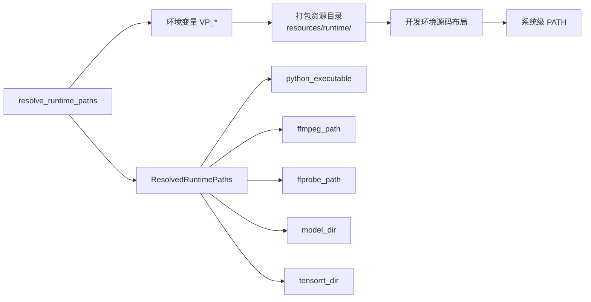
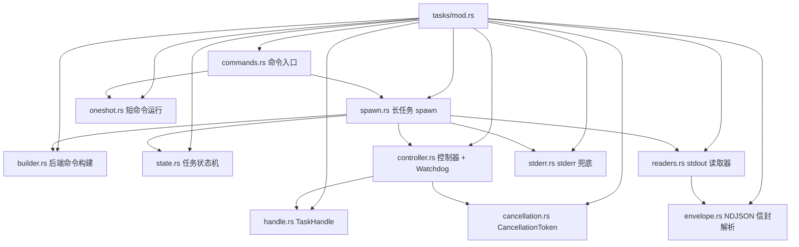
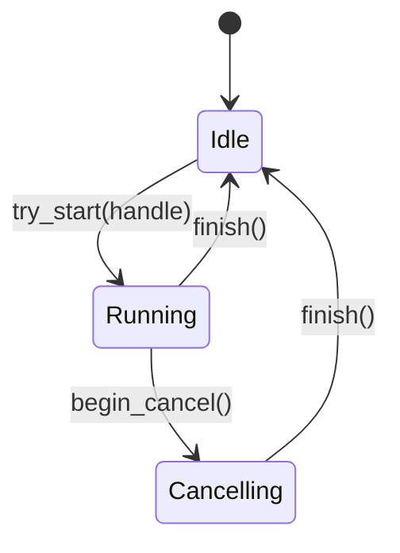
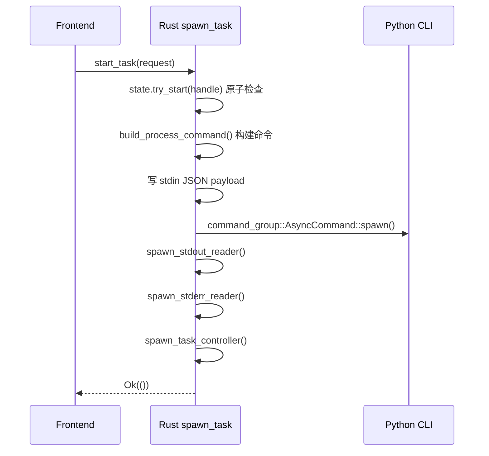
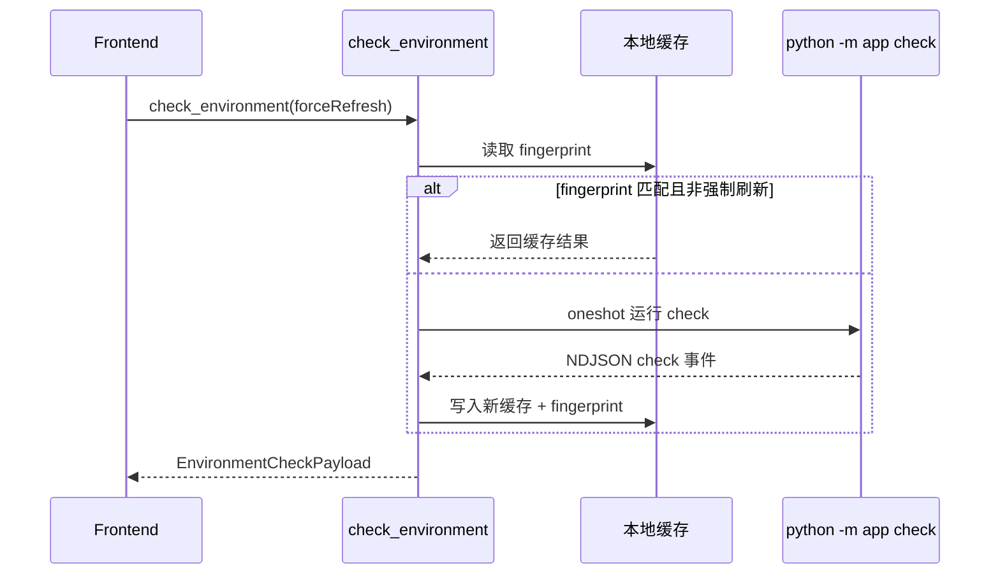

# Rust 桌面外壳架构

## Tauri Command 面

Rust 层通过 `#[tauri::command]` 暴露 12 个命令，前端通过 `@tauri-apps/api/core` 的 `invoke()` 调用。

### Command 清单

| Command | 签名 | 职责 | 实现文件 |
|---------|------|------|---------|
| `pick_inputs` | `() -> Result<Vec<String>, ShellError>` | 打开原生文件对话框，多选视频文件 | [`dialogs.rs`](../frontend/src-tauri/src/dialogs.rs) |
| `pick_output_directory` | `() -> Result<Option<String>, ShellError>` | 打开原生目录对话框 | [`dialogs.rs`](../frontend/src-tauri/src/dialogs.rs) |
| `check_environment` | `(forceRefresh: bool) -> Result<EnvironmentCheckPayload, ShellError>` | 执行或读取环境检查（带 fingerprint 缓存） | [`services/environment_service.rs`](../frontend/src-tauri/src/services/environment_service.rs) |
| `load_workbench_preset` | `() -> Result<Option<WorkbenchPreset>, ShellError>` | 从本地加载工作台预设 | [`persistence/commands.rs`](../frontend/src-tauri/src/persistence/commands.rs) |
| `save_workbench_preset` | `(preset: WorkbenchPreset) -> Result<(), ShellError>` | 保存工作台预设（原子写） | [`persistence/commands.rs`](../frontend/src-tauri/src/persistence/commands.rs) |
| `inspect_video` | `(inputPath: String) -> Result<VideoInfo, ShellError>` | 探测输入视频元数据 | [`tasks/commands.rs`](../frontend/src-tauri/src/tasks/commands.rs) |
| `check_resume_state` | `(request: TaskRequest) -> Result<Value, ShellError>` | 预检查输出文件和续传 sidecar 状态 | [`tasks/commands.rs`](../frontend/src-tauri/src/tasks/commands.rs) |
| `start_task` | `(request: TaskRequest) -> Result<(), ShellError>` | 启动 Python 处理子进程 | [`tasks/commands.rs`](../frontend/src-tauri/src/tasks/commands.rs) |
| `cancel_task` | `() -> Result<(), ShellError>` | 取消当前运行任务（协作式） | [`tasks/commands.rs`](../frontend/src-tauri/src/tasks/commands.rs) |
| `pause_task` | `() -> Result<(), ShellError>` | 暂停当前运行任务 | [`tasks/commands.rs`](../frontend/src-tauri/src/tasks/commands.rs) |
| `resume_task` | `() -> Result<(), ShellError>` | 恢复当前暂停任务 | [`tasks/commands.rs`](../frontend/src-tauri/src/tasks/commands.rs) |
| `open_output_location` | `(path: String) -> Result<(), ShellError>` | 用系统默认程序打开输出目录 | [`dialogs.rs`](../frontend/src-tauri/src/dialogs.rs) |

所有命令体均为 `async fn`；对话框命令使用 `rfd::AsyncFileDialog` 避免阻塞 tokio runtime。

### 单一真相源：commands_manifest.rs

[`frontend/src-tauri/src/commands_manifest.rs`](../frontend/src-tauri/src/commands_manifest.rs) 是命令清单的唯一声明位置：

```rust
pub const APP_COMMAND_NAMES: &[&str] = &[
    "pick_inputs",
    "pick_output_directory",
    // ... 12 个命令
];
```

该常量被两处消费：
1. `lib.rs` 的 `tauri::generate_handler![...]` —— 命令注册
2. `lib.rs::tests` 模块 —— 反向断言：每个命令名都出现在 `permissions/default.toml` 和 `gen/schemas/acl-manifests.json` 中

**新增命令的 checklist：** 实现函数 → 加入 `commands_manifest.rs` → 注册到 `generate_handler!` → 更新 `permissions/default.toml`。

## 运行时资源解析



[`frontend/src-tauri/src/runtime/mod.rs`](../frontend/src-tauri/src/runtime/mod.rs) 在 `lib.rs::setup` 中调用一次，结果存入 managed state。后续所有命令通过 `app.state::<ResolvedRuntimePaths>()` 读取，避免每次 invoke 重复执行约 10 次文件系统 stat。

解析优先级：
1. 显式环境变量覆盖，例如 `VP_FFMPEG_PATH`、`VP_PYTHON_EXECUTABLE`
2. `frontend/src-tauri/resources/` 内打包资源
3. 开发环境下的工作区源码布局
4. 系统级 PATH 兜底

环境变量通过 `build_env_map` 构建后完整透传给 Python 子进程，Python 端无需重复解析。

## 进程管理（tasks/ 模块）



### 任务状态机

[`frontend/src-tauri/src/tasks/state.rs`](../frontend/src-tauri/src/tasks/state.rs) 定义三阶段状态机：



- `Idle` — 无任务运行，`try_start` 是唯一合法转换
- `Running { handle }` — 任务正常运行，`begin_cancel` 或 `finish`
- `Cancelling { handle, started_at }` — 取消请求已发出，等待子进程退出，`finish` 是唯一合法转换

所有转换在 `Mutex` 保护下原子执行，消除 "read-then-write" 竞态窗口。`try_start` 拒绝双启动，`begin_cancel` 拒绝重复取消。

### 启动流程

[`frontend/src-tauri/src/tasks/spawn.rs`](../frontend/src-tauri/src/tasks/spawn.rs):



`spawn_task_controller` 内部启动 4 个异步 task：
1. **stdout 解析器** — 逐行读取 NDJSON，解析为 `NdjsonEnvelope`，发射 Tauri 事件
2. **stderr 转发器** — 滚动缓冲 stderr，转发为 `task-log` 事件
3. **控制消息通道** — 接收暂停/恢复请求，转发到 `ProcessController`
4. **Watchdog** — 检测 stdout 沉默超时

### NDJSON 信封解析

[`frontend/src-tauri/src/tasks/envelope.rs`](../frontend/src-tauri/src/tasks/envelope.rs):

```rust
#[derive(Debug, Clone, Deserialize)]
#[serde(tag = "type", rename_all = "snake_case")]
pub enum NdjsonEnvelope {
    #[serde(rename = "progress")]
    Progress(TaskProgressPayload),
    Completed(TaskCompletedPayload),
    Error(TaskErrorPayload),
    ResumeStatus(ResumeStatusPayload),
}
```

使用 serde 的 **internally tagged enum** 模式，`"type"` 字段作为 discriminant。解析失败时升级为 `SchemaMismatch` 错误。

### stderr 兜底

[`frontend/src-tauri/src/tasks/stderr.rs`](../frontend/src-tauri/src/tasks/stderr.rs) 维护一个滚动缓冲（400 行 / 8KB）。当 Python 在发出 NDJSON 终止事件前崩溃时，stderr 内容通过 `StderrCapture` 捕获，包装为 `BackendExit` 错误推送给前端。这是错误传播的兜底路径。

## 进程控制

[`frontend/src-tauri/src/process_control/`](../frontend/src-tauri/src/process_control/) 实现任务暂停/恢复：

- `mod.rs` — `ProcessController` trait 定义
- `windows.rs` — Win32 `SuspendThread` / `ResumeThread` 实现
- `posix.rs` — SIGSTOP / SIGCONT 实现（占位）

控制消息通过 `tokio::sync::mpsc` 通道发送，响应通过 `oneshot` 通道返回结构化错误（Phase 5a — 替代了之前的 `Result<(), String>`，保留原始 `io::Error` source chain）。

## 本地持久化

[`frontend/src-tauri/src/persistence/`](../frontend/src-tauri/src/persistence/):

- `storage.rs` — 缓存/预设读写，使用 `tempfile` + `os.replace` 实现原子写入
- `commands.rs` — `load_workbench_preset` / `save_workbench_preset` 命令体

持久化数据包括：
- **环境检查缓存**（`environment-cache.json`）— 带 fingerprint 策略，避免每次启动重复探测
- **工作台预设**（`workbench-preset.json`）— 用户当前编辑的完整配置快照

各平台路径差异由 Tauri 的 `app_handle.path()` API 自动处理。

## 环境检查服务

[`frontend/src-tauri/src/services/environment_service.rs`](../frontend/src-tauri/src/services/environment_service.rs):

- 缓存优先策略：若 fingerprint（运行时路径哈希）未变，直接返回缓存结果
- 首次或强制刷新时，通过 `oneshot.rs` 运行 `python -m app check` 子命令
- 输出结构包含：Python 版本、FFmpeg 版本、GPU 信息、模型发现状态


