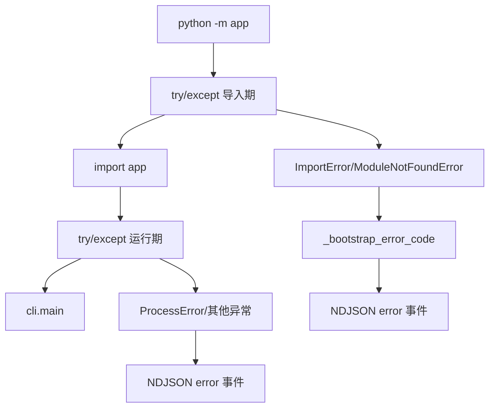
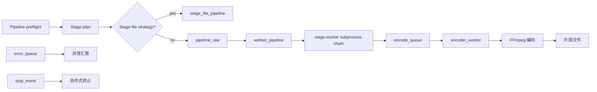
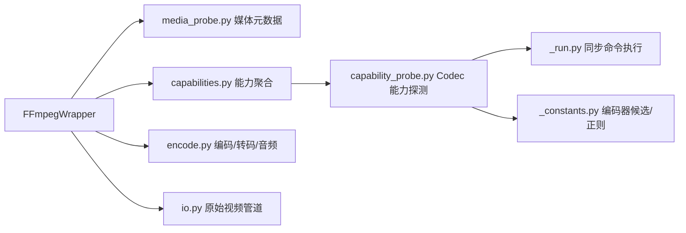

# Python 后端架构

## CLI 入口

后端提供 5 个 CLI 子命令：

| 子命令 | 职责 | 对应 Tauri Command |
|--------|------|-------------------|
| `python -m app check` | 环境自检（Python/FFmpeg/GPU/模型） | `check_environment` |
| `python -m app info --input <video>` | 探测视频元数据 | `inspect_video` |
| `python -m app process --input <video> ...` | 执行处理流水线 | `start_task` |
| `python -m app inspect-output --input <video> ...` | 续传预检 | `check_resume_state` |
| `python -m app benchmark ...` | 端到端补帧性能回归检查 | GitHub Actions / 本地开发 |

### 双层兜底

[`backend/app/__main__.py`](../backend/app/__main__.py) 在 `app` 包完全加载前后各设一层异常捕获：



- **导入期兜底**：捕获 `ImportError` / `ModuleNotFoundError`，通过 `_bootstrap_error_code` 推断错误码（如 `onnxruntime` 缺失 → `missing_python_dependency`），输出 NDJSON error 后 exit(1)
- **运行期兜底**：捕获所有未处理异常，转为 `ProcessError`，输出 NDJSON error 后 exit(1)

这种设计确保即使 Python 环境不完整，Rust 层仍能收到结构化错误信息而非静默失败。

### process 子命令三段式拆分

[`backend/app/cli/commands/process.py`](../backend/app/cli/commands/process.py) 拆分为三个阶段：
1. `_process_validation.py` — 输入验证与配置解析
2. `_process_planning.py` — 处理步骤规划与签名构建
3. `_process_execution.py` — 流式流水线执行

## 配置体系

### pydantic-settings

[`backend/app/config.py`](../backend/app/config.py) 使用 `pydantic-settings` 管理环境变量：

- 所有环境变量以 `VP_` 为前缀
- 通过 `.env` 文件或系统环境变量注入
- 类型安全：字符串、整数、路径自动转换

### Pydantic 模型

[`backend/app/models/`](../backend/app/models/) 定义 IPC 数据结构，均继承自 `_CamelBase`（自动将 snake_case 字段序列化为 camelCase）：

```python
class DecodeConfig(_CamelBase):
    hwAccel: str | None = None
    decoder: str | None = None
    # ...
```

模型用于：
- stdin JSON 反序列化（Rust → Python）
- 内部配置传递
- 类型提示

## 处理步骤规划

### StagePlan

[`backend/app/planning/stage_plan.py`](../backend/app/planning/stage_plan.py) 的 `StagePlan` 描述完整的处理步骤序列：

```python
@dataclass(slots=True)
class StagePlan:
    pre_steps: list[ProcessingStep]
    interpolation_step: ProcessingStep | None
    post_steps: list[ProcessingStep]
    total_encoded_frames: int
```

### 配置签名

[`backend/app/planning/run_identity.py`](../backend/app/planning/run_identity.py) 的
`build_run_identity()` 一次性构造 sidecar 配置快照，并基于同一份快照和输入文件元数据计算 SHA-256：
- 续传时判断配置是否变更
- sidecar 文件匹配

### SegmentManifest

[`backend/app/planning/manifest.py`](../backend/app/planning/manifest.py) 负责续传决策、片段路径和 sidecar 生命周期；
[`backend/app/planning/manifest_store.py`](../backend/app/planning/manifest_store.py) 负责 `manifest.json` 的版本校验与原子持久化：

- 在输出目录旁创建 `.vp_segments/` 子目录
- 片段文件名编码帧范围：`chunk-NNNN-out{start}-{end}-src{next}.{ext}`
- 已完成进度从片段文件名扫描恢复
- `manifest.json` 只记录配置签名、配置快照和路径元数据

## 流式执行器

### 三线程流水线

[`backend/app/processing/streaming/pipeline.py`](../backend/app/processing/streaming/pipeline.py):



rawvideo 路径由 stage-worker 子进程链执行算法，主进程只保留编码队列和生命周期编排：

raw pipeline 在流 FPS 确定后创建一次不可变的 `EncoderRuntimeConfig`，encoder thread、worker 与 segment writer 共享该配置；队列和停止事件仍由各自运行时边界管理，避免跨层重复维护编码参数。

stage-file 路径在每个 stage 规划完成后创建一次不可变的 `StageFileRuntimeConfig`，chunk 编排与单 chunk runtime 共享同一对象。manifest、resume state、segment size 和 chunk boundary 仍由各自生命周期层持有，不进入静态 runtime config。

| 模块 | 职责 |
|------|------|
| [`pipeline_preflight.py`](../backend/app/processing/streaming/pipeline_preflight.py) | 解析视频信息、stage plan、signature、resume domain 和输出尺寸 |
| [`pipeline_dispatch.py`](../backend/app/processing/streaming/pipeline_dispatch.py) | 根据 plan 分派 stage-file 或 rawvideo runtime |
| [`worker_pipeline.py`](../backend/app/processing/streaming/worker_pipeline.py) | 构建 stage-worker chain 并把处理后帧写入 `encode_queue` |
| [`stage_file_pipeline.py`](../backend/app/processing/streaming/stage_file_pipeline.py) | 为每个 stage 构造一次 runtime config，并编排 stage 间的 finalize |
| [`stage_file_runtime_config.py`](../backend/app/processing/streaming/stage_file_runtime_config.py) | 保存 stage-file chunk 编排与执行共享的不可变静态配置 |
| [`stage_file_chunks.py`](../backend/app/processing/streaming/stage_file_chunks.py) | 规划 chunk、推进 manifest，并复用同一 stage runtime config |
| [`stage_worker.py`](../backend/app/processing/streaming/stage_worker.py) | isolated worker 入口，执行单个 stage 的 rawvideo I/O 与算法循环 |
| [`encoder_runtime_config.py`](../backend/app/processing/streaming/encoder_runtime_config.py) | 保存 raw pipeline 编码阶段共享的不可变静态配置 |
| [`encoder_worker.py`](../backend/app/processing/streaming/encoder_worker.py) | 从 `encode_queue` 读取，FFmpeg 编码，生成分段文件 |

### 队列消息类型

[`backend/app/processing/streaming/queues.py`](../backend/app/processing/streaming/queues.py):

- `EncodedFrame` — stage-worker 输出的处理后帧（传递给编码器）
- `SegmentBoundary` — 分段边界信号
- `StreamEnd` — 流结束哨兵

### 最终拼接

所有片段完成后，`finalize_segmented_output()`：
1. 使用 FFmpeg concat demuxer 拼接视频片段
2. 合并原始音频（若 `keepAudio=true`）
3. 清理 `.vp_segments/` 和 sidecar 文件

## 算法层

### IAlgorithm 接口

[`backend/app/algorithms/base.py`](../backend/app/algorithms/base.py):

```python
class IAlgorithm(ABC):
    @abstractmethod
    def process_frame(self, frame: np.ndarray) -> np.ndarray: ...

    @abstractmethod
    def process_frame_pair(
        self, frame_a: np.ndarray, frame_b: np.ndarray, timestep: float
    ) -> np.ndarray: ...
```

- `process_frame` — 单帧处理（超分辨率、降噪等）
- `process_frame_pair` — 帧对处理（插帧，在 `frame_a` 和 `frame_b` 之间生成中间帧）

### Stage Worker 算法装配

[`backend/app/processing/streaming/stage_worker_factory.py`](../backend/app/processing/streaming/stage_worker_factory.py)
根据已经完成规划的 stage 类型惰性导入并实例化具体算法。该边界只暴露 `create_backend()` 和
`create_algorithm()`，不维护全局 registry，也不要求测试或应用启动代码预先注册算法。

- filter chain 不创建 tensor backend，直接构造 `FrameFilterChainAlgorithm`
- interpolation 与 super-resolution 复用规划层过滤后的 kwargs 和已创建 backend
- 未支持的 stage 类型在装配边界立即失败

帧滤镜链由 `FrameFilterChainAlgorithm` 负责验证、顺序执行和 CPU/Tensor fallback；
具体滤镜实现与支持能力集中在 `frame_filter_handlers.py` 的单一不可变 descriptor registry 中。
每种滤镜只注册一次 NumPy handler，并按实际能力选择性声明 Tensor handler 与 capability predicate；不维护平行 kind 列表或运行时全局注册表。

### RIFE 补帧家族

[`backend/app/algorithms/rife/`](../backend/app/algorithms/rife/) 实现 RIFE（Real-Time Intermediate Flow Estimation）补帧算法：

- `_model_spec.py` — 36 个版本（v4.0 ~ v4.26）的模型规格表
- `model_loader.py` — PyTorch 权重加载与 Head 构建
- `solver.py` — PyTorch 推理求解器
- `onnx_solver.py` — ONNX Runtime 推理求解器
- `onnx_export.py` — ONNX 模型导出工具
- `warplayer.py` — 光流后向变形
- `ifnet_v4_*.py` — 各版本 IFNet 网络定义

### 张量后端抽象

[`backend/app/algorithms/tensor_backend.py`](../backend/app/algorithms/tensor_backend.py) 提供 `ITensorBackend` 接口，统一 PyTorch、Paddle、ONNX Runtime 三种后端。算法代码无感知具体后端，通过工厂方法获取。

## FFmpeg 封装

[`backend/app/utils/ffmpeg/`](../backend/app/utils/ffmpeg/) 提供完整的 FFmpeg 操作封装：



| 模块 | 职责 |
|------|------|
| `media_probe.py` | 视频元数据、帧数缓存和 FFmpeg 可用性探测 |
| `capability_probe.py` | Codec 帮助解析、码率控制与硬件解码实测 |
| `capabilities.py` | 按 GPU vendor 聚合 encoder/decoder profiles |
| `encode.py` | 编码命令构建、音频合并、concat 拼接 |
| `io.py` | RawVideoReader / RawVideoWriter，原始视频管道 |
| `_progress.py` | 解析 FFmpeg stderr 的进度信息（frame、fps、time、bitrate） |
| `_run.py` | 同步 subprocess 执行，超时控制 |
| `_constants.py` | 编码器/解码器候选列表、正则表达式 |

## 异常体系

### ProcessError

[`backend/app/errors/__init__.py`](../backend/app/errors/__init__.py):

```python
class ProcessError(Exception):
    def __init__(self, code: TaskErrorCode, message: str, details: dict | None = None): ...
    @classmethod
    def from_exception(cls, exc: Exception) -> ProcessError: ...
```

- 所有跨边界异常的标准形式
- `from_exception` 工厂方法根据异常类型自动推断错误码

### ResumeConflictError

专门处理输出已存在时的用户决策需求。Rust 层捕获后包装为 `ShellError::InvalidInput`，前端展示 `ResumeConflictDialog`。

### 错误码推断

[`backend/app/errors/_bootstrap.py`](../backend/app/errors/_bootstrap.py):

- 启动期安全：在 `app` 完全加载前，按异常消息关键字匹配错误码
- 运行时：按异常类型分派（`ImportError` → `missing_python_dependency`, `FileNotFoundError` → `io_error`）

## 进度上报

### NdjsonEmitter

[`backend/app/protocol/__init__.py`](../backend/app/protocol/__init__.py) 提供单例发射器：

```python
class NdjsonEmitter:
    def progress(self, current, total, percent, stage, stage_index, stage_total, metrics=None): ...
    def completed(self, output_path, processed_frames, time_seconds): ...
    def error(self, code, message, details=None): ...
    def resume_status(self, resumed, completed_chunks, ...): ...
```

- 线程安全：Python GIL 序列化 `print()` 调用
- 普通日志和终端进度条继续输出到 stderr，不经过此处

### Reporter

[`backend/app/protocol/reporter.py`](../backend/app/protocol/reporter.py) 在终端显示人类可读的进度条，同时通过 `NdjsonEmitter` 输出结构化事件。两者独立，终端用户看进度条，Rust 层解析 NDJSON。
