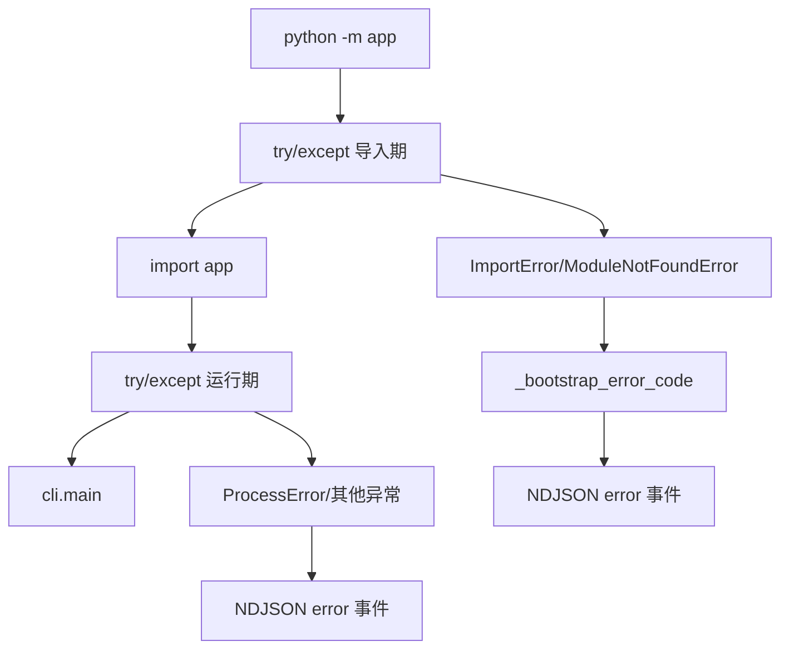
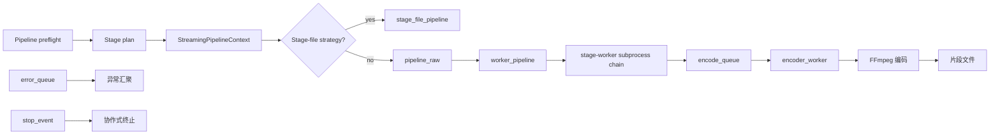
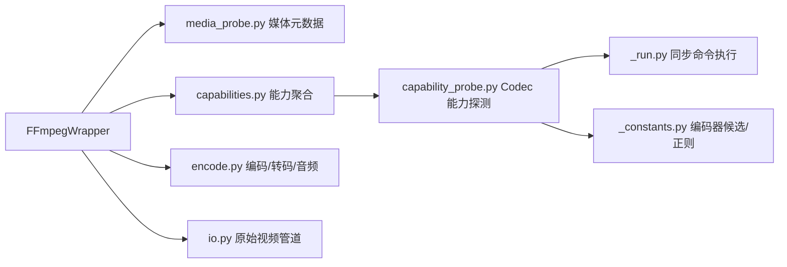

# Python 后端架构

## CLI 入口

后端提供 5 个面向桌面壳/开发者的子命令，以及 1 个仅由流水线拉起的内部 worker 子命令：

| 子命令 | 职责 | 对应 Tauri Command |
|--------|------|-------------------|
| `python -m app check` | 环境自检（Python/FFmpeg/GPU/模型） | `check_environment` |
| `python -m app info --input <video>` | 探测视频元数据 | `inspect_video` |
| `python -m app process --input <video> ...` | 执行处理流水线 | `start_task` |
| `python -m app inspect-output --input <video> ...` | 续传预检 | `check_resume_state` |
| `python -m app benchmark ...` | 端到端补帧性能回归检查 | GitHub Actions / 本地开发 |
| `python -m app stage-worker --config-json ...` | 执行单个隔离算法 stage | 仅由 Python 流水线内部拉起 |

### 双层兜底

[`backend/app/__main__.py`](../backend/app/__main__.py) 在 `app` 包完全加载前后各设一层异常捕获：



- **导入期兜底**：捕获 `ImportError` / `ModuleNotFoundError`，通过 `_bootstrap_error_code` 推断错误码（如 `onnxruntime` 缺失 → `missing_python_dependency`），输出 NDJSON error 后 exit(1)
- **运行期兜底**：捕获所有未处理异常，转为 `ProcessError`，输出 NDJSON error 后 exit(1)

这种设计确保即使 Python 环境不完整，Rust 层仍能收到结构化错误信息而非静默失败。

### process / inspect-output 共享预检

CLI composition root 将职责拆成以下边界：

1. `_process_validation.py` — 输入验证与生成配置模型解析
2. `_pipeline_preparation.py` — 构造不可变 `PreparedRun`
3. `_process_planning.py` — 组合 `PreparedRun` 与运行期 observers
4. `_process_execution.py` — 执行与完成事件

`process` 与 `inspect-output` 都调用 `prepare_pipeline_preflight()`，因此视频探测、工作流解析、
步骤顺序、输出 FPS、签名和 stage plan 只有一套实现。`PreparedRun` 只保存输出路径、类型化配置、
冻结步骤 tuple 和 preflight；reporter、callback、metrics 放在单独的 `RunObservers`，不进入静态计划。

## 配置体系

配置与 NDJSON payload 的字段、别名和枚举均由 `contracts/boundary.schema.json` 生成到
`backend/app/generated/contracts.py`。`app.models` 只增加输出路径等领域校验；NDJSON 发射器
直接接收生成模型，不再保留手写 payload adapter 或镜像字段。

### pydantic-settings

[`backend/app/config.py`](../backend/app/config.py) 使用 `pydantic-settings` 管理环境变量：

- 所有环境变量以 `VP_` 为前缀
- 通过 `.env` 文件或系统环境变量注入
- 类型安全：字符串、整数、路径自动转换

### 生成模型与领域校验

[`backend/app/generated/contracts.py`](../backend/app/generated/contracts.py) 是
`datamodel-code-generator` 产出的唯一边界字段定义。`app.models` 直接 re-export 生成类型，只在
`OutputConfig` 上增加非空路径领域校验。`RuntimeConfigs` 保存校验后的 Pydantic 模型，并按需
生成 camelCase JSON 投影供签名、adapter 和 worker 使用，不维护展开缓存或冗余深拷贝。

## 处理步骤规划

### StagePlan

[`backend/app/planning/stage_plan.py`](../backend/app/planning/stage_plan.py) 的 `StagePlan` 描述完整的处理步骤序列：

```python
@dataclass(frozen=True, slots=True)
class StagePlan:
    steps: tuple[ProcessingStep, ...]
    projection: StageProjection
```

插值位置、输出帧数与 FPS 均从有序步骤和同一个 `StageProjection` 派生，不保存可互相矛盾的平行状态。输出尺寸由 preflight 对同一 `StagePlan` 应用 stage 尺寸规则得到。

[`backend/app/catalog/stage_descriptors.py`](../backend/app/catalog/stage_descriptors.py) 是 stage
能力的中立不可变 catalog，统一声明执行模式、文件流水线要求、后端支持、固定倍率、模型类别和
工厂键。`ProcessingStep`、规划规则与算法装配读取同一个 descriptor；规划层不导入算法实现。
模型文件存在性由消费方定义的 `ModelAvailabilityPort` 注入，production adapter 才访问文件系统
和运行时路径，因此纯规划测试可只提供 fake port。

### 配置签名

[`backend/app/planning/run_identity.py`](../backend/app/planning/run_identity.py) 的
`build_run_identity()` 一次性构造 sidecar 配置快照，并基于同一份快照和输入文件元数据计算 SHA-256：
- 续传时判断配置是否变更
- sidecar 文件匹配

### SegmentManifest

续传由纯 `ResumePolicy`、文件系统 `SegmentWorkspace` 和 `ManifestRepository` 协作；
repository 负责 v3 `manifest.json` 的版本校验、不兼容数据隔离与原子持久化：

- 为 `output.mp4` 创建同目录 sidecar `output.mp4.vp_segments/`
- 片段文件名编码帧范围：`chunk-NNNN-out{start}-{end}-src{next}.{ext}`
- 已完成进度从片段文件名扫描恢复
- `manifest.json` 只记录配置签名、配置快照和路径元数据

`ResumePolicy` 只做纯冲突决策，`SegmentWorkspace` 只拥有路径、清理、隔离和原子 rename，
`ManifestRepository` 使用生成的 `SegmentManifest` Pydantic contract 严格读写 v3 JSON；
`SegmentManifest` 负责协调三者。损坏或非 v3 sidecar 整体
改名为 `.incompatible[-N]`，应用不迁移或回读。

## 媒体消费方端口

[`backend/app/ports/media.py`](../backend/app/ports/media.py) 由消费方定义
`MediaProbePort`、`RawVideoPort`、`EncodePort`、`FinalizationPort` 及更窄组合。规划、分段编码和
收尾模块只接收自己所需的 Protocol；`MediaRuntimePort` 只存在于 composition root。
[`backend/app/adapters/ffmpeg_media.py`](../backend/app/adapters/ffmpeg_media.py) 是 FFmpeg wrapper
到这些端口的唯一 adapter，raw ffprobe 结构不会进入规划领域。

## 流式执行器

### stage-worker 流式流水线

[`backend/app/processing/streaming/pipeline.py`](../backend/app/processing/streaming/pipeline.py):



[`backend/app/planning/stage_projection.py`](../backend/app/planning/stage_projection.py) 的
`StageProjection.resolve_workflow()` 在 composition root 对已校验 workflow 只投影一次。插帧、
超分与处理顺序全部由 workflow 自身决定；同一不可变 projection 直接下传 `StagePlan`，不接受
第二套 algorithm override，也不为 CLI 构造备用 stage。

`process_video_streaming()` 在 preflight 和 manifest 准备完成后只构造一次不可变的
`StreamingPipelineContext`。dispatch、raw/stage-file runtime 与最终 lifecycle 共享同一对象；
preflight 派生结果由同一对象持有。

rawvideo 路径由 stage-worker 子进程链执行算法，主进程只保留编码队列和生命周期编排：

raw pipeline 在流 FPS 确定后创建一次不可变的 `EncoderRuntimeConfig`，encoder thread、worker 与 segment writer 共享该配置；队列和停止事件仍由各自运行时边界管理，避免跨层重复维护编码参数。

同一 composition root 还创建一次不可变的 `WorkerPipelineRuntimeConfig`，集中 FFmpeg、输入、
decode config、stage plan、backend、进度回调、源尺寸/帧数、resume state 与 metrics。
`worker_pipeline` 和 `worker_chain_runtime` 传递同一对象；派生 worker plans、queues、error queue
和 stop event 仍归各自运行时层所有。`PipelineMetrics` 必须由 processing plan 显式提供。

进程边界使用明确的 `StageProgressCallback`、`EncodeQueue`、`BinaryIO`、`threading.Event`
与 worker handle protocol；只有 JSON 配置和算法 tensor 保留动态类型。decoder writer、
stderr event reader、raw chain 和 stage-file chunk 因此共享同一静态契约，而不改变线程与
pipe 的所有权。

stage-file 路径在每个 stage 规划完成后创建一次不可变的 `StageFileRuntimeConfig`，chunk 编排、单 chunk runtime 和 worker-output encoder 共享同一对象。manifest、resume state、segment size 和 chunk boundary 仍由各自生命周期层持有，不进入静态 runtime config。

| 模块 | 职责 |
|------|------|
| [`pipeline_context.py`](../backend/app/processing/streaming/pipeline_context.py) | 定义不可变 preflight 与执行 context，保持运行时对象引用 |
| [`pipeline_preflight.py`](../backend/app/processing/streaming/pipeline_preflight.py) | 解析视频信息、stage plan、signature、resume domain 和输出尺寸 |
| [`pipeline_dispatch.py`](../backend/app/processing/streaming/pipeline_dispatch.py) | 消费共享 context，根据 preflight 分派 stage-file 或 rawvideo runtime |
| [`worker_pipeline.py`](../backend/app/processing/streaming/worker_pipeline.py) | 构建 stage-worker chain 并把处理后帧写入 `encode_queue` |
| [`worker_runtime_config.py`](../backend/app/processing/streaming/worker_runtime_config.py) | 保存 raw worker pipeline 与 chain runtime 共享的不可变静态配置 |
| [`worker_chain_runtime.py`](../backend/app/processing/streaming/worker_chain_runtime.py) | 管理 worker session、decode writer 与最终 worker stdout drain |
| [`worker_process_io.py`](../backend/app/processing/streaming/worker_process_io.py) | 使用 typed pipe/queue/event 契约管理 decode writer 与最终 stdout |
| [`worker_process_events.py`](../backend/app/processing/streaming/worker_process_events.py) | 解析 worker stderr 事件并写入 typed progress/error 边界 |
| [`stage_file_pipeline.py`](../backend/app/processing/streaming/stage_file_pipeline.py) | 为每个 stage 构造一次 runtime config，并编排 stage 间的 finalize |
| [`stage_file_runtime_config.py`](../backend/app/processing/streaming/stage_file_runtime_config.py) | 保存 stage-file chunk 编排与执行共享的不可变静态配置 |
| [`stage_file_chunks.py`](../backend/app/processing/streaming/stage_file_chunks.py) | 规划 chunk、推进 manifest，并复用同一 stage runtime config |
| [`stage_worker.py`](../backend/app/processing/streaming/stage_worker.py) | isolated worker 入口，执行单个 stage 的 rawvideo I/O 与算法循环 |
| [`encoder_runtime_config.py`](../backend/app/processing/streaming/encoder_runtime_config.py) | 保存 raw pipeline 编码阶段共享的不可变静态配置 |
| [`encoder_worker.py`](../backend/app/processing/streaming/encoder_worker.py) | 从 `encode_queue` 读取，FFmpeg 编码，生成分段文件 |

### 队列消息类型

[`backend/app/processing/streaming/queues.py`](../backend/app/processing/streaming/queues.py):

- `EncodedFrame` — stage-worker 输出的处理后帧（传递给编码器）
- `SegmentBoundary` — 分段边界信号
- `StreamEnd` — 流结束哨兵
- `_EncodeEnd` — encoder 线程内部终止信号；只通过 `EncodeQueueItem` 私有联合类型流转

`EncodeQueue = queue.Queue[EncodeQueueItem]` 是 raw pipeline、worker chain 与 encoder worker
共享的唯一队列契约。

### 最终拼接

所有片段完成后，`finalize_segmented_output()`：
1. 使用 FFmpeg concat demuxer 拼接视频片段
2. 合并原始音频（若 `keepAudio=true`）
3. 将结果写入调用方提供的最终输出路径

该 helper 是写入调用方指定 `output_path` 的命令并返回 `None`。音频提取仅返回成功布尔值，音频合并同样是无返回值命令；pipeline lifecycle 和 stage-file runtime 始终继续使用自身已持有的输出路径。只有最终输出成功后，pipeline lifecycle 才清理 `<output>.vp_segments` sidecar；finalize 失败时保留现场用于续传。

## 算法层

### 窄算法端口

[`backend/app/algorithms/interfaces.py`](../backend/app/algorithms/interfaces.py) 按实际消费模式定义三个 Protocol：

```python
class SingleFrameAlgorithm(Protocol): ...
class FramePairAlgorithm(Protocol): ...
class FrameSequenceAlgorithm(Protocol): ...
```

stage descriptor 明确声明 single / pair / sequence 模式，执行器只接收对应窄端口；不存在恒等实现或跨模式默认回退。

`ProcessingStep` 是不可变 descriptor，`execution_mode` 在算法实例创建前就确定。ONNX 单帧超分由
`OnnxSuperResolution` 实现，PaddleGAN 视频超分由 `PaddleGanVideoSuperResolution` 实现；
stage-worker factory 按 descriptor 显式选择，不用同一类兼容两种消费模式。

### Stage Worker 算法装配

[`backend/app/processing/streaming/stage_worker_factory.py`](../backend/app/processing/streaming/stage_worker_factory.py)
根据已经完成规划的 stage 类型惰性导入并实例化具体算法。该边界只暴露 `create_backend()` 和
`create_algorithm()`，不维护全局 registry，也不要求测试或应用启动代码预先注册算法。

- filter chain 不创建 tensor backend，直接构造 `FrameFilterChainAlgorithm`
- interpolation 与 super-resolution 复用规划层过滤后的 kwargs 和已创建 backend
- 未支持的 stage 类型在装配边界立即失败

factory、stage runtime 和 execution loop 共享 `Algorithm` union、`ITensorBackend` 与
`StageWorkerConfig` 类型契约，并按 descriptor 的模式做一次结构化 Protocol 校验。
`FramePayload` 的 host/device 转换必须显式接收同一 `PipelineMetrics`，确保生产和测试路径都
记录一致的传输指标。

帧滤镜链由 `FrameFilterChainAlgorithm` 负责验证、顺序执行和 CPU/Tensor fallback；
具体滤镜实现与支持能力集中在 `frame_filter_handlers.py` 的单一不可变 descriptor registry 中。
每种滤镜只注册一次 NumPy handler，并按实际能力选择性声明 Tensor handler 与 capability predicate；不维护平行 kind 列表或运行时全局注册表。

### RIFE 补帧家族

[`backend/app/algorithms/pytorch/rife/`](../backend/app/algorithms/pytorch/rife/) 实现 RIFE 补帧算法：

- `app/catalog/rife_models.py` — 与算法实现解耦的 36 个版本模型规格
- `model_loader.py` — PyTorch 权重加载与 Head 构建
- `solver.py` — PyTorch 推理求解器
- `onnx_solver.py` — ONNX Runtime 推理求解器
- `onnx_export.py` — ONNX 模型导出工具
- `warplayer.py` — 光流后向变形
- `ifnet_v4_*.py` — 各版本 IFNet 网络定义

### 张量后端抽象

[`backend/app/algorithms/tensor_backend.py`](../backend/app/algorithms/tensor_backend.py) 提供 `ITensorBackend` 接口，统一 PyTorch、Paddle、ONNX Runtime 三种后端。算法代码无感知具体后端，通过工厂方法获取。

## FFmpeg 封装

[`backend/app/utils/ffmpeg/`](../backend/app/utils/ffmpeg/) 提供完整的 FFmpeg 操作封装：



| 模块 | 职责 |
|------|------|
| `media_probe.py` | 视频元数据、帧数缓存和 FFmpeg 可用性探测 |
| `capability_probe.py` | Codec 帮助解析、码率控制与硬件解码实测 |
| `capabilities.py` | 按 GPU vendor 聚合 encoder/decoder profiles |
| `encode.py` | 编码命令构建、音频合并、concat 拼接 |
| `io.py` | RawVideoReader / RawVideoWriter，原始视频管道 |
| `_progress.py` | 解析 FFmpeg stderr 的进度信息（frame、fps、time、bitrate） |
| `_run.py` | 同步 subprocess 执行，超时控制 |
| `_constants.py` | 编码器/解码器候选列表、正则表达式 |

## 异常体系

### ProcessError

[`backend/app/errors/__init__.py`](../backend/app/errors/__init__.py):

```python
class ProcessError(Exception):
    def __init__(self, code: TaskErrorCode, message: str, details: dict | None = None): ...
    @classmethod
    def from_exception(cls, exc: Exception) -> ProcessError: ...
```

- 所有跨边界异常的标准形式
- `from_exception` 工厂方法根据异常类型自动推断错误码

### ResumeConflictError

专门处理输出已存在时的用户决策需求。Python 发出 backend 子集中的 `resume_conflict` envelope；
Rust 原样保留 `code / message / details`，前端再把 details 投影为 `ResumeConflictDialog` 所需领域结构。

### 错误码推断

[`backend/app/errors/_bootstrap.py`](../backend/app/errors/_bootstrap.py):

- 启动期安全：在 `app` 完全加载前，按异常消息关键字匹配错误码
- 运行时：按异常类型分派（`ImportError` → `missing_python_dependency`, `FileNotFoundError` → `io_error`）

## 进度上报

### NDJSON emitter

[`backend/app/protocol/__init__.py`](../backend/app/protocol/__init__.py) 提供唯一模块级 `ndjson`
发射器；生产代码不自行拼装 task envelope：

```python
class _NdjsonEmitter:
    def emit(self, event_type: BackendEnvelopeType, payload: BaseModel) -> None: ...
```

- command、reporter 和 pipeline lifecycle 在调用前构造 manifest 指定的生成 Pydantic 模型；
  生成的 envelope→payload 映射在写出前拒绝模型类型或 discriminator 不匹配
- 所有结构化 stdout 输出集中在同一 emitter；专用锁覆盖校验、序列化、整行 write 与 flush，
  保证并发 reporter 不会交错 NDJSON 行
- 普通日志和终端进度条继续输出到 stderr，不经过此处

### Reporter

[`backend/app/protocol/reporter.py`](../backend/app/protocol/reporter.py) 在 stderr 显示人类可读的进度条，同时通过 `ndjson` 输出结构化事件。两者独立，终端用户看进度条，Rust 层解析 stdout NDJSON。
