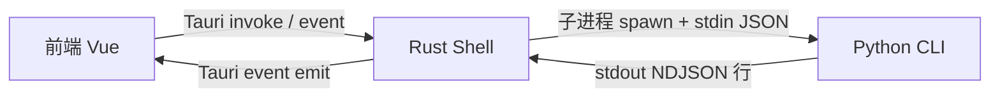
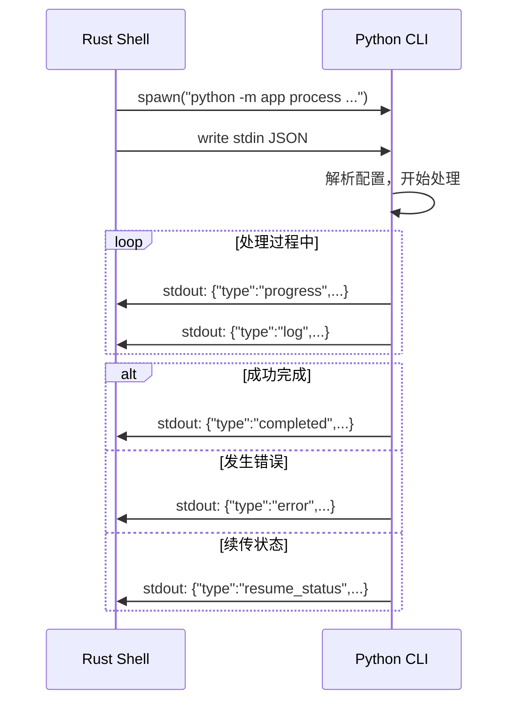
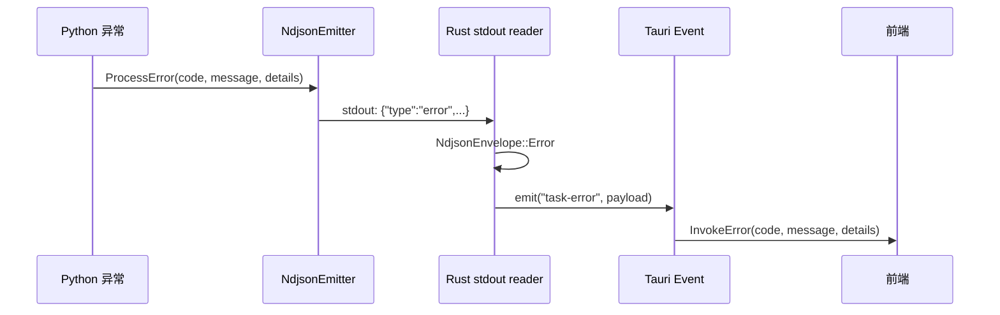
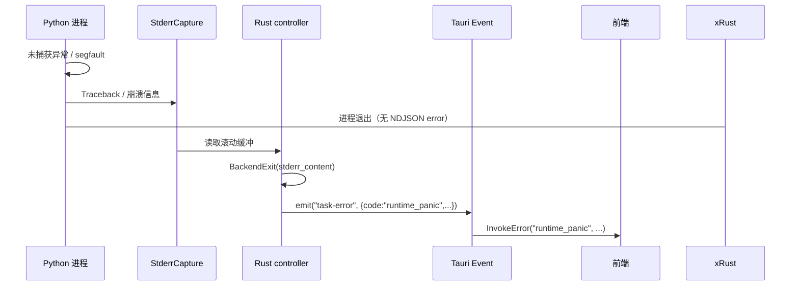

# IPC 通信协议

## 通信分层

VP Workbench 的跨层通信分为两个区间：

1. **前端 ↔ Rust**：通过 Tauri 的 IPC 机制（`invoke()` + `listen()`）
2. **Rust ↔ Python**：通过子进程 stdout 的 NDJSON 行协议



## 前端 ↔ Rust：Tauri Command

### Command 清单

| Command | Rust 签名 | 职责 |
|---------|-----------|------|
| `pick_inputs` | `async fn() -> Result<Vec<String>, ShellError>` | 多选视频文件 |
| `pick_output_directory` | `async fn() -> Result<Option<String>, ShellError>` | 选择输出目录 |
| `check_environment` | `async fn(bool) -> Result<EnvironmentCheckPayload, ShellError>` | 环境检查（带缓存） |
| `load_workbench_preset` | `async fn() -> Result<Option<WorkbenchPreset>, ShellError>` | 加载预设 |
| `save_workbench_preset` | `async fn(WorkbenchPreset) -> Result<(), ShellError>` | 保存预设 |
| `inspect_video` | `async fn(String) -> Result<VideoInfo, ShellError>` | 视频元数据探测 |
| `check_resume_state` | `async fn(TaskRequest) -> Result<Value, ShellError>` | 续传预检 |
| `start_task` | `async fn(TaskRequest) -> Result<(), ShellError>` | 启动处理任务 |
| `cancel_task` | `async fn() -> Result<(), ShellError>` | 取消任务 |
| `control_task` | `async fn(TaskControlKind) -> Result<(), ShellError>` | 暂停或恢复任务（`kind: "pause" | "resume"`） |
| `open_output_location` | `async fn(String) -> Result<(), ShellError>` | 打开输出目录 |

所有命令体均为 `async fn`；对话框命令使用 `rfd::AsyncFileDialog` 避免阻塞 tokio runtime。

### 权限清单

Tauri v2 的权限系统要求每个 command 在 ACL 中显式声明。权限文件 [`frontend/src-tauri/permissions/default.toml`](../frontend/src-tauri/permissions/default.toml) 中对应每个命令都有 `allow-<command>` 条目。

`lib.rs::tests` 模块通过 `include_str!` 反向断言：
- 所有活跃命令都出现在默认权限中
- 已移除的旧命令（`pick-input`、`pick-output`、`open-file-or-directory`、`resolved-runtime`）不出现在权限清单中
- `gen/schemas/acl-manifests.json` 与 `permissions/default.toml` 同源

### 前端封装：safeInvoke 与 InvokeError

[`frontend/src/lib/ipc/client.ts`](../frontend/src/lib/ipc/client.ts)：

```typescript
export type IpcCommand = keyof IpcCommandArgs

export class InvokeError extends Error {
  readonly code: string
  readonly details: Record<string, unknown> | null
}

export async function safeInvoke<C extends IpcCommand>(
  command: C,
  ...args: IpcInvokeArgs<C> extends undefined ? [] : [args: IpcInvokeArgs<C>]
): Promise<IpcInvokeResult<C>>
```

`frontend/src/lib/ipc/contract.ts` 是前端命令契约表：命令名、参数对象和返回类型在
TypeScript 编译期绑定，`scripts/check_architecture_contracts.py` 会把它与 Rust
`commands_manifest.rs`、Tauri permissions 和 endpoint 层 `safeInvoke()` 调用一起比对。

调用方按 `code` 路由：

```typescript
try {
  await taskIpc.start(request)
} catch (error) {
  if (error instanceof InvokeError && error.code === 'schema_mismatch') {
    // 表单字段与 Rust 模型漂移，提示重置草稿
  } else if (error instanceof InvokeError && error.code === 'persistence_failed') {
    // 落盘失败，记到 operation issue
  }
}
```

## Rust ↔ Python：NDJSON 行协议

### 通信模式

Rust 通过 `command_group::AsyncCommand::spawn()` 启动 Python 子进程，将配置以 JSON 形式写入 stdin。Python 处理过程中通过 stdout 每行输出一个 JSON 对象，Rust 的 stdout reader 即时解析。



### NDJSON Envelope

[`frontend/src-tauri/src/tasks/envelope.rs`](../frontend/src-tauri/src/tasks/envelope.rs)：

```rust
#[derive(Debug, Clone, Deserialize)]
#[serde(tag = "type", rename_all = "snake_case")]
pub enum NdjsonEnvelope {
    #[serde(rename = "progress")]
    Progress(TaskProgressPayload),
    Completed(TaskCompletedPayload),
    Error(TaskErrorPayload),
    ResumeStatus(ResumeStatusPayload),
}
```

使用 serde 的 **internally tagged enum** 模式，`"type"` 字段作为 discriminant。

[`backend/app/protocol/__init__.py`](../backend/app/protocol/__init__.py)：

```python
class NdjsonEventType(str, Enum):
    PROGRESS = "progress"
    COMPLETED = "completed"
    ERROR = "error"
    RESUME_STATUS = "resume_status"
    RESUME_INSPECTION = "resume_inspection"
    INFO = "info"
    CHECK = "check"
```

### 事件载荷结构

#### Progress

```rust
pub struct TaskProgressPayload {
    pub current: u64,
    pub total: u64,
    pub percent: f64,
    pub stage: String,
    pub stage_index: u64,
    pub stage_total: u64,
    pub metrics: Option<serde_json::Value>,  // 可选流水线指标
}
```

`metrics` 字段携带流水线可观测性数据（队列深度、处理帧数、实测 fps、耗时等），自由格式以便 schema 演进。

#### Completed

```rust
pub struct TaskCompletedPayload {
    pub output_path: String,
    pub processed_frames: u64,
    pub time_seconds: f64,
}
```

#### Error

```rust
pub struct TaskErrorPayload {
    pub code: TaskErrorCode,
    pub message: String,
    pub details: Option<serde_json::Value>,
}
```

#### Resume Status

```rust
pub struct ResumeStatusPayload {
    pub resumed: bool,
    pub completed_chunks: u64,
    pub completed_output_frames: u64,
    pub start_source_frame: u64,
    pub total_output_frames: u64,
}
```

### Tauri 事件名称

Rust 解析 NDJSON 后，通过 `app_handle.emit()` 推送 Tauri 事件给前端：

| Rust 事件名 | 字符串值 | 来源 NDJSON 类型 | Payload 类型 |
|------------|---------|-----------------|-------------|
| `TaskProgress` | `task-progress` | `progress` | `TaskProgressPayload` |
| `TaskCompleted` | `task-completed` | `completed` | `TaskCompletedPayload` |
| `TaskError` | `task-error` | `error` | `TaskErrorPayload` |
| `TaskCancelled` | `task-cancelled` | 终止时构造 | `TaskCancelledPayload` |
| `TaskLog` | `task-log` | 非 JSON 行 | `TaskLogPayload` |
| `TaskResumeStatus` | `task-resume-status` | `resume_status` | `ResumeStatusPayload` |

定义在 [`frontend/src-tauri/src/protocol.rs`](../frontend/src-tauri/src/protocol.rs)：

```rust
#[serde(rename_all = "kebab-case")]
pub enum TaskEventName {
    TaskProgress,
    TaskCompleted,
    TaskError,
    TaskCancelled,
    TaskLog,
    TaskResumeStatus,
}
```

## 错误码体系

### 三层一致的 TaskErrorCode

| 错误码 | Python 枚举 | Rust 枚举 | TS generated union |
|--------|------------|-----------|---------|
| `missing_ffmpeg` | `MISSING_FFMPEG` | `MissingFfmpeg` | `"missing_ffmpeg"` |
| `missing_model` | `MISSING_MODEL` | `MissingModel` | `"missing_model"` |
| `missing_tensor_backend` | `MISSING_TENSOR_BACKEND` | `MissingTensorBackend` | `"missing_tensor_backend"` |
| `missing_python_dependency` | `MISSING_PYTHON_DEPENDENCY` | `MissingPythonDependency` | `"missing_python_dependency"` |
| `cancelled` | `CANCELLED` | `Cancelled` | `"cancelled"` |
| `process_failed` | `PROCESS_FAILED` | `ProcessFailed` | `"process_failed"` |
| `spawn_failed` | `SPAWN_FAILED` | `SpawnFailed` | `"spawn_failed"` |
| `runtime_panic` | `RUNTIME_PANIC` | `RuntimePanic` | `"runtime_panic"` |
| `invalid_input` | `INVALID_INPUT` | `InvalidInput` | `"invalid_input"` |
| `invalid_config` | `INVALID_CONFIG` | `InvalidConfig` | `"invalid_config"` |
| `resume_conflict` | `RESUME_CONFLICT` | `ResumeConflict` | `"resume_conflict"` |
| `io_error` | `IO_ERROR` | `IoError` | `"io_error"` |
| `schema_mismatch` | `SCHEMA_MISMATCH` | `SchemaMismatch` | `"schema_mismatch"` |
| `persistence_failed` | `PERSISTENCE_FAILED` | `PersistenceFailed` | `"persistence_failed"` |
| `backend_no_json` | `BACKEND_NO_JSON` | `BackendNoJson` | `"backend_no_json"` |
| `backend_envelope` | `BACKEND_ENVELOPE` | `BackendEnvelope` | `"backend_envelope"` |
| `controller_unavailable` | `CONTROLLER_UNAVAILABLE` | `ControllerUnavailable` | `"controller_unavailable"` |
| `backend_probe_failed` | `BACKEND_PROBE_FAILED` | `BackendProbeFailed` | `"backend_probe_failed"` |

### Rust ShellError → TaskErrorCode 映射

[`frontend/src-tauri/src/error.rs`](../frontend/src-tauri/src/error.rs)：

| ShellError variant | TaskErrorCode |
|-------------------|---------------|
| `RuntimeResolution` | `ProcessFailed` |
| `Spawn` | `SpawnFailed` |
| `BackendExit` | `RuntimePanic` |
| `NdjsonDecode` | `SchemaMismatch` |
| `SchemaValidation` | `SchemaMismatch` |
| `Persistence` | `PersistenceFailed` |
| `Io` | `IoError` |
| `InvalidInput` | `InvalidInput` |
| `NoActiveTask` | `InvalidInput` |
| `OpenLocation` | `IoError` |

## 跨层错误传播

### 正常路径



### 兜底路径：Python 崩溃



[`frontend/src-tauri/src/tasks/stderr.rs`](../frontend/src-tauri/src/tasks/stderr.rs) 维护滚动缓冲（400 行 / 8KB），即使 Python 在发出 NDJSON 终止事件前崩溃，stderr 内容也能到达前端。

## 任务终止事件区分

Controller 根据三个信号的组合决定终止事件类型：

| 场景 | cancel_token.reason | exit_status | terminal_sent | 终止事件 |
|------|---------------------|-------------|---------------|---------|
| 用户取消 | `User` | 任意 | — | `task-cancelled` {reason: "user"} |
| Watchdog 超时 | `Stalled` | 任意 | — | `task-cancelled` {reason: "stalled"} |
| Python 正常完成 | `None` | 0 | false | `task-completed` |
| Python 错误退出 | `None` | 非 0 | false | `task-error` |
| Python 崩溃 | `None` | 非 0 / signal | false | `task-error` {runtime_panic} |

## 跨层契约的同源机制

| 契约项 | 单一真相源 | 派生目标 | 校验方式 |
|--------|-----------|---------|---------|
| Tauri Command 清单 | `commands_manifest.rs` | `lib.rs` handler + `permissions/default.toml` | `lib.rs::tests` 反向断言 |
| 事件名 | Rust `TaskEventName` | TS `TASK_EVENT_NAMES` | `satisfies Record<string, TaskEventName>` |
| 错误码 | Rust `TaskErrorCode` | generated TS union + Python `TaskErrorCode` | `check_error_code_drift.py` + `test_schema_drift.py` |
| 配置模型 | Rust `models/*.rs` | TS `types/generated/*.ts` | `ts-rs` 编译时生成 + `cargo build` |
| ACL 清单 | `permissions/default.toml` | `gen/schemas/acl-manifests.json` | `lib.rs::tests` 反向断言 |
