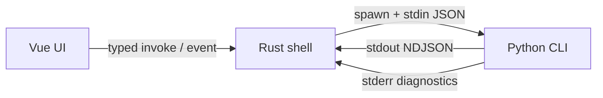
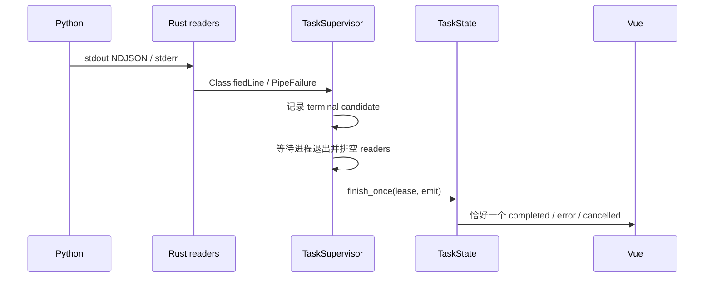

# IPC 通信协议

## 通信边界

VP Workbench 只有两个跨层通信区间：

1. Vue 前端与 Rust 桌面壳通过 Tauri `invoke()` 和事件通信。
2. Rust 与 Python CLI 通过 stdin JSON、stdout NDJSON 和 stderr 日志通信。



前端不启动或探测 Python；Python 不感知 Tauri 或 UI。Rust 是唯一 IPC 网关和进程监管者。

## 单一契约来源

根目录 [`contracts/`](../contracts/) 中的 JSON Schema 2020-12 文档定义配置、任务请求、环境检查、
NDJSON、错误码和持久化边界。源 schema 使用本地外部 `$ref` 复用结构，并为每个对象显式声明
`additionalProperties`。

[`contracts/ipc-manifest.json`](../contracts/ipc-manifest.json) schema version 5 是命令名、参数、
返回值、事件名、Python task/one-shot envelope、stdin payload、期限、大小上限和两个诊断前缀的
唯一清单。
`python scripts/generate_contracts.py` 会：

- 校验所有 schema、外部 `$ref`/JSON Pointer、manifest 唯一性和错误码集合；
- 生成并跟踪 `contracts/boundary.schema.json`；
- 用 `datamodel-code-generator` 生成 Python Pydantic 边界；
- 用 `json-schema-to-typescript` 生成 TypeScript 边界；
- 从同一清单生成覆盖四类 task 与三类 one-shot 的 `ndjson.schema.json`；
- 生成 Python envelope enum/类型映射/协议 limits、TypeScript 事件/进度常量，以及 Rust manifest、
  task envelope、sealed process/one-shot spec、错误码转换、事件和持久化版本适配器；
- 从 `stage-worker.schema.json` 生成 Python 内部 worker config/progress/error 模型；
- 让 Rust 的私有 Typify 模块在编译期消费同一聚合 schema。

`python scripts/generate_contracts.py --check` 对上述生成物执行逐字节 freshness 检查。Rust
`build.rs` 只把已生成 manifest 接入 Tauri build，不在 Cargo build 中生成或改写跨语言文件。

## 前端 ↔ Rust：10 个 Tauri Command

| Command | 参数 | 返回 | 职责 |
|---------|------|------|------|
| `pick_inputs` | — | `string[]` | 选择多个输入视频 |
| `pick_output_directory` | — | `string \| null` | 选择输出目录 |
| `check_environment` | `forceRefresh: boolean` | `EnvironmentCheckPayload` | 环境检查或读取缓存 |
| `load_workbench_preset` | — | `WorkbenchPreset \| null` | 加载预设 |
| `save_workbench_preset` | `preset: WorkbenchPreset` | `void` | 保存预设 |
| `inspect_video` | `inputPath: string` | `VideoInfo` | 探测视频元数据 |
| `check_resume_state` | `request: TaskRequest` | `ResumeInspectionResult` | 续传预检 |
| `start_task` | `request: TaskRequest` | `void` | 启动长任务 |
| `control_task` | `kind: pause \| resume \| cancel` | `void` | 统一任务控制 |
| `open_output_location` | `path: string` | `void` | 打开输出位置 |

不存在独立的暂停、恢复或取消 command。生成的
[`frontend/src/lib/ipc/contract.ts`](../frontend/src/lib/ipc/contract.ts) 将命令名绑定到参数和结果：

```typescript
export async function safeInvoke<C extends IpcCommand>(
  command: C,
  ...args: IpcInvokeArgs<C> extends undefined ? [] : [args: IpcInvokeArgs<C>]
): Promise<IpcInvokeResult<C>>
```

[`frontend/src/lib/ipc/endpoints/`](../frontend/src/lib/ipc/endpoints/) 是业务调用方的唯一入口。
`safeInvoke()` 把 Rust 序列化的 `{ code, message, details? }` 规范化为 `InvokeError`；上层按 code
处理，不解析错误字符串。

### 注册和权限一致性

命令面由两组门禁锁定：

- `scripts/check_architecture_contracts.py` 比对 manifest、Rust `#[tauri::command]` 参数、
  `generate_handler!` 可达面、前端 endpoint 调用、生成 contract 和 `permissions/default.toml`。
- Rust 单测比对生成 manifest、默认 permissions、Tauri ACL schema，并断言 command 精确为 10 个。

[`frontend/src-tauri/capabilities/default.json`](../frontend/src-tauri/capabilities/default.json) 只把这些
权限授予本地 `main` 窗口，不授权任何远程 origin。

## Rust ↔ Python：任务流 NDJSON

Rust 以进程组启动
`python -m app process --input <path> --config-stdin [--resume-mode <mode>]`。输入路径和恢复模式
使用窄 CLI 参数，stdin 只传 `{ decode, workflow, encode, output }` 四段类型化配置。Python 的
stdout 只承载结构化 task envelope；普通诊断写到 stderr。

聚合 `ndjson.schema.json` 覆盖全部七种 Python stdout envelope；长任务 reader 仍只允许其中
四种 task envelope，one-shot runner 只允许与当前子命令匹配的一种，两个解析上下文不会混用：

四类 task variant 由 manifest 生成到
`frontend/src-tauri/src/generated/backend_task_envelope.rs`；生产 classifier 直接使用该 enum，
不维护手写镜像。

其中：

- `progress` 包含 `current / total / percent / stage / stageIndex / stageTotal` 和可选 metrics；
- `completed` 包含 `outputPath / processedFrames / timeSeconds`；
- `error` 只接受 backend 错误码子集，并携带 `message` 与可选 `details`；
- `resume_status` 包含已完成片段、输出帧数、下一源帧和总输出帧数。

[`frontend/src-tauri/src/tasks/envelope.rs`](../frontend/src-tauri/src/tasks/envelope.rs) 的
`classify_line()` 是生产 reader 和测试共用的唯一 classifier：

- 合法 envelope 只解析一次并返回类型化 payload；
- 普通文本、JSON scalar 或 array 作为日志；
- 对象形 JSON、未知 `type`、缺少必填字段，或以 `{` 开头的破损 JSON，均成为 fatal
  `schema_mismatch`；
- supervisor 收到 fatal 分类后终止进程组，不继续消费漂移协议。

Python 的所有结构化 task 输出都经
[`backend/app/protocol/emitter.py`](../backend/app/protocol/emitter.py) 的模块级 `ndjson`
发射器；调用方必须先构造 manifest 指定的生成 Pydantic payload。生成的 envelope→payload
映射在写 stdout 前拒绝错误模型、非法字段、负值和 discriminator 漂移，并按 schema 的可选字段
集合移除空值。发射器用专用锁覆盖序列化、整行 write 和 flush，并发 reporter 不会交错行。
正常运行路径不自行拼装 error 对象。

## One-shot CLI Envelope

`check`、`info` 和 `inspect-output` 是短命令。Rust 的
[`tasks/oneshot.rs`](../frontend/src-tauri/src/tasks/oneshot.rs) 从 stdout 末尾逆序查找最后一个
schema 合法且类型匹配的 success 或 backend error envelope：

- `check` 与 `info` 在 DTO 解码前移除 transport-only `type`；
- `resume_inspection.type` 是公共结果的一部分，保持不变；
- 后端 error 原样转为 `ShellError::BackendEnvelope`；
- 没有合法候选时，成功退出映射为 `backend_no_json`，非零退出映射为
  `backend_probe_failed`；
- 若只找到类型匹配但 schema 错误的候选，则返回 `schema_mismatch`。

应用 IPC command → 私有 Python subcommand、envelope 名和 discriminator 保留策略的映射由
manifest 生成到 `generated/backend_oneshot.rs` 的 sealed spec。Rust 调用方以 spec 类型选择
subcommand、输入/输出模型和期限，不维护字符串条件链。这避免了日志尾行、较早出现的合法
envelope 或无关事件影响结果选择。

进程执行期限由 Rust 的共享子进程策略统一约束：stdin 10 秒，`info` 30 秒，
`inspect-output` 60 秒，`check` 180 秒，终止回收 5 秒。`process` 与每个 one-shot 条目均通过
`terminationReapLimit` 显式绑定回收上限，生成的 sealed spec 不使用手写 deadline 表。无 payload 的 one-shot 使用空 stdin；
超时、错误或 future drop 都会 kill-and-reap 其进程组/job。

长任务 `process` 没有总时限，只受 10 秒 stdin、watchdog、terminal exit grace 和回收期限约束。
manifest v5 的 transport limits 如下：

| 限制 | 值 | 作用域 |
|------|----|--------|
| 单条 pipe 行 | 1 MiB | 长任务 stdout/stderr 与 stage-worker stderr |
| one-shot stdout | 8 MiB | 完整 one-shot 输出；超限即终止 |
| retained stderr tail | 64 KiB | 长任务、one-shot 与 stage-worker 诊断尾部 |
| error summary | 8 KiB | 写入结构化错误 details 的最终摘要 |
| termination/reap | 5 秒 | Rust 子进程组与 Python worker 回收 |

终端进度前缀来自 `protocolConstants.terminalProgressPrefix`，TensorRT 生命周期日志前缀来自
`protocolConstants.tensorRtLogPrefix`，内部 worker 事件前缀来自
`protocolConstants.stageWorkerEventPrefix`。生成器只向实际消费者语言输出相应常量；reporter、
worker parser 与前端日志折叠不再硬编码协议字面量。通用门禁拒绝非生成生产代码中的 `VP_*`
跨进程标记镜像。

## Python 主进程 ↔ stage-worker

stage-worker 从 `--config-json` 接收生成的 `StageWorkerConfig`，stdin/stdout 只传 rawvideo bytes；
进度与错误以 `VP_STAGE_EVENT ` 前缀加类型化 JSON 写入 stderr。父进程保留普通 stderr 日志，但
只有前缀匹配且通过生成模型校验的行会进入 worker event 通道。超长行、非法 event 或 pipe 失败
会终止 worker chain，并经主 task 的类型化 error envelope 上报 Rust。

## Tauri 任务事件

| 事件名 | 来源 | Payload |
|--------|------|---------|
| `task-progress` | `progress` | `TaskProgressPayload` |
| `task-completed` | 终态仲裁后的 `completed` | `TaskCompletedPayload` |
| `task-error` | backend 或 supervisor error | `TaskErrorPayload` |
| `task-cancelled` | 用户取消或 watchdog | `TaskCancelledPayload` |
| `task-log` | stdout 普通文本或 stderr | `TaskLogPayload` |
| `task-resume-status` | `resume_status` | `ResumeStatusPayload` |

名称和 payload 映射从 manifest 生成到
[`frontend/src/types/protocol/events.ts`](../frontend/src/types/protocol/events.ts) 和
[`frontend/src-tauri/src/generated/task_events.rs`](../frontend/src-tauri/src/generated/task_events.rs)。

## 错误码按生产者分层

Backend 子集有 11 个：

`missing_ffmpeg`、`missing_model`、`missing_tensor_backend`、`missing_python_dependency`、
`cancelled`、`process_failed`、`invalid_input`、`invalid_config`、`resume_conflict`、`io_error`、
`persistence_failed`。

Shell 子集有 11 个：

`process_failed`、`invalid_input`、`io_error`、`spawn_failed`、`runtime_panic`、
`schema_mismatch`、`persistence_failed`、`backend_no_json`、`controller_unavailable`、
`backend_probe_failed`、`process_control_unsupported`。

四个公共码重叠，因此前端的完整 `TaskErrorCode` 联合共有 18 个值。生成器要求完整集合严格等于
两个生产者子集的并集。Python 只能发 backend 子集；Rust 自己生成 shell 子集，但收到
`BackendTaskErrorPayload` 时会保留原始 `code / message / details`，不会改写成信息更少的壳错误。

## 终态与错误传播



仲裁优先级：

1. 取消 token 的第一个原因生成 `task-cancelled`。
2. 第一个 supervisor/protocol 错误保持 sticky。
3. 类型化 backend error 保留并优先于 exit status。
4. completed 只有在进程成功退出、reader 排空且无协议错误时成立。
5. 无 terminal、重复 terminal、schema mismatch、pipe failure 或 terminal 后不退出都成为壳错误。

stderr 最多保留 400 行且总量不超过 64 KiB，最终摘要再截到 8 KiB。Python 未发结构化 error 就
异常退出时，Rust 生成 `runtime_panic` 并把摘要放在 `details.traceback`；reader 排空发生在最终
事件前。
