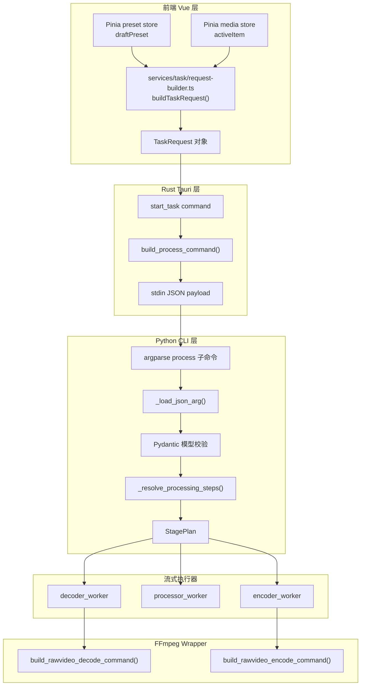
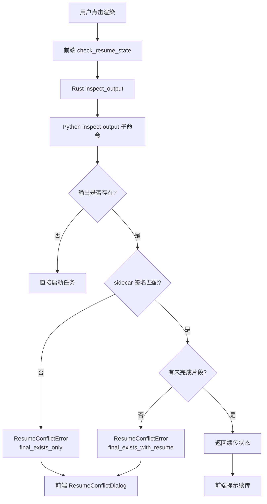

# 配置数据流与参数映射

本文档描述一条完整的视频处理任务中，用户配置如何从前端界面流转到底层 FFmpeg 执行参数，涵盖序列化、校验、规划、执行的完整链路。

## 总体数据流



## 前端层：配置构建

### 两套配置存储

前端有两套配置存储：

1. **工作台预设**（`presetStore.draftPreset`）：用户当前编辑的通用配置，自动保存到本地。包含 `decodeConfig`、`workflowConfig`、`encodeConfig`、`outputConfig`。
2. **素材级配置**（`mediaItem.decodeConfig` 等）：每个素材可以覆盖预设中的部分配置。当素材被激活编辑时，editor computed 属性优先返回素材级配置，否则回退到预设。

### TaskRequest 构建

[`frontend/src/services/task/request-builder.ts`](../frontend/src/services/task/request-builder.ts) 的 `buildTaskRequest()` 将 `MediaItem` 转换为 `TaskRequest`：

```typescript
export function buildTaskRequest(item: MediaItem, resumeMode?: ResumeMode): TaskRequest {
  return {
    inputPath: item.inputPath,
    decodeConfig: item.decodeConfig,
    workflowConfig: item.workflowConfig,
    encodeConfig: item.encodeConfig,
    outputConfig: item.outputConfig,
    ...(resumeMode ? { resumeMode } : {}),
  }
}
```

`TaskRequest` 结构由 Rust `models/task.rs` 定义，通过 `ts-rs` 生成 TypeScript 类型。

## Rust 层：序列化与命令构建

### build_process_command

[`frontend/src-tauri/src/tasks/builder.rs`](../frontend/src-tauri/src/tasks/builder.rs) 构建启动 Python 子进程的命令：

1. 解析 `ResolvedRuntimePaths` 获取 Python 可执行文件路径
2. 构建命令行：`python -m app process --input <path> ...`
3. 将 `TaskRequest` 序列化为 JSON，通过 stdin 传递给 Python

关键设计：spawn 后立即写 stdin，避免 Python 等待 stdin 输入而阻塞。stdin 写入在单独的异步 task 中完成，与 stdout reader 并发执行。

### build_inspect_output_args

续传预检使用类似的命令构建逻辑，但调用 `inspect-output` 子命令而非 `process`。

## Python 层：解析与规划

### 配置解析

[`backend/app/cli/commands/process.py`](../backend/app/cli/commands/process.py)：

1. 从 stdin 读取 JSON payload
2. 使用 Pydantic 模型反序列化（`DecodeConfig`、`WorkflowConfig`、`EncodeConfig`、`OutputConfig`）
3. 字段名自动转换：Pydantic 的 `alias_generator` 将 camelCase 转为 snake_case

### 处理步骤规划

`_resolve_processing_steps()` 解析工作流配置，生成处理步骤列表：

- 预处理步骤（`pre_steps`）：滤镜链（裁剪、缩放、降噪、锐化、色彩调整、填充）
- 插帧步骤（`interpolation_step`）：可选，RIFE 补帧
- 后处理步骤（`post_steps`）：滤镜链

### StagePlan 构建

[`backend/app/planning/stage_plan.py`](../backend/app/planning/stage_plan.py) 的 `build_stage_plan()`：

1. 计算总输出帧数（考虑插帧倍数）
2. 计算总编码帧数
3. 计算插帧对数
4. 返回 `StagePlan` 结构

```python
@dataclass(slots=True)
class StagePlan:
    pre_steps: list[dict]
    interpolation_step: dict | None
    post_steps: list[dict]
    total_output_frames: int
    total_encoded_frames: int
    total_pairs: int
```

## 参数四层映射

### 解码参数

| 前端字段 | Rust 字段 | Python 字段 | FFmpeg 参数 |
|----------|-----------|-------------|-------------|
| `hwAccel` | `hw_accel` | `hw_accel` | `-hwaccel` |
| `decoder` | `decoder` | `decoder` | `-c:v` (解码器) |
| `pixFmt` | `pix_fmt` | `pix_fmt` | `-pix_fmt` |
| `startFrame` | `start_frame` | `start_frame` | `-ss` |
| `endFrame` | `end_frame` | `end_frame` | `-to` |

### 编码参数

| 前端字段 | Rust 字段 | Python 字段 | FFmpeg 参数 |
|----------|-----------|-------------|-------------|
| `encoder` | `encoder` | `encoder` | `-c:v` |
| `crf` | `crf` | `crf` | `-crf` |
| `preset` | `preset` | `preset` | `-preset` |
| `bitrate` | `bitrate` | `bitrate` | `-b:v` |
| `fps` | `fps` | `fps` | `-r` |
| `keepAudio` | `keep_audio` | `keep_audio` | 音频流处理 |
| `audioCodec` | `audio_codec` | `audio_codec` | `-c:a` |

### 工作流参数

| 前端字段 | Rust 字段 | Python 字段 | 算法影响 |
|----------|-----------|-------------|---------|
| `interpolation.enabled` | `interpolation.enabled` | `interpolation.enabled` | 启用 RIFE 插帧 |
| `interpolation.multi` | `interpolation.multi` | `interpolation.multi` | 插帧倍数（2/3/4） |
| `interpolation.modelVersion` | `interpolation.model_version` | `interpolation.model_version` | RIFE 模型版本 |
| `superResolution.enabled` | `super_resolution.enabled` | `super_resolution.enabled` | 启用超分辨率 |
| `superResolution.scaleFactor` | `super_resolution.scale_factor` | `super_resolution.scale_factor` | 放大倍数 |
| `superResolution.onnxModel` | `super_resolution.onnx_model` | `super_resolution.onnx_model` | ONNX 模型路径 |

### 输出参数

| 前端字段 | Rust 字段 | Python 字段 | 作用 |
|----------|-----------|-------------|------|
| `outputDirectory` | `output_directory` | `output_directory` | 输出目录 |
| `filenamePattern` | `filename_pattern` | `filename_pattern` | 文件名模板 |
| `containerFormat` | `container_format` | `container_format` | 容器格式（mp4/mkv/mov） |
| `segmentFrames` | `segment_frames` | `segment_frames` | 分段帧数阈值 |
| `resumeMode` | `resume_mode` | `resume_mode` | 续传模式（auto/force-fresh/force-resume） |

## 续传状态流转



## 进度数据流

```mermaid
graph LR
    A[FFmpeg stderr] --> B[Python _progress.py]
    B --> C[Python reporter.py]
    C --> D[NdjsonEmitter.progress()]
    D --> E[stdout NDJSON]
    E --> F[Rust stdout reader]
    F --> G[app_handle.emit]
    G --> H[前端 task-progress 事件]
    H --> I[services/task/events.ts]
    I --> J[Pinia media store]
    J --> K[UI 进度条更新]
```

### 多阶段进度

进度报告包含 `stage_index` 和 `stage_total`，前端据此显示当前阶段和总阶段数。典型流程：

1. Stage 1: 解码 / 预处理
2. Stage 2: 增强（插帧/超分）
3. Stage 3: 编码 / 后处理

## Watchdog 数据流

```mermaid
graph LR
    A[stdout reader] --> B[progress_beat 更新]
    B --> C[Arc<AtomicU64>]
    D[Watchdog] --每秒轮询--> C
    D --> E{超时?}
    E -->|是| F[cancel_token.cancel(Stalled)]
    E -->|否| G[继续轮询]
    F --> H[Controller 终止任务]
```

Watchdog 配置：
- 默认超时：`VP_TASK_STALL_TIMEOUT_SECS` 环境变量，默认 600 秒
- 轮询间隔：5 秒
- `VP_TASK_STALL_TIMEOUT_SECS=0` 禁用 Watchdog
