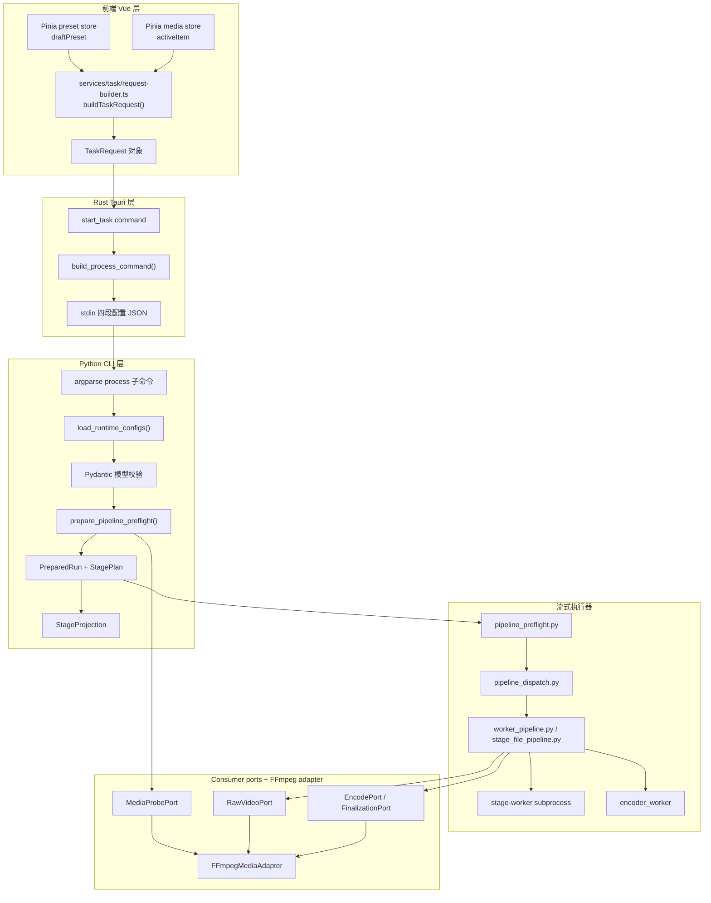
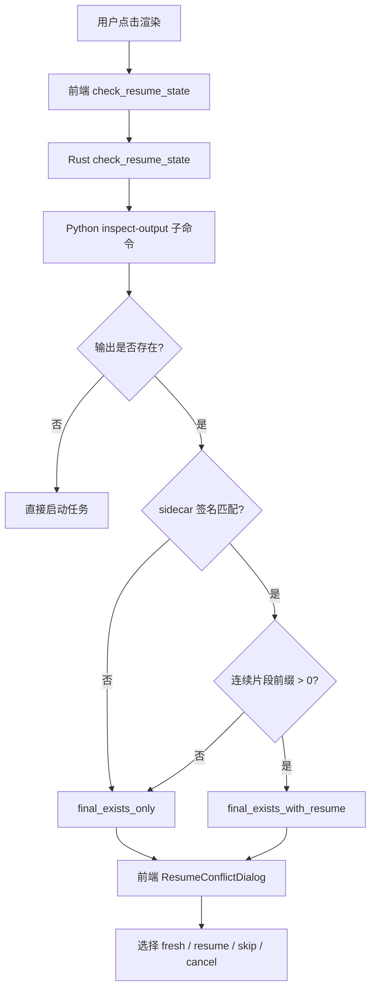

# 配置数据流与参数映射

本文档描述一条完整的视频处理任务中，用户配置如何从前端界面流转到底层 FFmpeg 执行参数，涵盖序列化、校验、规划、执行的完整链路。

## 总体数据流



`stage-worker` 通过参数接收生成的 `StageWorkerConfig`，只消费 stdin rawvideo、输出 stdout
rawvideo，并在 stderr 以 manifest v4 的 `stageWorkerEventPrefix` 上报生成的 progress/error event。
父进程对单行设置 1 MiB 上限并只解析该前缀后的 JSON；FFmpeg decoder/encoder 与 finalization
port 由父流水线消费，worker 不穿透 adapter。

## 前端层：配置构建

### 两套配置存储

前端有两套配置存储：

1. **工作台预设**（`presetStore.draftPreset`）：用户当前编辑的通用配置，自动保存到本地。包含 `decodeConfig`、`workflowConfig`、`encodeConfig`、`outputConfig`。
2. **素材级配置**（`mediaItem.decodeConfig` 等）：每个素材可以覆盖预设中的部分配置。当素材被激活编辑时，editor computed 属性优先返回素材级配置，否则回退到预设。

### TaskRequest 构建

[`frontend/src/services/task/request-builder.ts`](../frontend/src/services/task/request-builder.ts) 的 `buildTaskRequest()` 将 `MediaItem` 转换为 `TaskRequest`：

```typescript
export function buildTaskRequest(item: MediaItem, resumeMode?: ResumeMode): TaskRequest {
  return {
    inputPath: item.inputPath,
    decodeConfig: item.decodeConfig,
    workflowConfig: item.workflowConfig,
    encodeConfig: item.encodeConfig,
    outputConfig: item.outputConfig,
    ...(resumeMode ? { resumeMode } : {}),
  }
}
```

`TaskRequest` 结构由 `contracts/task-request.schema.json` 定义，各语言只在边界使用生成或校验后的类型。

## Rust 层：序列化与命令构建

### build_process_command

[`frontend/src-tauri/src/tasks/builder.rs`](../frontend/src-tauri/src/tasks/builder.rs) 构建启动 Python 子进程的命令：

1. 解析 `ResolvedRuntimePaths` 获取 Python 可执行文件路径
2. 通过生成的 `StartTaskSpec` 取得 `process` subcommand、stdin 类型、10 秒写入期限和 5 秒回收期限
3. 构建命令行：`python -m app process --input <path> --config-stdin`，可选追加
   `--resume-mode`
4. 从 `TaskRequest` 提取 `{ decode, workflow, encode, output }` 四段配置并序列化到 stdin

关键设计：spawn 后立即写 stdin，避免 Python 等待 stdin 输入而阻塞。stdin 写入在单独的异步 task 中完成，与 stdout reader 并发执行。

### build_inspect_output_args

续传预检使用类似的命令构建逻辑，但调用 `inspect-output` 子命令而非 `process`。

## Python 层：解析与规划

### 配置解析

[`backend/app/cli/commands/process.py`](../backend/app/cli/commands/process.py)：

1. 从 stdin 读取 JSON payload
2. 使用 `datamodel-code-generator` 生成的 Pydantic 模型严格反序列化
3. `RuntimeConfigs` 保存类型化配置，只在 adapter/signature/worker 边界投影 camelCase JSON

### 处理步骤规划

`StageProjection.resolve_workflow()` 先统一计算 target FPS 对应的插帧倍数，再以唯一顺序构造不可变
步骤描述，并同时返回已解析 workflow、projection 与可选编码 FPS。preflight 对源媒体调用
`projection.stages()` 恰好一次，直接物化 `StagePlan`，执行路径不再从 workflow 或 steps 重建投影。
步骤包含：

- 可选预处理滤镜链
- 按 `processOrder` 排列的插帧和超分辨率步骤
- 可选后处理滤镜链

### StagePlan 构建

[`backend/app/planning/stage_plan.py`](../backend/app/planning/stage_plan.py) 的 `StagePlan` 保存源
`VideoMetadata`、完整 `ProjectedStage` tuple 与可选编码 FPS override。步骤顺序、每阶段输入/输出
帧数、几何、最终 FPS、编码帧数和插帧步骤均由该 tuple 派生：

```python
@dataclass(frozen=True, slots=True)
class StagePlan:
    source: VideoMetadata
    stages: tuple[ProjectedStage, ...]
    encoder_fps_override: float | None
```

`prepare_pipeline_preflight()` 将它与输出路径、签名和恢复预检一起封装为不可变 `PreparedRun`；
`PreparedRun.processing_steps` 和 `final_output_fps` 只投影 `StagePlan` 中的事实，不重复存储。
`process` 和 `inspect-output` 共享这份准备结果。reporter、callback 和 metrics 属于运行期 observers，
不进入静态计划。文件流水线选择和恢复帧数也只在 `StagePlan` 派生一次，dispatch、raw 与
stage-file 执行路径不再各自维护判断函数；resume/chunk 只投影局部帧数，不重算顺序、尺寸或 FPS。

## 边界字段与执行映射

### 解码参数

| JSON Schema 字段 | Rust/Python 领域字段 | FFmpeg 作用 |
|------------------|----------------------|-------------|
| `mode` | `mode` | 选择软件/硬件解码 profile |
| `hwaccel` | `hwaccel` | `-hwaccel` |
| `hwaccelDevice` | `hwaccel_device` | `-hwaccel_device` |
| `decoder` | `decoder` | 输入 `-c:v` |
| `options` | `options` | profile 允许的附加参数 |

### 编码参数

| JSON Schema 字段 | Rust/Python 领域字段 | FFmpeg 作用 |
|------------------|----------------------|-------------|
| `codec` | `codec` | 输出 `-c:v` |
| `family` | `family` | 选择编码能力 profile |
| `container` | `container` | 输出容器/扩展名 |
| `keepAudio` | `keep_audio` | 最终音频提取与合并 |
| `rateControl` | `rate_control` | `crf / cq / qp / bitrate` |
| `options` | `options` | profile 允许的附加参数 |

### 工作流参数

| 前端字段 | Rust 字段 | Python 字段 | 算法影响 |
|----------|-----------|-------------|---------|
| `interpolation.enabled` | `interpolation.enabled` | `interpolation.enabled` | 启用 RIFE 插帧 |
| `interpolation.multi` | `interpolation.multi` | `interpolation.multi` | 插帧倍数（2/3/4） |
| `interpolation.model` | `interpolation.model` | `interpolation.model` | RIFE 模型版本 |
| `interpolation.tensorBackend` | `tensor_backend` | `tensor_backend` | PyTorch/Paddle/ONNX 后端 |
| `interpolation.engine` | `engine` | `engine` | cuda/tensorrt/dcu |
| `superResolution.enabled` | `super_resolution.enabled` | `super_resolution.enabled` | 启用超分辨率 |
| `superResolution.scaleFactor` | `super_resolution.scale_factor` | `super_resolution.scale_factor` | 放大倍数 |
| `superResolution.onnxModel` | `super_resolution.onnx_model` | `super_resolution.onnx_model` | ONNX 模型路径 |
| `superResolution.numFrames` | `super_resolution.num_frames` | `super_resolution.num_frames` | PaddleGAN 帧序列窗口/块大小 |

### 输出参数

| 前端字段 | Rust 字段 | Python 字段 | 作用 |
|----------|-----------|-------------|------|
| `outputDir` | `output_dir` | `output_dir` | 输出目录 |
| `openOnComplete` | `open_on_complete` | `open_on_complete` | 完成后打开输出位置 |
| `segmentFrames` | `segment_frames` | `segment_frames` | 分段帧数阈值 |
| `TaskRequest.resumeMode` | `resume_mode` | `resume_mode` | `auto / force-fresh / force-resume` |

## 续传状态流转



用户选择 `resume` 时前端显式发送 `force-resume`，选择 `fresh` 时发送 `force-fresh`；默认
`auto` 只用于首次预检后的普通启动，不会被用来重放已确认的冲突。

## 进度数据流

```mermaid
graph LR
    A[FFmpeg stderr] --> B[Python _progress.py]
    B --> C[Python reporter.py]
    C --> D[NdjsonEmitter.emit typed progress]
    D --> E[stdout NDJSON]
    E --> F[Rust stdout reader]
    F --> G[app_handle.emit]
    G --> H[前端 task-progress 事件]
    H --> I[services/task/events.ts]
    I --> J[Pinia media store]
    J --> K[UI 进度条更新]
```



### 多阶段进度

进度报告包含 `stage_index` 和 `stage_total`，前端据此显示当前处理步骤及步骤总数。规划出的每个
preprocess filter chain、插帧、超分和 postprocess filter chain 各占一个 stage；顺序与
`StagePlan.stages` 中的 step 顺序完全一致。解码与编码是这些 stage 的 I/O 边界，不另维护一套阶段序号。

## Watchdog 数据流

```mermaid
graph LR
    A[stdout reader] --> B[progress_beat 更新]
    B --> C[Arc Mutex Instant]
    D[Watchdog] --每 5 秒轮询--> C
    D --> E{超时?}
    E -->|是| F[cancel_token.cancel(Stalled)]
    E -->|否| G[继续轮询]
    F --> H[TaskSupervisor 终止进程组]
```

Watchdog 配置：
- 默认超时：`VP_TASK_STALL_TIMEOUT_SECS` 环境变量，默认 600 秒
- 轮询间隔：5 秒
- `VP_TASK_STALL_TIMEOUT_SECS=0` 禁用 Watchdog
