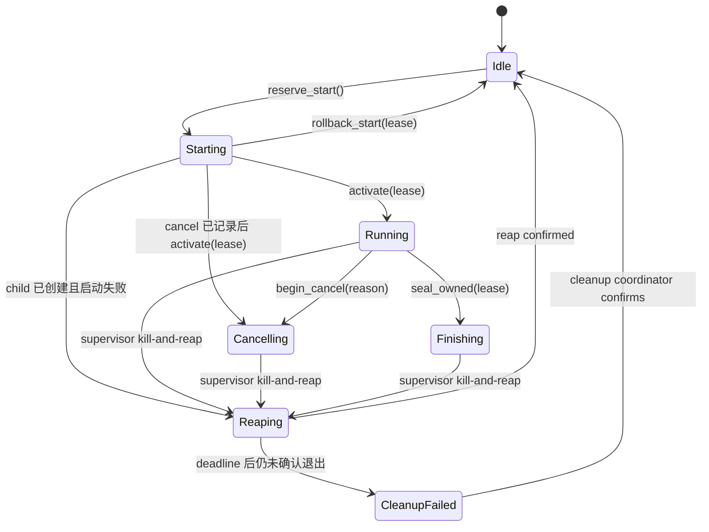
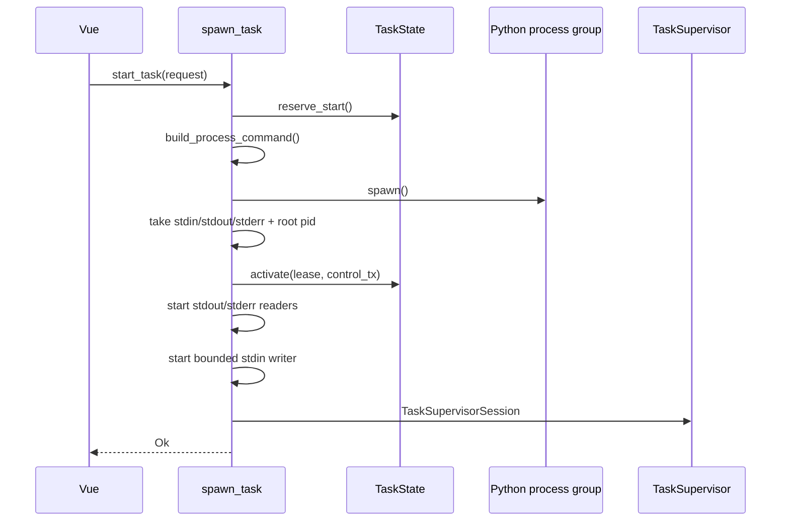
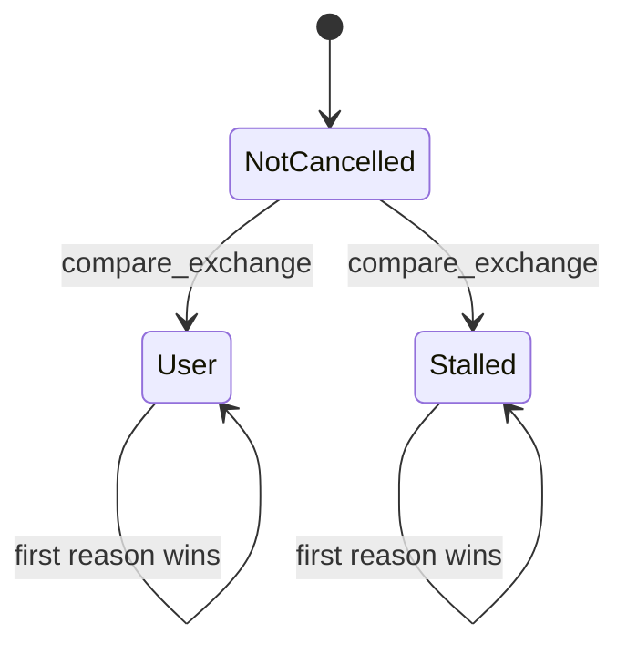
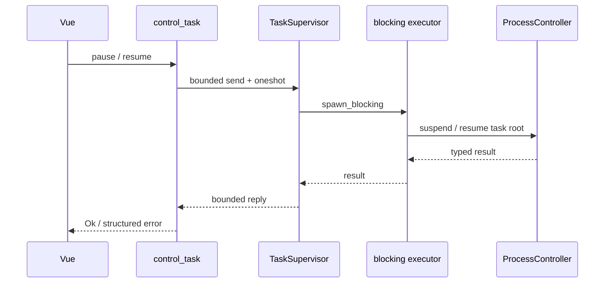

# 任务生命周期与状态机

## 七阶段生命周期

[`frontend/src-tauri/src/tasks/state.rs`](../frontend/src-tauri/src/tasks/state.rs) 用一个
`Mutex<TaskStatePhase>` 管理单任务槽：

| 状态 | 所有权 | 合法行为 |
|------|--------|----------|
| `Idle` | 无 | `reserve_start()` |
| `Starting { lease }` | 启动租约和取消 token | activate、按 lease 回滚、记录首次取消 |
| `Running` | 租约、控制 sender、取消 token | pause、resume、cancel、seal |
| `Cancelling` | 同一任务仍持有槽位 | 等待 supervisor 回收并终结 |
| `Finishing` | 已观察到 terminal/退出的同一任务 | 拒绝控制，排空 reader 后终结 |
| `Reaping` | 稳定进程 owner 与 reap ticket | 拒绝新任务和控制，等待确认退出 |
| `CleanupFailed` | 同一 lease 的未确认回收 | 保持槽位关闭，等待 cleanup coordinator |

`reserve_start()` 在任何命令构建或 spawn 副作用前执行。第二个 start 在 `Starting` 阶段就被拒绝，
不会出现“子进程已创建但任务未登记”的窗口。

## StartLease 规则

每个 `StartLease` 包含单调 id 和该任务唯一的 `CancellationToken`：

- `activate()` 只接受当前 lease，并在 child、pipe 和 root pid 均已取得后发布 control sender 与
  `Running` 阶段。
- 任一启动失败都先杀死并回收已创建的进程组，再调用 `rollback_start(lease)`。
- startup 期间到达的 cancel 直接写入 lease token；activate 后状态成为 `Cancelling`。
- `cancel_owned()` 让 watchdog 只能取消自己监管的 lease。
- `seal_owned()` 只允许当前 `Running` lease 进入 `Finishing`；此后 pause、resume 和 cancel
  返回 `AlreadyFinishing`，终态仍由同一 supervisor 仲裁。
- `finish_once()` 只接受当前已激活 lease。回调在状态锁内先提交终态，再把槽位置为 `Idle`；
  过期 supervisor 不能终结新任务，也不能重复发终态。
- `begin_reaping()` 在 kill 后继续占有槽；若 5 秒内不能确认退出，`fail_cleanup_once()` 提交至多
  一个失败终态并进入 `CleanupFailed`。只有同一 ticket 的 `confirm_cleanup()` 能稍后开放槽位。

状态层只返回 `TaskStateError`。`tasks/commands.rs` 是唯一把
`AlreadyRunning`、`StartLeaseExpired`、`NoActiveTask`、`StillStarting`、`AlreadyCancelling`、
`AlreadyFinishing`、`Reaping`、`CleanupFailed`
映射为 `ShellError` 的命令 adapter。

## 启动流程

仓库自有的 `ProcessGroupChild` 让 kill 作用于整个进程组/job；Windows spawn 使用无控制台窗口标志。stdout/stderr
reader 在写入潜在的大 stdin payload 前启动，避免三 pipe 死锁；stdin 写入超时为 10 秒。

## TaskSupervisor 结构化所有权

[`frontend/src-tauri/src/tasks/controller.rs`](../frontend/src-tauri/src/tasks/controller.rs) 的
`TaskSupervisorSession` 一次接管：

- backend child 进程组和 root pid；
- start lease；
- control/output channel；
- stdin writer、stdout reader、stderr reader；
- `StderrCapture`；
- cancellation token；
- progress beat 与 watchdog。

reader 只负责观察和分类，不直接发送终态。supervisor 在同一个 `tokio::select!` 循环中等待
reader 消息、进程退出、取消、暂停/恢复结果、watchdog 和各类 deadline。`controller.rs` 与
`readers.rs` 不导入 Tauri；它们只依赖 `TaskEventSink`、`TaskLifecyclePort` 和 Tokio，唯一 Tauri
实现位于 `ports.rs` 并由 `spawn.rs` 注入。supervisor 被 abort 或
panic 时，child 的 kill-on-drop owner 先请求终止，再把稳定 group/job handle 交给进程级 cleanup
coordinator。协调器持有自己的线程 join handle，持续保有未退出的 child，并通过 `ReapTicket` 发布
`Reaped/Failed`；join monitor 按原 lease 提交至多一个 `process_failed`，只有确认回收才释放任务槽。

## NDJSON 与终态仲裁

`TerminalState` 保存一个 candidate：

- `Completed(TaskCompletedPayload)`
- `BackendError(TaskErrorPayload)`
- `SupervisorError(TaskErrorPayload)`

仲裁规则：

1. 第一个 supervisor/protocol 错误保持 sticky。
2. 第二个 completed/error envelope 是协议违规，升级为 `schema_mismatch` 并 kill。
3. backend error 原样保留，优先于进程非零 exit status。
4. completed 只有在进程成功退出时有效。
5. 成功退出但无 terminal envelope 是 `schema_mismatch`；非零退出且无 backend error 是
   `runtime_panic`；wait 失败是 `process_failed`。
6. schema mismatch、pipe failure、terminal 后 5 秒仍不退出都会触发进程组 kill。
7. 进程退出后，supervisor 最多等待 5 秒排空 reader，再 join 三个 pipe task；排空或 join 失败
   会覆盖先前 completed。
8. 最终通过 `TaskState.finish_once(lease, emit)` 发送恰好一个事件，然后才释放任务槽。

stderr 使用 400 行/64 KiB 滚动缓冲，写入 error details 前再截为 8 KiB。无结构化 backend error
的崩溃会把摘要写入 `task-error.details.traceback`。每条 stdout/stderr 行上限为 1 MiB；这些大小、
stdin/one-shot deadline 和 5 秒回收期限都来自 manifest v3 生成 spec。

## 取消状态

[`frontend/src-tauri/src/tasks/cancellation.rs`](../frontend/src-tauri/src/tasks/cancellation.rs) 使用
一个 `AtomicU8` 同时表达“未取消 / User / Stalled”，不维护独立布尔值：

CAS 胜者写入首个原因并通过 `Notify` 唤醒所有 waiter；后续原因不能覆盖它。用户 cancel 在
`TaskState` 锁内同时完成生命周期转换和原因写入，supervisor 观察 token 后终止并回收进程组。
取消原因最终优先于其他 terminal candidate：

- `User` → `task-cancelled { reason: "user" }`
- `Stalled` → `task-cancelled { reason: "stalled", details? }`

## 暂停与恢复

`control_task({ kind: "pause" | "resume" })` 从当前 task-bound state 取得 control sender，通过
容量为 8 的 channel 发送 `TaskControlMessage`，并等待 typed oneshot reply：

- command 发送与 reply 各有 5 秒上限；
- supervisor 内 OS 操作有 4 秒上限，保留 1 秒给 reply 传递；
- Windows 以进程句柄和 creation FILETIME 校验 root/后代身份，恢复只使用暂停期间保留并校验
  owner/creation time 的线程句柄；
- Linux 固定点枚举任务树，为每个成员保留 pidfd，并校验 `/proc` 启动时间、parent link 与 PGID；
  暂停/恢复只向这些稳定句柄发信号；
- macOS 没有等价的稳定信号句柄，pause/resume 明确返回 `Unsupported`；cancel 与进程组回收仍可用；
- 无法证明身份一致时 fail closed，不使用旧 PID/TID 继续控制；
- OS 扫描在 `spawn_blocking` 执行，取消观察不会被同步系统调用阻塞；
- pause/resume 对 supervisor 当前 pause 状态幂等，取消后拒绝新控制；
- control 超时或 terminal 与 blocking 操作竞态时，supervisor 继续拥有 worker，并按操作开始前的
  pause 状态执行补偿；补偿失败或状态无法确定会终止任务，绝不遗留无人监管的暂停进程。

## Watchdog

stdout reader 只在收到合法 `progress` envelope 时更新共享 `Instant`。supervisor 默认每 5 秒检查：

- `VP_TASK_STALL_TIMEOUT_SECS` 未设置或非法：600 秒；
- 值为 `0`：禁用；
- 超时：以当前 lease 调用 `cancel_owned(..., Stalled)` 并 kill 进程组。

如果 lease 已失效，watchdog 不能影响新任务。

## 前端控制请求生命周期

前端 `BatchState.controlPending` 保存未决的 `pause | resume | cancel`。每个控制 attempt 记录单调
token 和开始时的 `currentId`；异步回复只有在 token、任务 ID、运行态和 pending kind 仍匹配时
才能提交或回滚。过期回复不会覆盖新任务，也不会清空更新的控制状态。终态 reducer 随后把
`controlPending`、pause/cancelling 标记和当前任务上下文统一清理。

续传冲突的用户选择也使用显式模式：`resume` 重新启动时发送 `force-resume`，`fresh` 发送
`force-fresh`；`skip` 只推进队列，`cancel` 终止批次。不会用默认 `auto` 再次进入同一冲突。
