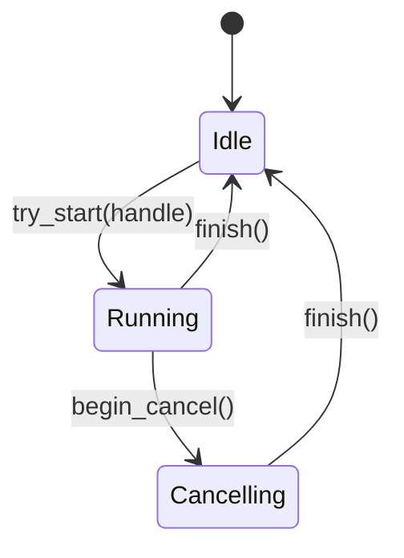
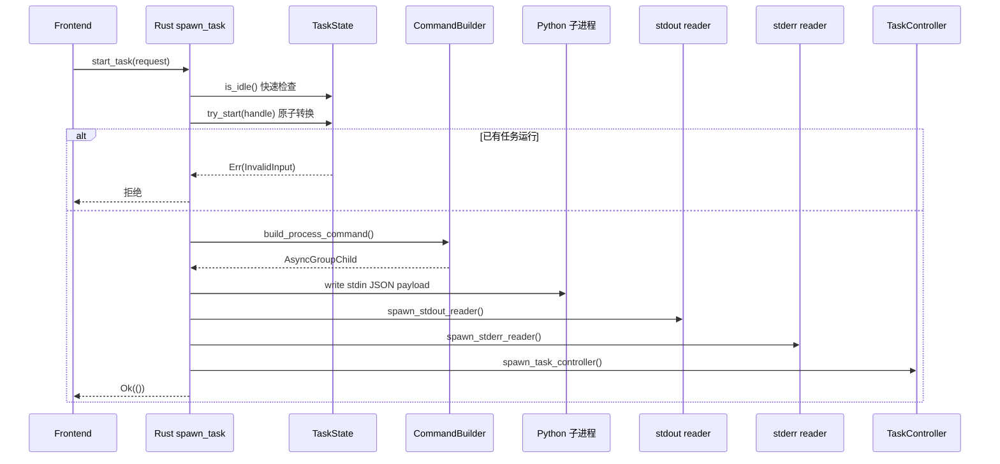
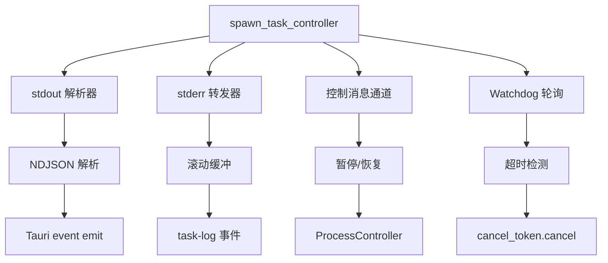
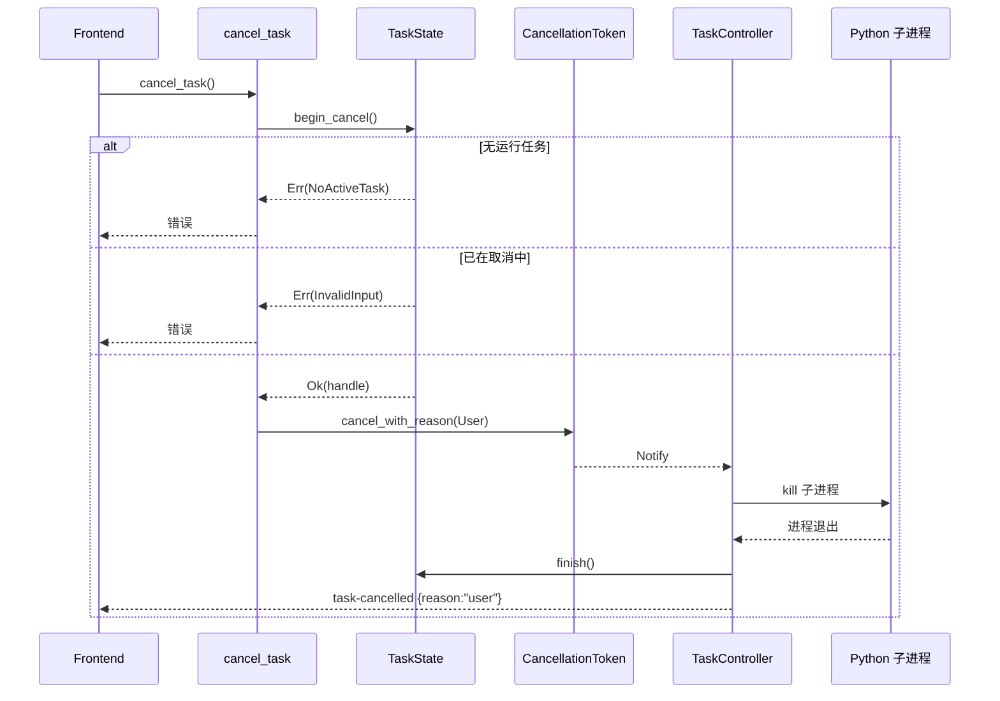
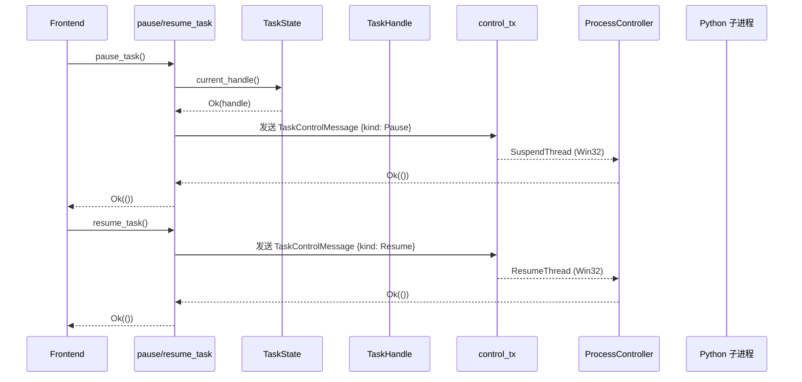

# 任务生命周期与状态机

## TaskStatePhase 状态机

[`frontend/src-tauri/src/tasks/state.rs`](../frontend/src-tauri/src/tasks/state.rs) 定义三阶段状态机：



### 三阶段说明

| 阶段 | 说明 | 合法转换 |
|------|------|---------|
| `Idle` | 无任务运行 | `try_start`（转入 Running） |
| `Running { handle }` | 任务正常运行 | `begin_cancel`（转入 Cancelling）或 `finish`（回到 Idle） |
| `Cancelling { handle, started_at }` | 取消请求已接受，等待子进程退出 | `finish`（回到 Idle） |

`started_at` 仅用于可观测性 —— Watchdog 可能用它来决定是否升级终止手段（如 SIGKILL）。

### 原子转换

所有转换在 `Mutex<TaskStatePhase>` 保护下执行：

```rust
pub async fn try_start(&self, handle: TaskHandle
) -> Result<(), ShellError>

pub async fn begin_cancel(&self
) -> Result<TaskHandle, ShellError>

pub async fn finish(&self)
```

- `try_start` 拒绝双启动：若当前不是 Idle，返回 `InvalidInput`
- `begin_cancel` 拒绝重复取消：若已在 Cancelling，返回 `"already being cancelled"`
- `finish` 可从任何阶段回到 Idle，是清理的统一出口

### 测试覆盖

`state.rs` 包含 7 个异步单元测试，覆盖所有状态转换路径：
- 新鲜状态为 Idle
- try_start Idle → Running
- try_start 拒绝重复启动
- begin_cancel Running → Cancelling
- begin_cancel 拒绝重复取消
- current_handle 在 Cancelling 阶段可读
- finish 从 Running / Cancelling 回到 Idle

## spawn_task 启动流程



### 关键设计决策

- **进程组管理**：使用 `command-group` crate 的 `AsyncGroupChild`，确保子进程及其所有后代都被正确管理
- **Windows 无窗口**：通过 `CREATE_NO_WINDOW` 标志隐藏 Python 控制台窗口
- **stdin 立即写入**：spawn 后立即写入 JSON payload，避免 Python 阻塞等待 stdin

## Controller 并发模型

[`frontend/src-tauri/src/tasks/controller.rs`](../frontend/src-tauri/src/tasks/controller.rs) 的 `spawn_task_controller` 启动 4 个并发异步 task：



这 4 个 task 通过 `tokio::select!` 在 Controller 中并发等待：

```rust
loop {
    tokio::select! {
        // 1. stdout 解析器完成
        _ = stdout_task => { ... }
        // 2. stderr 转发器完成
        _ = stderr_task => { ... }
        // 3. 收到控制消息
        msg = control_rx.recv() => { ... }
        // 4. cancel_token 被取消
        _ = cancel_token.notified() => { ... }
    }
}
```

### 终止事件分发

Controller 根据三个信号决定终止事件：

| 信号 | 来源 | 说明 |
|------|------|------|
| `cancel_token.reason` | 用户 / Watchdog | 取消原因 |
| `child.wait()` 结果 | 子进程 | 退出状态码 |
| `terminal_sent` | Controller 自身 | 是否已发送终止事件 |

终止事件类型：
- `cancel_token.reason == Some(User)` → `task-cancelled` {reason: "user"}
- `cancel_token.reason == Some(Stalled)` → `task-cancelled` {reason: "stalled"}
- 退出码 0 且无取消 → `task-completed`
- 退出码非 0 且无取消 → `task-error`
- stdout 解析器失败 → `task-error` {schema_mismatch}

### progress_beat 更新

stdout 解析器每解析到一行有效 NDJSON（尤其是 progress 事件），更新 `Arc<AtomicU64>` 中的时间戳。Watchdog 轮询时读取该时间戳判断是否超时。

## Watchdog Stall 检测

```mermaid
graph LR
    A[Watchdog Config] --> B{VP_TASK_STALL_TIMEOUT_SECS}
    B -->|0| C[禁用]
    B -->|>0| D[启用]
    D --> E[默认 600s]

    F[每秒轮询] --> G[读取 progress_beat]
    G --> H{超时?}
    H -->|是| I[cancel_token.cancel(Stalled)]
    H -->|否| F
    I --> J[Controller 终止]
    J --> K[emit task-cancelled<br/>{reason:"stalled"}]
```

[`frontend/src-tauri/src/tasks/controller.rs`](../frontend/src-tauri/src/tasks/controller.rs) 的 `WatchdogConfig`：

```rust
pub struct WatchdogConfig {
    pub poll_interval: Duration,      // 默认 5s
    pub stall_timeout: Option<Duration>,  // 默认 600s, None 禁用
}
```

Phase D.3.2 将 poll interval 和 stall timeout 拆分为独立配置结构，使 Watchdog 可用毫秒级超时测试，且未来可从 app settings 读取配置。

## 取消流程



### CancelReason

[`frontend/src-tauri/src/tasks/cancellation.rs`](../frontend/src-tauri/src/tasks/cancellation.rs)：

```rust
pub enum CancelReason {
    User,    // 用户按下取消按钮
    Stalled, // Watchdog 检测到 stdout 超时
}
```

CancellationToken 是手实现的（非 tokio_util），包含：
- `reason: Option<CancelReason>` — 取消原因
- `notify: Notify` — 异步通知

## 暂停/恢复流程



### 控制消息通道

Phase 5a 引入 typed reply channel：

```rust
pub struct TaskControlMessage {
    pub kind: TaskControlKind,  // Pause / Resume
    pub response: oneshot::Sender<Result<(), ProcessControlError>>,
}
```

替代了之前的 `Result<(), String>`，保留原始 `io::Error` source chain，使 `ShellError` 转换和前端 `TaskErrorCode` 路由更精确。

### 暂停状态下取消

若用户在暂停状态下请求取消：
1. `current_handle()` 在 Cancelling 阶段仍返回 handle（Phase 5d 设计）
2. Controller 的 `cancel_token.cancelled()` select 分支与 pause/resume 请求竞争
3. 无论哪个先到达，最终都走向 kill 路径
