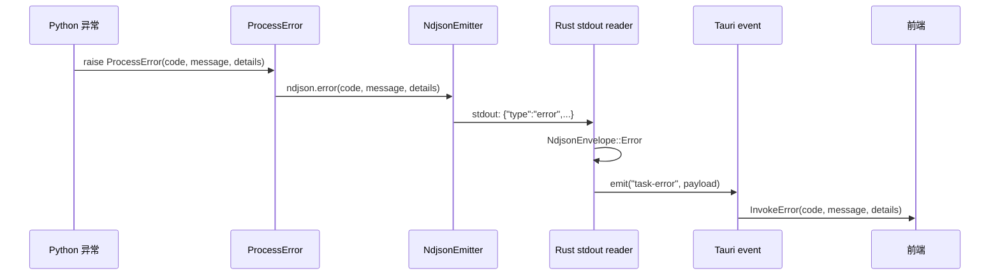
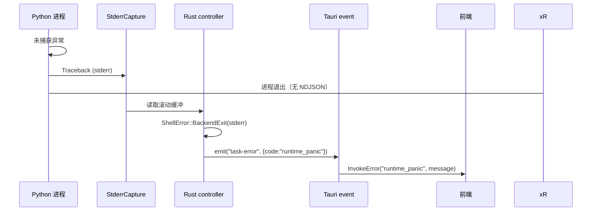

# 错误处理体系

## 设计哲学

VP Workbench 采用**结构化错误**替代字符串错误，核心原则：

1. **具名 variant 优于 catch-all**：每个失败场景对应一个具体的错误变体，便于前端按码路由
2. **三层同名枚举保证可路由性**：Python `TaskErrorCode`、Rust `TaskErrorCode`、ts-rs 生成的 TypeScript `TaskErrorCode` union 使用相同的 snake_case 字符串；`TASK_ERROR_CODES` 只保留前端实际使用的运行时别名
3. **保留 error source chain**：Rust 的 `ShellError` 保留原始 `io::Error` / `serde_json::Error`，不丢失上下文

## Rust 层：ShellError

[`frontend/src-tauri/src/error.rs`](../frontend/src-tauri/src/error.rs) 定义 10 个具名 variant（无 catch-all）：

```rust
pub enum ShellError {
    RuntimeResolution(String),      // 运行时资源解析失败
    Spawn(std::io::Error),          // 子进程 spawn 失败
    BackendExit(String),            // Python 崩溃 / 非正常退出
    NdjsonDecode(serde_json::Error), // stdout 不是有效 NDJSON
    SchemaValidation(String),       // schema 校验失败
    Persistence(String),            // 本地持久化失败
    Io(std::io::Error),             // 通用 IO 失败
    InvalidInput(String),           // 输入参数无效
    NoActiveTask,                   // 没有运行中的任务
    OpenLocation(std::io::Error),   // 打开文件/目录失败
}
```

Phase C.2.3 移除了 `Other(String)` / `From<String>` / `From<&str>` 变体，任何新失败必须选择具名 variant。

### 自定义 Serialize

```rust
impl Serialize for ShellError {
    fn serialize<S: Serializer>(&self, serializer: S
    ) -> Result<S::Ok, S::Error> {
        Wire {
            code: self.code(),
            message: &self.to_string(),
        }.serialize(serializer)
    }
}
```

序列化输出结构：`{ "code": "spawn_failed", "message": "backend spawn failed: ..." }`，前端可直接按 `code` 路由。

### code() 映射

| ShellError | TaskErrorCode |
|-----------|---------------|
| `RuntimeResolution` | `process_failed` |
| `Spawn` | `spawn_failed` |
| `BackendExit` | `runtime_panic` |
| `NdjsonDecode` | `schema_mismatch` |
| `SchemaValidation` | `schema_mismatch` |
| `Persistence` | `persistence_failed` |
| `Io` | `io_error` |
| `InvalidInput` | `invalid_input` |
| `NoActiveTask` | `invalid_input` |
| `OpenLocation` | `io_error` |

## Python 层：ProcessError

[`backend/app/errors/__init__.py`](../backend/app/errors/__init__.py)：

```python
class ProcessError(Exception):
    def __init__(
        self,
        code: TaskErrorCode,
        message: str,
        details: dict | None = None,
    ): ...

    @classmethod
    def from_exception(cls, exc: Exception) -> ProcessError:
        # 按异常类型推断错误码
```

- `from_exception` 工厂方法根据异常类型自动推断错误码
- `ImportError` → `missing_python_dependency`
- `FileNotFoundError` → `io_error`
- `ResumeConflictError` → `resume_conflict`

### 双层兜底

[`backend/app/__main__.py`](../backend/app/__main__.py)：

```python
try:
    from app.cli import main  # 导入期兜底
except Exception as exc:
    # 推断错误码，输出 NDJSON error
    sys.exit(1)

try:
    main()  # 运行期兜底
except Exception as exc:
    # 包装为 ProcessError，输出 NDJSON error
    sys.exit(1)
```

即使 Python 环境不完整（如缺失依赖），Rust 层仍能收到结构化错误信息。

## TypeScript 层：InvokeError

[`frontend/src/lib/ipc/client.ts`](../frontend/src/lib/ipc/client.ts)：

```typescript
export class InvokeError extends Error {
  readonly code: string
  readonly details: Record<string, unknown> | null

  constructor(
    code: string,
    message: string,
    details: Record<string, unknown> | null = null,
  ) {
    super(message)
    this.name = 'InvokeError'
    this.code = code
    this.details = details
  }
}
```

`normalizeInvokeError()` 处理两类错误：
1. Tauri ACL 权限拒绝（`not allowed` / `Command not found`）— 附加开发者提示
2. 通用错误 — 通过 `normalizeError()` 提取 `{ code, message, details }`

## 14 个错误码完整对照

| 错误码 | 触发场景 | 典型 details | Python 定义 | Rust 定义 | TS 定义 |
|--------|---------|-------------|------------|-----------|---------|
| `missing_ffmpeg` | FFmpeg/FFprobe 未找到 | 搜索路径 | `_codes.py` | `models/task.rs` | `errors.ts` |
| `missing_model` | 模型文件未找到 | 模型路径 | `_codes.py` | `models/task.rs` | `errors.ts` |
| `missing_tensor_backend` | PyTorch/Paddle/ONNX 未安装 | 后端名 | `_codes.py` | `models/task.rs` | `errors.ts` |
| `missing_python_dependency` | pip 包缺失 | 包名 | `_codes.py` | `models/task.rs` | `errors.ts` |
| `cancelled` | 用户取消任务 | — | `_codes.py` | `models/task.rs` | `errors.ts` |
| `process_failed` | 运行时解析失败 | 路径 | `_codes.py` | `models/task.rs` | `errors.ts` |
| `spawn_failed` | 子进程 spawn 失败 | io::Error | `_codes.py` | `models/task.rs` | `errors.ts` |
| `runtime_panic` | Python 崩溃 / 未预期退出 | stderr 内容 | `_codes.py` | `models/task.rs` | `errors.ts` |
| `invalid_input` | 输入参数无效 | 字段名 | `_codes.py` | `models/task.rs` | `errors.ts` |
| `invalid_config` | 配置校验失败 | 字段名 | `_codes.py` | `models/task.rs` | `errors.ts` |
| `resume_conflict` | 续传冲突 | 冲突详情 | `_codes.py` | `models/task.rs` | `errors.ts` |
| `io_error` | 文件系统 IO 失败 | 路径 | `_codes.py` | `models/task.rs` | `errors.ts` |
| `schema_mismatch` | NDJSON 解析失败 / schema 漂移 | 原始行 | `_codes.py` | `models/task.rs` | `errors.ts` |
| `persistence_failed` | 本地存储失败 | 路径 | `_codes.py` | `models/task.rs` | `errors.ts` |

## 跨层错误传播

### 正常路径



### 兜底路径：Python 崩溃



[`frontend/src-tauri/src/tasks/stderr.rs`](../frontend/src-tauri/src/tasks/stderr.rs) 维护滚动缓冲（400 行 / 8KB），这是崩溃后唯一的信息来源。

## 编译期一致性保证

### ts-rs 类型生成

Rust 模型使用 `#[derive(TS)]` 宏，编译时自动生成 TypeScript 类型。`cargo build` 是类型同步的触发点。

### satisfies 约束

[`frontend/src/types/protocol/events.ts`](../frontend/src/types/protocol/events.ts)：

```typescript
export const TASK_EVENT_NAMES = {
  TaskProgress: 'task-progress',
  // ...
} as const satisfies Record<string, TaskEventName>

type _VariantsCovered = TaskEventName extends _ValuesOf<typeof TASK_EVENT_NAMES> ? true : never
const _COVERAGE_CHECK: _VariantsCovered = true
```

若 Rust 新增 `TaskEventName` variant 但未同步到 `TASK_EVENT_NAMES`，`_VariantsCovered` 变为 `never`，`tsc` 编译失败。

### 形状反向锁

[`frontend/src/types/protocol/_contract_check.ts`](../frontend/src/types/protocol/_contract_check.ts) 对核心 IPC 类型做额外形状校验，防止字段增删导致的类型漂移。

### schema drift 测试

Python 测试 `test_schema_drift.py` 自动比对 `TaskErrorCode` 的字符串值：

```python
def test_error_codes_match_rust_schema():
    rust_codes = load_ts_generated_codes()
    for code in TaskErrorCode:
        assert code.value in rust_codes, f"{code.value} missing in Rust"
```

### CI 与 pre-commit

- `test.yml` GitHub Actions 工作流运行三层一致性检查
- `.pre-commit-config.yaml` 的自定义钩子在提交前检查 `TaskErrorCode`

## 错误码演进历史

| 阶段 | 时间 | 变更 |
|------|------|------|
| Phase A | 早期 | 字符串自由匹配，无结构化错误 |
| Phase B | 2026 起 | Tauri 命令返回 `Result<T, ShellError>`，前端通过 `InvokeError` 路由 |
| Phase C | Refactor | 具名 `ShellError` variant，移除 catch-all |
| Phase D | 当前 | 三层枚举对齐 + 编译期约束（`satisfies` + `_contract_check.ts` + `test_schema_drift.py`）|
