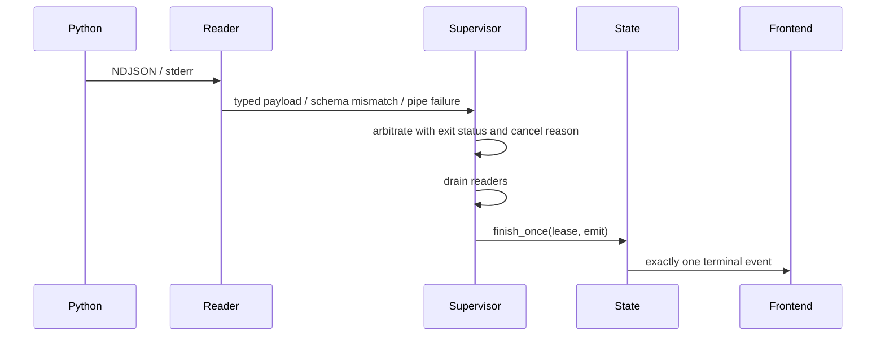

# 错误处理体系

## 原则

VP Workbench 的错误边界遵循四条规则：

1. 生产者只生成自己负责的错误码子集。
2. Python 的 `code / message / details` 穿过 Rust 时保持原样。
3. 领域错误只在命令 adapter 映射为 IPC `ShellError`。
4. JSON、schema、持久化、进程控制和 OS IO 失败按发生上下文分类，不用字符串 catch-all。

## 中立错误契约

[`contracts/backend-error-codes.schema.json`](../contracts/backend-error-codes.schema.json) 定义 Python
可发出的 11 个码：

| Code | 典型来源 |
|------|----------|
| `missing_ffmpeg` | FFmpeg/FFprobe 不可用 |
| `missing_model` | 模型权重不存在 |
| `missing_tensor_backend` | 请求的推理后端不可用 |
| `missing_python_dependency` | Python 包缺失 |
| `cancelled` | CLI 自身收到取消 |
| `process_failed` | 后端处理失败 |
| `invalid_input` | 输入路径或参数无效 |
| `invalid_config` | 配置校验/工作流组合无效 |
| `resume_conflict` | 输出和恢复状态需要用户决策 |
| `io_error` | 后端文件系统或媒体 IO |
| `persistence_failed` | 分段 manifest 或工作区持久化失败 |

[`contracts/shell-error-codes.schema.json`](../contracts/shell-error-codes.schema.json) 定义 Rust 壳可生成
的 11 个码：

| Code | 典型来源 |
|------|----------|
| `process_failed` | 运行时解析或进程控制失败 |
| `invalid_input` | 命令参数或 task state 不允许该操作 |
| `io_error` | 壳文件系统/打开位置失败 |
| `spawn_failed` | 子进程创建失败 |
| `runtime_panic` | 子进程异常退出且无 backend error |
| `schema_mismatch` | NDJSON/one-shot/持久化 schema 漂移 |
| `persistence_failed` | 原子读写或隔离失败 |
| `backend_no_json` | one-shot 成功退出但无合法 envelope |
| `controller_unavailable` | 控制 channel/reply 关闭或超时 |
| `backend_probe_failed` | one-shot 非零退出且无 backend error |
| `process_control_unsupported` | 当前平台不支持 pause/resume |

四个码在两组中重叠，因此
[`contracts/error-codes.schema.json`](../contracts/error-codes.schema.json) 的完整前端联合为 18 个
值。生成器断言完整集合严格等于两个子集的并集。

## Python：ProcessError

[`backend/app/errors/process.py`](../backend/app/errors/process.py) 的 `ProcessError` 是 Python
跨进程失败的标准形式：

```python
class ProcessError(Exception):
    def __init__(
        self,
        code: TaskErrorCode,
        message: str,
        details: dict[str, Any] | None = None,
    ) -> None: ...
```

`TaskErrorCode` 直接来自生成边界；`ProcessError.from_exception()` 与启动失败共同调用
`errors/bootstrap.py` 中只依赖标准库和 bootstrap 生成常量的错误码推断。
`ResumeConflictError` 预置 `resume_conflict` 及结构化 details。

[`backend/app/__main__.py`](../backend/app/__main__.py) 有两个防御边界：

- 导入期：在完整 app 包尚不可用时，用唯一允许的 bootstrap 手写 error envelope 报告依赖错误；
- 运行期：把未处理异常转为 `ProcessError`，构造生成的 `BackendTaskErrorPayload`，再通过
  `ndjson.emit(BackendEnvelopeType.ERROR, payload)` 发出。

正常 CLI 代码不能自行拼装 `{"type": "error"}`；架构门禁要求手写 error envelope 只剩 bootstrap
这一处。

## Rust：领域错误与 ShellError

任务状态层返回 `TaskStateError`：

`AlreadyRunning`、`StartLeaseExpired`、`NoActiveTask`、`StillStarting`、
`AlreadyCancelling`、`AlreadyFinishing`、`Reaping`、`CleanupFailed`。

只有 [`frontend/src-tauri/src/tasks/commands.rs`](../frontend/src-tauri/src/tasks/commands.rs) 将这些
领域状态映射为 `ShellError::InvalidInput` 或 `ShellError::NoActiveTask`。状态机和 supervisor
内部不依赖 IPC 错误。

[`frontend/src-tauri/src/error.rs`](../frontend/src-tauri/src/error.rs) 当前壳错误为：

```rust
enum ShellError {
    RuntimeResolution(String),
    Spawn(std::io::Error),
    BackendNoJson,
    BackendEnvelope(BackendTaskErrorPayload),
    ControllerUnavailable,
    BackendProbeFailed(String),
    ProcessControl(ProcessControlError),
    SchemaValidation(String),
    Persistence(String),
    Io(std::io::Error),
    InvalidInput(String),
    NoActiveTask,
    OpenLocation(std::io::Error),
}
```

不存在 `From<String>` 或通用 `Other(String)`。`Spawn / ProcessControl / Io / OpenLocation` 保留
原始 source chain。自定义 `Serialize` 输出 `{ code, message, details? }`：

- `BackendEnvelope` 的 code 属于 backend 子集，message/details 原样透传；
- 其他 variant 映射到 shell 子集；
- 没有 details 的壳错误不会伪造空 details。

主要映射：

| ShellError | Wire code |
|------------|-----------|
| `RuntimeResolution`、非 unsupported 的 `ProcessControl` | `process_failed` |
| `ProcessControl(Unsupported)` | `process_control_unsupported` |
| `Spawn` | `spawn_failed` |
| `BackendNoJson` | `backend_no_json` |
| `ControllerUnavailable` | `controller_unavailable` |
| `BackendProbeFailed` | `backend_probe_failed` |
| `SchemaValidation` | `schema_mismatch` |
| `Persistence` | `persistence_failed` |
| `Io`、`OpenLocation` | `io_error` |
| `InvalidInput`、`NoActiveTask` | `invalid_input` |

## TypeScript：InvokeError 与领域投影

[`frontend/src/lib/ipc/client.ts`](../frontend/src/lib/ipc/client.ts) 的 `safeInvoke()` 把 Tauri reject
规范化为 `InvokeError`。前端完整错误码类型来自生成 `TaskErrorCode`；运行时
`TASK_ERROR_CODES` 只为实际分支使用的 code 提供经 `satisfies` 校验的别名，不复制整份枚举。

`services/error/normalize.ts` 把未知 JS/Tauri 错误投影为前端 `TaskError`。环境探测由 env store
持有错误；其他操作由 issue store 按 scope 路由：

- environment issue 由环境面展示；
- task/input/encode issue 由对应工作流展示；
- preset issue 由 App 根部全局 `IssueBanner` 展示。

损坏或非 v2 预设被 Rust 隔离后返回 `schema_mismatch`；`usePresetSync()` 重置默认草稿、显示
banner，并立即保存 schema 2 默认替代。替代保存成功不清除不兼容提示；替代写入失败改为展示
具体 `persistence_failed`。常规保存使用 generation latest-wins，过期失败不能覆盖新的成功状态。

## TaskSupervisor 终态错误

长任务的 stdout/stderr reader 不发送终态，只把 observation 交给 supervisor：



优先级：

1. cancellation token 的首次原因生成 cancelled；
2. 第一个 supervisor/protocol error 保持 sticky；
3. 类型化 backend error 保留并优先于非零退出；
4. completed 仅在成功退出且 reader 排空后有效；
5. 无 terminal、重复 terminal、schema mismatch、pipe failure 和 wait/kill/drain 超时生成壳 error。

Python 未发 error 就异常退出时，Rust 生成 `runtime_panic`，把已排空的 stderr 滚动缓冲放入
`details.traceback`。

## One-shot 错误

`check`、`info`、`inspect-output` 从 stdout 尾部逆序找最后一个 schema 合法的目标 envelope：

- 合法 backend error → `BackendEnvelope`；
- 合法 success + exit 0 → 返回类型化结果；
- exit 0 但无合法结果 → `BackendNoJson`；
- 非零退出且无合法 backend error → `BackendProbeFailed`；
- 只有目标类型的坏 schema 候选 → `SchemaValidation`。

## 持久化错误分类

当前版本为环境缓存 16、工作台预设 2、分段 manifest 3：

- 文件不存在是正常 miss；
- JSON/版本不兼容数据改名隔离，不迁移或回退读取；
- 环境缓存损坏/过期后重新探测；
- 预设损坏/版本不匹配返回 `schema_mismatch`，隔离失败或读写失败返回
  `persistence_failed`；
- v3 分段 manifest 无效时执行准备会隔离整个 sidecar，恢复检查只把它视为不可用。

## 一致性门禁

- `python scripts/generate_contracts.py --check`：验证 schema、外部 `$ref`、错误码并集和所有生成物
  的逐字节 freshness。
- `python scripts/check_architecture_contracts.py`：验证 typed error emission、命令面、依赖方向和
  未消费导出。
- Rust 单测：覆盖 backend error 原样透传、ShellError 映射、schema mismatch kill、stderr 排空和
  终态恰好一次。
- Python schema drift 测试：覆盖生成模型、未知字段拒绝和 wire alias。
- 前端单测：覆盖 InvokeError、preset banner 和过期异步回复不会覆盖新状态。
