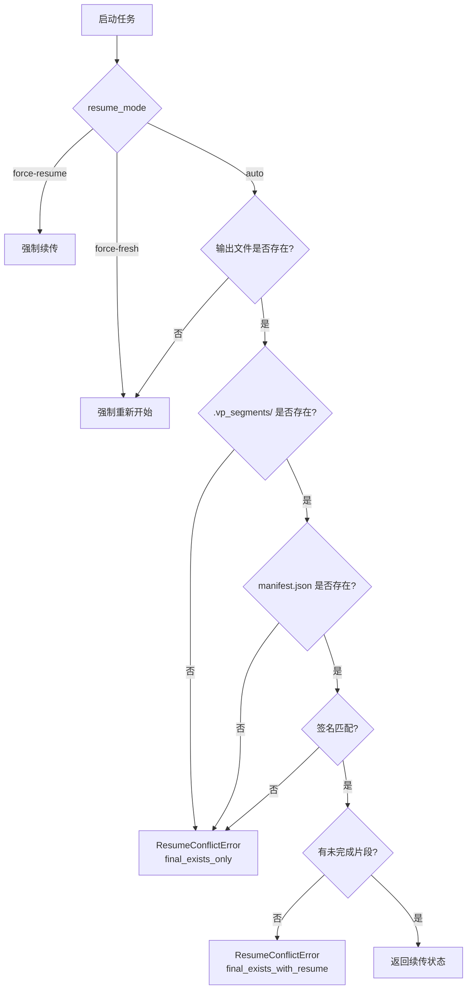
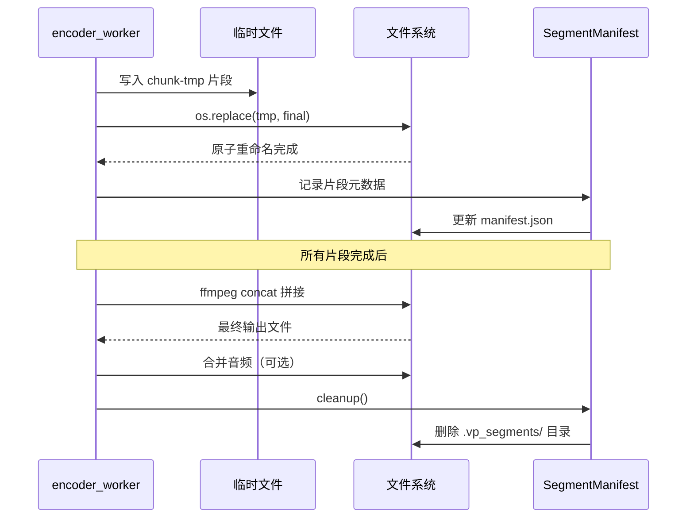
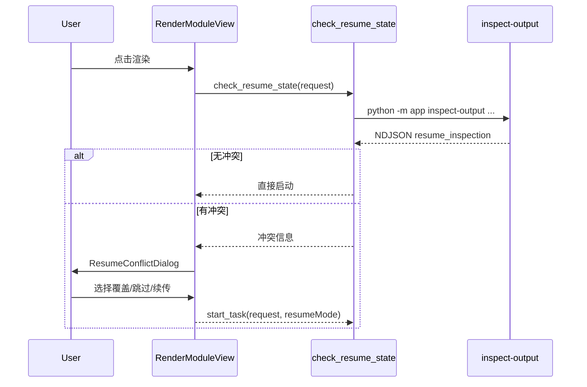

# 断点续传机制

## 设计目标

VP Workbench 的断点续传遵循三个核心设计原则：

1. **不依赖数据库**：续传状态存储在文件系统本身，无需外部依赖
2. **文件名自描述**：片段文件名编码帧范围信息，人类可读且机器可解析
3. **连续前缀保证一致性**：只承认连续前缀内的片段为有效，非连续片段自动清理

## SegmentManifest 目录结构

当任务启用分段输出时，在输出目录旁创建 `.vp_segments/` 子目录：

```
output.mp4
.vp_segments/
├── manifest.json              # 续传元数据
├── chunk-0001-out0-499-src500.mp4    # 第 1 段：输出帧 0-499，下一源帧 500
├── chunk-0002-out500-999-src1000.mp4 # 第 2 段：输出帧 500-999，下一源帧 1000
└── chunk-0003-out1000-1499-src1500.mp4 # 第 3 段：输出帧 1000-1499，下一源帧 1500
```

### 片段文件名编码规范

```
chunk-{序号}-out{起始输出帧}-{结束输出帧}-src{下一源帧}.{扩展名}
```

| 字段 | 说明 |
|------|------|
| `序号` | 片段序号，4 位零填充 |
| `起始输出帧` | 该片段第一帧在整体输出中的位置 |
| `结束输出帧` | 该片段最后一帧在整体输出中的位置 |
| `下一源帧` | 处理完该片段后，源视频应继续的帧位置 |
| `扩展名` | 与最终输出相同的容器格式 |

### manifest.json 内容

```json
{
  "signature": "sha256_hash_of_config",
  "completed_segments": [
    {"index": 1, "frame_count": 500, "start_output_frame": 0, "end_output_frame": 499},
    {"index": 2, "frame_count": 500, "start_output_frame": 500, "end_output_frame": 999}
  ],
  "completed_output_frames": 1000,
  "start_source_frame": 1000
}
```

## 配置签名

[`backend/app/planning/stage_plan.py`](../backend/app/planning/stage_plan.py) 的 `build_signature()` 对以下参数计算 SHA-256 哈希：

- 输入文件绝对路径
- 输出文件绝对路径
- 解码配置（decode_config）
- 编码配置（encode_config）
- 工作流配置（workflow_config）
- 输出配置（output_config）
- 处理步骤列表（processing_steps）
- 视频元信息（宽度、高度、源 fps、源帧数）

签名用途：
- **续传时判断配置是否变更**：若签名与 sidecar 中的签名不匹配，说明用户修改了配置，不能续传
- **防止误续传**：避免不同视频或不同配置使用相同输出路径时错误续传

## 续传决策矩阵

[`backend/app/planning/manifest.py`](../backend/app/planning/manifest.py) 的 `prepare()` 方法根据三个因素做决策：



### 决策结果类型

| 结果 | 说明 | 用户交互 |
|------|------|---------|
| `fresh` | 全新开始，无输出文件 | 直接启动 |
| `resume` | 有匹配的 sidecar，可续传 | 提示续传进度，用户确认后启动 |
| `conflict_final_exists` | 输出存在但无 sidecar / 签名不匹配 | 展示冲突对话框，用户选择覆盖或跳过 |
| `conflict_final_exists_with_resume` | 输出存在且 sidecar 匹配，但已全部完成 | 提示任务已完成 |

## 片段扫描

### 连续前缀算法

[`backend/app/planning/manifest.py`](../backend/app/planning/manifest.py) 的 `scan_completed_chunks()`：

1. 按文件名排序列出 `.vp_segments/` 中的所有 `chunk-*` 文件
2. 验证文件名格式和帧范围连续性
3. 找到最长的连续前缀（如 chunk-0001, chunk-0002 连续，但 chunk-0004 不连续，则前缀为 2）
4. 超出连续前缀的片段视为无效，标记为待清理

```python
# 示例
chunk-0001-out0-499-src500.mp4      # 有效，连续前缀内
chunk-0002-out500-999-src1000.mp4   # 有效，连续前缀内
chunk-0004-out1500-1999-src2000.mp4 # 无效，chunk-0003 缺失
```

### 非连续片段清理

启动新任务前，`prepare()` 自动清理非连续片段，防止碎片累积。

## 片段生命周期



### 原子重命名

`finalize_chunk()` 使用 `os.replace()`（POSIX）或 `MoveFileEx`（Windows）实现原子重命名：

1. 先写入临时文件（`chunk-NNNN-tmp.{ext}`）
2. 片段完整写入后，原子重命名为最终文件名
3. 确保即使进程在写入过程中崩溃，也不会留下不完整的片段文件

### 最终拼接

所有片段完成后，`_finalize_segmented_output()`：

1. 生成 concat 列表文件（FFmpeg concat demuxer 格式）
2. 调用 FFmpeg 拼接视频片段
3. 若 `keepAudio=true`，从原始视频提取音频并合并
4. 清理 `.vp_segments/` 目录和 sidecar 文件

## 前端续传 UX

### 预检查流程



### 冲突分类

[`frontend/src/services/task/resume-classifier.ts`](../frontend/src/services/task/resume-classifier.ts)：

| 分类 | 说明 | 用户选项 |
|------|------|---------|
| `final_exists_only` | 输出存在但无有效 sidecar | 覆盖 / 跳过 |
| `final_exists_with_resume` | 输出存在且 sidecar 匹配 | 覆盖 / 跳过 / 续传 |

[`frontend/src/components/ResumeConflictDialog.vue`](../frontend/src/components/ResumeConflictDialog.vue) 展示冲突信息和用户决策选项。

### 运行时冲突处理

即使预检查通过，任务执行过程中仍可能遇到续传冲突（如文件被外部修改）。此时 Python 抛出 `ResumeConflictError`，通过 NDJSON error 事件传播到前端，前端展示冲突对话框让用户决策。
