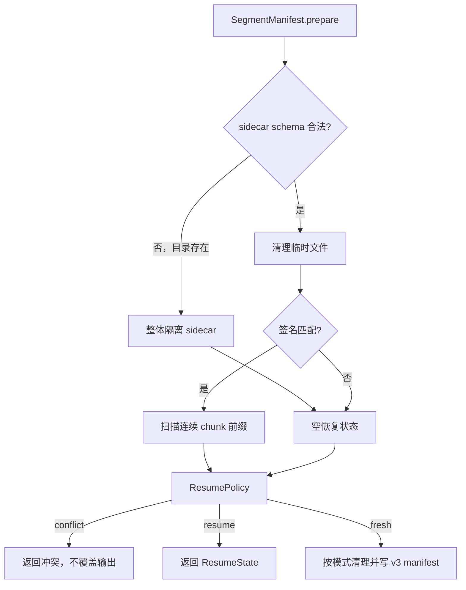

# 断点续传机制

## 职责拆分

恢复系统由四个对象协作：

| 对象 | 文件 | 职责 |
|------|------|------|
| `ResumePolicy` | [`resume_policy.py`](../backend/app/planning/resume_policy.py) | 纯函数决定 conflict/fresh/resume |
| `SegmentWorkspace` | [`segment_workspace.py`](../backend/app/planning/segment_workspace.py) | sidecar 路径、chunk rename、清理和隔离 |
| `ManifestRepository` | [`manifest_store.py`](../backend/app/planning/manifest_store.py) | v3 JSON 校验与原子读写 |
| `SegmentManifest` | [`manifest.py`](../backend/app/planning/manifest.py) | 协调策略、workspace、repository 和连续前缀 |

计划层不依赖 FFmpeg 具体实现；执行和收尾通过 consumer-owned media ports 工作。

## Sidecar 布局

最终输出 `D:/renders/output.mp4` 对应同目录 sidecar：

```text
D:/renders/
├── output.mp4
└── output.mp4.vp_segments/
    ├── manifest.json
    ├── chunk-0001-out00000000-00000499-src00000500.mp4
    ├── chunk-0002-out00000500-00000999-src00001000.mp4
    └── stages/
```

sidecar 名是 `<完整输出文件名>.vp_segments`，不是输出目录共用的 `.vp_segments/`。这样不同输出
不会共享恢复状态。

### Chunk 文件名

```text
chunk-{index:04d}-out{start:08d}-{end:08d}-src{next_source:08d}.{ext}
```

| 字段 | 含义 |
|------|------|
| `index` | 从 1 开始的片段序号 |
| `start/end` | 该片段覆盖的闭区间输出帧 |
| `next_source` | 下一个应读取的源帧 |
| `ext` | 输出容器扩展名 |

临时文件使用 `chunk-tmp[-NNNN].<ext>`。编码器完整关闭后，
`SegmentWorkspace.finalize_chunk()` 才通过 `os.replace()` 原子改名为最终 chunk。

## v3 manifest

`manifest.json` 只保存运行身份，不复制可从 chunk 文件名恢复的进度：

```json
{
  "version": 3,
  "signature": "sha256...",
  "created_at": "2026-07-28T08:00:00Z",
  "input_path": "D:/input.mp4",
  "output_path": "D:/renders/output.mp4",
  "config_snapshot": {
    "input_path": "D:/input.mp4"
  }
}
```

必填字段由 [`contracts/persistence.schema.json`](../contracts/persistence.schema.json) 定义。
repository 使用由该 schema 生成的 `SegmentManifest` Pydantic contract 严格解码未知/缺失字段；
`ManifestRepository.write()` 在同目录写 `manifest.json.tmp`、flush/fsync 后再 `os.replace()`。

任何非 v3、破损或缺字段 manifest 都不可恢复。执行准备时整个 sidecar 会改名为
`output.mp4.vp_segments.incompatible[-N]`，随后按当前 schema 重建；应用不迁移、解析或回退读取
v2 数据。

## 运行身份与签名

[`backend/app/planning/run_identity.py`](../backend/app/planning/run_identity.py) 先生成一份
`config_snapshot`，再用同一内容及输入元数据计算 SHA-256。身份覆盖：

- 输入绝对路径、大小和修改时间；
- 最终输出绝对路径；
- decode/workflow/encode/output 配置；
- 冻结的 processing step 序列；
- 宽、高、源 FPS、源帧数等探测结果。

manifest 写入和签名计算共享同一 snapshot，避免两套字段漂移。签名不匹配的 sidecar 不会续传。

## 连续前缀

恢复进度只来自 chunk 文件名：

1. 匹配严格文件名格式并按 index 排序。
2. 第一个 chunk 必须为 index 1、输出起点 0。
3. 后续 index 必须递增 1，`start` 必须等于前一个 `end + 1`。
4. 首个缺口或非法范围终止前缀。
5. 前缀后的 chunk 视为 stranded，不计入恢复。

例如：

```text
chunk-0001-out00000000-00000499-src00000250.mp4  # 有效
chunk-0002-out00000500-00000999-src00000500.mp4  # 有效
chunk-0004-out00001500-00001999-src00001000.mp4  # 无效：缺少 0003
```

`ResumeState` 由最后一个有效 chunk 派生 `completed_output_frames` 和
`start_source_frame`，不从 JSON 中读取平行计数。

## 恢复策略

`ResumePolicy.decide_output_action()` 的输入只有：

`final_exists / sidecar_exists / signature_match / has_progress / mode`。

| Mode/状态 | 决策 |
|-----------|------|
| `auto` 且最终文件存在 | `conflict`，交给 UI |
| `force-fresh` | `fresh` |
| sidecar 不存在或签名不匹配 | `fresh` |
| 有合法连续进度 | `resume` |
| 无进度 | `fresh` |

`force-fresh` 会删除当前 sidecar，并在最终文件存在时删除最终文件。`force-resume` 忽略最终文件冲突，
但仍要求当前 schema、签名和连续前缀有效；否则安全地从 fresh 开始。

### 准备流程



## 前端预检与用户选择

`check_resume_state` 运行 `python -m app inspect-output`，返回 schema 类型化的
`ResumeInspectionResult`：最终文件/sidecar 是否存在、签名是否匹配、已完成 chunk/帧数和总帧数。
inspection 使用纯 `_read_resume_state`，不会删除临时文件、清理 stranded chunk、隔离目录或改写
manifest；目录内容在预检前后逐字节不变。只有执行期 `prepare()` 可以做 workspace mutation。
前端立即投影为最小领域结构：

- `final_exists_only`：没有可用连续进度；
- `final_exists_with_resume`：签名匹配且有连续进度。

`ResumeConflictDialog` 的动作：

| 动作 | 行为 |
|------|------|
| `resume` | 显式以 `force-resume` 重启当前项 |
| `fresh` | 显式以 `force-fresh` 重启当前项 |
| `skip` | 跳过当前项并推进队列 |
| `cancel` | 清空队列并终止批次 |

确认后的启动不使用默认 `auto`，因此不会重新进入同一个冲突。预检后文件仍可能被外部修改；
执行期的 `ResumeConflictError` 仍以 `resume_conflict` 原样穿过 Rust，并由同一对话框处理。

## 最终化

所有片段完成后，finalization port：

1. 使用 FFmpeg concat 拼接 chunk；
2. 按 `keepAudio` 提取并合并原音频；
3. 写入调用方指定的最终输出；无音频合并路径用 `os.replace()` 提交 concat 临时文件；
4. 仅在全部成功后删除 `<output>.vp_segments`。

任何收尾失败都会保留 sidecar 和完整 chunk，下一次任务可继续恢复。
