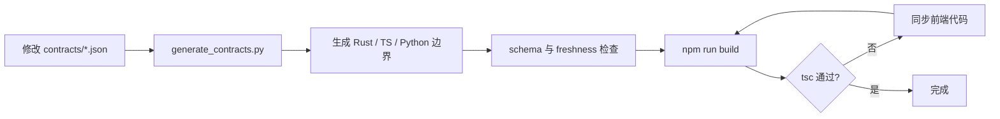

# 开发指南

## 仓库结构速览

```
vp/
├── contracts/                  # JSON Schema 2020-12 中立边界与 IPC manifest
├── backend/                    # Python CLI 与流式处理链路
│   ├── app/                    # 主应用包
│   │   ├── ports/              # 消费方定义的媒体 Protocol
│   │   ├── adapters/           # FFmpeg 等基础设施 adapter
│   │   └── generated/          # 生成的 Python 边界，禁止手改
│   ├── models/                 # 预置模型权重
│   ├── tests/                  # 测试套件
│   ├── requirements.txt        # Python 运行时依赖
│   ├── requirements-dev.txt    # 本地测试和质量门禁依赖
│   └── pyproject.toml          # pytest 配置
├── frontend/                   # Vue 3 + TypeScript 前端
│   ├── src/                    # 源码
│   ├── src-tauri/              # Tauri v2 Rust 外壳
│   │   ├── src/                # Rust 源码
│   │   ├── permissions/        # Tauri ACL 权限
│   │   ├── resources/          # 打包资源
│   │   └── Cargo.toml          # Rust 依赖
│   ├── package.json            # npm 依赖与脚本
│   └── vite.config.ts          # Vite 配置
├── docs/                       # 开发文档
├── scripts/                    # 辅助脚本
├── .github/workflows/          # CI/CD 工作流
└── README.md                   # 项目入口
```

## 开发命令速查

| 命令 | 用途 |
|------|------|
| `cd backend && python -m pytest tests -q` | 运行 Python 测试 |
| `python -m ruff check backend scripts` | 检查 Python lint、未使用符号和生产参数 |
| `python -m ruff format --check backend scripts` | 检查 Python 格式 |
| `cd backend && python -m app benchmark --report-json ../test-results/benchmark-report.json --report-markdown ../test-results/benchmark-report.md` | 运行后端 benchmark 回归检查 |
| `cd frontend && npm install` | 安装前端依赖 |
| `cd frontend && npm run test` | 运行前端单元测试 |
| `cd frontend && npm run lint` | 运行 Vue、TypeScript 与 Node 脚本 ESLint 零 warning 门禁 |
| `cd frontend && npm run build` | 前端生产构建 |
| `cd frontend && npm run tauri:dev` | Tauri 桌面开发模式 |
| `cd frontend/src-tauri && cargo fmt --check` | 检查 Rust 格式 |
| `cd frontend/src-tauri && cargo build` | 编译 Rust 桌面壳 |
| `cd frontend/src-tauri && cargo test --quiet` | 运行 Rust 测试 |
| `cd frontend/src-tauri && cargo clippy --all-targets -- -D warnings` | 以零 warning 门槛检查全部 Rust targets |
| `python scripts/generate_contracts.py` | 从中立 schema 更新生成物 |
| `python scripts/generate_contracts.py --check` | 校验 schema/引用并逐字节检查生成物 freshness |
| `python scripts/check_architecture_contracts.py` | 运行跨层依赖、环、命令面、未消费导出/依赖门禁 |
| `python scripts/check_python_dead_code.py` | 分别运行 production-only 与全套 Python Vulture 60% 零发现门禁 |
| `cd frontend && npm run check:duplicates` | 扫描前端、Python、Rust 与仓库脚本的生产实现克隆 |
| `cd frontend && npm run check` | 运行 ESLint、测试类型、架构、死代码和重复检测 |
| `pre-commit run --all-files` | 运行所有 pre-commit 检查 |

## 类型同步工作流

修改跨层边界时先编辑 `contracts/`，再生成各语言绑定：



### 注意事项

- 源 schema 使用 JSON Schema 2020-12 外部 `$ref` 复用；每个 object 必须显式声明
  `additionalProperties`
- Python 由 `datamodel-code-generator` 生成，TypeScript 由 `json-schema-to-typescript` 生成，
  Rust 通过 Typify 编译期消费聚合 schema
- 生成文件禁止手工修改；`python scripts/generate_contracts.py --check` 必须无差异
- 跨层产品默认值只修改 `application-defaults.json`；schema 验证后生成 Python、TypeScript、Rust
  只读常量，PowerShell 工具通过 `runtime-tools.ps1` 读取同一数据文件
- 前端统一从 `types/protocol` 导入边界类型，不新增手写镜像或 normalize 层
- 新增事件、错误码或字段时同时更新对应 schema/manifest；运行时别名只保留生产代码实际分支
- `build.rs` 只接入已生成 IPC manifest；生成和漂移检查必须显式运行

## 测试策略

### 前端单元测试（Vitest）

```powershell
cd frontend
npm run test
```

覆盖范围：

- services 中的纯函数与窄 capability orchestration
- composables/store 的状态变换和异步 latest-wins
- Vue 组件语义、可访问性和渲染
- IPC endpoint/事件适配器与生成协议

### Rust 单元测试 / 集成测试

```powershell
cd frontend/src-tauri
cargo test --quiet
cargo clippy --all-targets -- -D warnings
```

覆盖范围：

- manifest ↔ handler ↔ permissions ↔ ACL 与本地 capability/CSP
- `Idle / Starting / Running / Cancelling / Finishing / Reaping / CleanupFailed`、启动/取消/封口与回收竞态
- TaskSupervisor 终态唯一性、stderr 排空、kill/reap、控制超时
- 生产 `classify_line()`、one-shot 逆序类型化 envelope 解析
- 稳定进程身份、PID/TID 重用 fail-closed 与 one-shot 有界期限
- 持久化隔离、错误分类和 ShellError 原样透传

### Python 测试（pytest）

```powershell
cd backend
python -m pytest tests -q
```

覆盖范围：
- 算法层单元测试
- FFmpeg 封装测试
- 流水线集成测试
- 生成边界的严格解码与错误码一致性测试
- manifest v4 严格字段校验、协议标记唯一来源与并发 NDJSON 整行写入测试
- CLI `_HANDLERS` 惰性导入、parser/handler/实现精确同集和无副作用 package import 测试

默认进程运行共享与 ONNX 测试。PyTorch 与 Paddle 使用独立 pytest 进程，避免在同一进程加载
不兼容的 cuDNN runtime：

```powershell
$env:VP_TEST_BACKEND = "pytorch"
python -m pytest tests -q

$env:VP_TEST_BACKEND = "paddle"
python -m pytest tests -m paddle -q

Remove-Item Env:VP_TEST_BACKEND
```

需要真实模型/GPU/TensorRT 的套件显式运行：

```powershell
python -m pytest tests_full_e2e -m full_e2e -q
```

本机缺少对应资源时跳过这一步，由具备模型和 GPU runtime 的 CI/runner 执行；共享软件路径、
契约与静态门禁仍须在本机全部通过。

生产 Python 代码启用 Ruff `ARG` 未使用参数门禁。协议或抽象方法要求保留但实现不消费的参数使用 `_name` / `**_kwargs`；测试 doubles、RIFE 实现和 PaddleGAN vendor 通过精确路径排除，不应扩大忽略范围。

零重复门禁使用 `frontend/.jscpd.json`，扫描前端生产/脚本/全部 unit 与 E2E、Python
生产/测试、Rust 源码、根级脚本和源 contracts，阈值为 0。只精确排除三类保护项：
各语言生成绑定/聚合 schema、PaddleGAN vendor、与中立 catalog 精确同集的 36 个动态 RIFE
`ifnet_v4_*` 模块。RIFE allowlist 逐文件生成并校验实际目录；新增未登记模块或缺失 catalog
模块都会失败。
声明式大 fixture 只有在无法抽取且有理由时，才允许使用最小范围成对
`jscpd:ignore-start/end`；生产函数和测试 helper 均参与扫描。

### 测试矩阵

| 类型 | 命令 | 覆盖范围 | 运行环境 |
|------|------|---------|---------|
| 前端单元 | `npm run test` | services/ + composables/ | Node.js |
| 前端测试类型 | `npm run test:typecheck` | unit、E2E、helpers | Node.js |
| 前端生产构建 | `npm run build` | Vue/TS 类型 + Vite bundle | Node.js |
| 前端静态 | `npm run check` | ESLint、typecheck、DAG、Knip、jscpd | Node.js |
| Rust 单元 | `cargo test --quiet` | state/supervisor/envelope/persistence/security | Rust |
| Rust 静态 | `cargo fmt --check` + `cargo build` + `cargo clippy --all-targets -- -D warnings` | 格式、编译、零 warning | Rust |
| Python 单元 | `pytest tests -q` | algorithms/ffmpeg/protocol | Python 3.12+ |
| Python 静态 | Ruff + Vulture 60% | lint/format/死代码零发现 | Python 3.12+ |
| 中立契约 | `generate_contracts.py --check` | schema/ref/生成物逐字节 freshness | Python + Node |
| 全仓架构 | `check_architecture_contracts.py` | 命令面、层级、环、未消费导出/依赖 | Python 3.12+ |
| 克隆 | `npm run check:duplicates` | 全仓源与测试，零阈值 | Node.js |

静态门禁职责不重叠：

- `frontend/scripts/check-architecture.mjs` 建立前端 import DAG，拒绝环和
  services/stores/IPC 反向依赖；Knip 查未消费导出、文件和 npm 依赖。
- `scripts/check_architecture_contracts.py` 的聚合入口调用公共语义检查、应用默认值、脚本可达性和
  Rust 最小可见性模块。脚本入口从 pre-commit、workflow 与明确工具入口计算，并跟踪 PowerShell
  dot-source；受限 Rust 符号必须存在非测试生产消费者。Rust 检查共同使用词法提取器，只按
  delimiter 精确抹除 `#[cfg(test)]` item 并保留其后的生产声明与原始行号。公共语义检查同时建立 Python package DAG
  与 Rust crate-module DAG，
  检查未使用 Cargo 依赖、Rust public surface、生成协议深导入、命令面、未消费协议 re-export、
  Python 中立 dataclass 字段/包级 re-export/CLI handler、无副作用 package、CSS/test-id/test-support
  export 和算法 catalog↔factory 一致性；同时建立 Rust tasks 子模块 DAG，并只允许
  `tasks/commands.rs`、`tasks/spawn.rs`、`tasks/ports.rs` 依赖 Tauri。任务门禁还拒绝忽略
  emit/lifecycle/reap/rollback 结果或在 `subprocess.rs` 外 fire-and-forget 地持有进程 owner，并验证
  cleanup coordinator 始终保留 join handle、稳定进程句柄和 `ReapTicket` outcome。Cargo 扫描只在
  Typify 宏确实导入 `contracts/` 内含 `pattern` 的 schema 时，把 `regress` 认作生成代码依赖。
- `scripts/check_python_dead_code.py` 只是参数/退出码入口；`scripts/python_quality/` 将模块解析、
  reviewed boundary、production reachability 与 Vulture 分为无副作用职责模块。它从 `app`、
  `app.__main__` 和显式导出入口静态遍历 production
  import DAG，把 CLI 字面量 `_HANDLERS` 转换为精确动态边，并以 production roots 单独运行
  Vulture；测试引用或普通字符串不能让生产模块/符号存活，stage-worker 生成模型通过真实 command
  与 processing import 边可达。
  RIFE、vendor 与生成物 exclusion 必须声明理由、evidence 文件和 marker，RIFE 还必须与中立
  catalog 精确同集。Pydantic、pytest 与 framework 动态入口由 gate 内的精确
  `(path, symbol, reason, evidence)` registry 审核；不存在会跨文件保活同名符号的全局 whitelist。
- jscpd 负责跨语言实现克隆，阈值为 0；发现必须抽取或给出最小、可回归验证的保护理由。

## 调试技巧

### 前端浏览器预览模式限制

在浏览器中运行前端（`npm run dev`）时，Tauri API 不可用。`isTauriRuntime()` 会返回 false，`safeInvoke` 会抛出提示错误。桌面功能必须在 `npm run tauri:dev` 中测试。

### Rust 日志输出

Rust 代码使用 `eprintln!` 输出诊断信息，在 Tauri 开发模式下可在终端看到。

关键日志点：
- `lib.rs::setup` — 运行时路径解析结果
- `tasks/spawn.rs` — 子进程启动参数
- `tasks/controller.rs` — TaskSupervisor 控制、reader 排空与终态仲裁

### Python stdout/stderr 查看

在 Tauri 开发模式下，Python 子进程的 stdout（NDJSON）和 stderr（日志/Traceback）都会被 Rust 层处理。若需要直接查看 Python 输出：

从 `backend/` 手动运行时，用 PowerShell pipeline 把符合 schema 的四段配置 envelope
`{ decode, workflow, encode, output }` 写入 stdin（输入路径仍由 `--input` 指定）：

```powershell
$requestJson = Get-Content -Raw .\request.json
$requestJson | python -m app process --input "video.mp4" --config-stdin
```

### 关闭 Watchdog

开发调试时，若任务执行时间较长且 stdout 无输出，Watchdog 可能误杀：

```powershell
$env:VP_TASK_STALL_TIMEOUT_SECS = "0"
npm run tauri:dev
```

## 添加新 Tauri Command 的 Checklist

1. **实现函数**：在合适的子模块中创建 `async fn`（如 `dialogs.rs`、`tasks/commands.rs`）
2. **加入清单**：在 [`contracts/ipc-manifest.json`](../contracts/ipc-manifest.json) 中声明命令、参数和结果
3. **注册 handler**：在 [`lib.rs`](../frontend/src-tauri/src/lib.rs) 的 `tauri::generate_handler![...]` 中添加函数引用
4. **更新权限**：在 [`permissions/default.toml`](../frontend/src-tauri/permissions/default.toml) 中添加 `allow-<command>` 条目
5. **前端封装**：在 [`lib/ipc/endpoints/`](../frontend/src/lib/ipc/endpoints/) 中添加对应封装函数
6. **运行门禁**：执行生成 freshness、架构检查、`cargo build/test/clippy` 和 `npm run build`

## 添加新 NDJSON 事件类型的 Checklist

1. **Payload schema**：在 [`contracts/`](../contracts/) 中添加严格 payload schema
2. **Envelope 清单**：在 [`contracts/ipc-manifest.json`](../contracts/ipc-manifest.json) 的
   `backendTaskStream` 或 `backendOneShotCommands` 中添加 envelope、生成 payload 和 schema ref；
   若还需 Tauri 事件，再更新 `events`
3. **重新生成**：运行 `python scripts/generate_contracts.py`，不要手改前端事件常量或 Rust 枚举
4. **Python 发射点**：构造生成 Pydantic payload，并调用模块级 `ndjson.emit()`；envelope enum、
   payload 类型映射、可选字段和 discriminator 策略均由 manifest 生成，不手写条件分支
5. **Rust classifier**：确认重新生成的 `generated/backend_task_envelope.rs` variant 被
   [`tasks/envelope.rs`](../frontend/src-tauri/src/tasks/envelope.rs) 的生产 classifier 覆盖
6. **前端监听**：在 [`lib/ipc/events.ts`](../frontend/src/lib/ipc/events.ts) 接入生成事件
7. **运行构建**：执行 freshness、架构检查、`cargo build/test/clippy` 与 `npm run build`

## pre-commit 配置

[`.pre-commit-config.yaml`](../.pre-commit-config.yaml)：

- **通用检查**：尾随空白、文件末尾换行、YAML/JSON 检查、大文件检查（10MB 上限）
- **Python 格式化**：ruff format + ruff lint
- **自定义钩子**：中立契约 freshness、三层架构、前端静态质量/全仓重复、Python Vulture 60% 零发现

安装 pre-commit：

```powershell
python -m pip install -r backend/requirements-dev.txt
pre-commit install
```

提交前会自动运行检查，失败的检查会阻止提交。

## .gitignore 规则

- **根目录 `.gitignore`**：仓库级缓存、样例媒体、工作区产物
- **`backend/.gitignore`**：Python 缓存、运行日志、输出目录、本地模型权重
- **`frontend/.gitignore`**：`node_modules`、`dist`、`src-tauri/target`、Tauri 自动生成权限文件

**注意**：`frontend/src-tauri/permissions/autogenerated/` 是构建时生成目录，默认忽略。`frontend/src-tauri/gen/schemas/*.json` 是当前仍受 Git 跟踪的生成文件，修改命令面或权限后需要一并同步。
