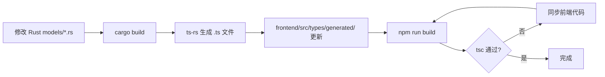

# 开发指南

## 仓库结构速览

```
vp/
├── backend/                    # Python CLI 与流式处理链路
│   ├── app/                    # 主应用包
│   ├── models/                 # 预置模型权重
│   ├── tests/                  # 测试套件
│   ├── requirements.txt        # Python 依赖
│   └── pyproject.toml          # pytest 配置
├── frontend/                   # Vue 3 + TypeScript 前端
│   ├── src/                    # 源码
│   ├── src-tauri/              # Tauri v2 Rust 外壳
│   │   ├── src/                # Rust 源码
│   │   ├── permissions/        # Tauri ACL 权限
│   │   ├── resources/          # 打包资源
│   │   └── Cargo.toml          # Rust 依赖
│   ├── package.json            # npm 依赖与脚本
│   └── vite.config.ts          # Vite 配置
├── docs/                       # 开发文档
├── scripts/                    # 辅助脚本
├── .github/workflows/          # CI/CD 工作流
└── README.md                   # 项目入口
```

## 开发命令速查

| 命令 | 用途 |
|------|------|
| `cd backend && python -m pytest tests -q` | 运行 Python 测试 |
| `python -m ruff check backend scripts` | 检查 Python 格式、未使用符号和生产参数 |
| `cd backend && python -m app benchmark --report-json ../test-results/benchmark-report.json --report-markdown ../test-results/benchmark-report.md` | 运行后端 benchmark 回归检查 |
| `cd frontend && npm install` | 安装前端依赖 |
| `cd frontend && npm run test` | 运行前端单元测试 |
| `cd frontend && npm run build` | 前端生产构建 |
| `cd frontend && npm run tauri:dev` | Tauri 桌面开发模式 |
| `cd frontend/src-tauri && cargo test --quiet` | 运行 Rust 测试 |
| `cd frontend/src-tauri && cargo clippy --all-targets -- -D warnings` | 以零 warning 门槛检查全部 Rust targets |
| `cd frontend/src-tauri && cargo build` | 触发 ts-rs 类型生成 |
| `pre-commit run --all-files` | 运行所有 pre-commit 检查 |

## 类型同步工作流

Rust 模型通过 `ts-rs` 宏在编译时自动生成 TypeScript 类型。修改 Rust 模型后的标准流程：



### 注意事项

- 修改 `frontend/src-tauri/src/models/*.rs` 后必须运行 `cargo build`，否则前端类型不同步
- 环境协议类型只在 Rust `models/env.rs` 定义，前端统一从 `types/protocol` 导入，不新增手写镜像或 normalize 层
- 新增字段到 Rust 模型时，检查是否需要更新前端的 `TASK_EVENT_NAMES` 或 `TASK_ERROR_CODES`
- `ts-rs` 生成的文件不要手工修改，会在下次 `cargo build` 时被覆盖

## 测试策略

### 前端单元测试（Vitest）

```powershell
cd frontend
npm run test
```

覆盖范围：
- services/ 中的纯函数（如 `services/task/events.ts` 的 reducer）
- composables/ 中的状态变换逻辑
- utils/ 中的格式化函数

**注意**：不涉及 Vue 组件渲染测试（无 `mount` 调用），因为 `jsdom` 环境不支持完整的 Vue 组件生命周期。

### Rust 单元测试 / 集成测试

```powershell
cd frontend/src-tauri
cargo test --quiet
cargo clippy --all-targets -- -D warnings
```

覆盖范围：
- `lib.rs::tests` — 权限反向断言（commands_manifest ↔ permissions/default.toml ↔ acl-manifests.json）
- `tasks/state.rs::tests` — 任务状态机转换
- `tasks/envelope.rs::tests` — NDJSON 信封解析
- `error.rs::tests` — ShellError 序列化

### Python 测试（pytest）

```powershell
cd backend
python -m pytest tests -q
```

覆盖范围：
- 算法层单元测试
- FFmpeg 封装测试
- 流水线集成测试
- schema drift 测试（错误码一致性）

生产 Python 代码启用 Ruff `ARG` 未使用参数门禁。协议或抽象方法要求保留但实现不消费的参数使用 `_name` / `**_kwargs`；测试 doubles、RIFE 实现和 PaddleGAN vendor 通过精确路径排除，不应扩大忽略范围。

### 测试矩阵

| 类型 | 命令 | 覆盖范围 | 运行环境 |
|------|------|---------|---------|
| 前端单元 | `npm run test` | services/ + composables/ | Node.js |
| 前端类型 | `npm run build` | TS 类型检查 + satisfies 约束 | Node.js |
| Rust 单元 | `cargo test` | state/envelope/error/tests | Rust |
| Python 单元 | `pytest tests -q` | algorithms/ffmpeg/protocol | Python 3.12+ |
| 错误码一致 | `pytest tests/test_schema_drift.py` | 三层 TaskErrorCode | Python 3.12+ |

## 调试技巧

### 前端浏览器预览模式限制

在浏览器中运行前端（`npm run dev`）时，Tauri API 不可用。`isTauriRuntime()` 会返回 false，`safeInvoke` 会抛出提示错误。桌面功能必须在 `npm run tauri:dev` 中测试。

### Rust 日志输出

Rust 代码使用 `eprintln!` 输出诊断信息，在 Tauri 开发模式下可在终端看到。Release 构建中这些日志会进入系统日志。

关键日志点：
- `lib.rs::setup` — 运行时路径解析结果
- `tasks/spawn.rs` — 子进程启动参数
- `tasks/controller.rs` — 终止事件分发决策

### Python stdout/stderr 查看

在 Tauri 开发模式下，Python 子进程的 stdout（NDJSON）和 stderr（日志/Traceback）都会被 Rust 层处理。若需要直接查看 Python 输出：

```powershell
# 手动运行 Python CLI，查看原始输出
python -m app process --input "video.mp4" --config-stdin '<<EOF
{"decodeConfig":{},"workflowConfig":{},"encodeConfig":{},"outputConfig":{}}
EOF'
```

### 关闭 Watchdog

开发调试时，若任务执行时间较长且 stdout 无输出，Watchdog 可能误杀：

```powershell
$env:VP_TASK_STALL_TIMEOUT_SECS = "0"
npm run tauri:dev
```

## 添加新 Tauri Command 的 Checklist

1. **实现函数**：在合适的子模块中创建 `async fn`（如 `dialogs.rs`、`tasks/commands.rs`）
2. **加入清单**：在 [`commands_manifest.rs`](../frontend/src-tauri/src/commands_manifest.rs) 的 `APP_COMMAND_NAMES` 数组末尾添加命令名字符串
3. **注册 handler**：在 [`lib.rs`](../frontend/src-tauri/src/lib.rs) 的 `tauri::generate_handler![...]` 中添加函数引用
4. **更新权限**：在 [`permissions/default.toml`](../frontend/src-tauri/permissions/default.toml) 中添加 `allow-<command>` 条目
5. **前端封装**：在 [`lib/ipc/endpoints/`](../frontend/src/lib/ipc/endpoints/) 中添加对应封装函数
6. **运行测试**：`cargo test --quiet` 验证权限反向断言通过

## 添加新 NDJSON 事件类型的 Checklist

1. **Rust 枚举**：在 [`protocol.rs`](../frontend/src-tauri/src/protocol.rs) 的 `TaskEventName` 中添加新 variant
2. **Rust Payload**：在 [`models/task.rs`](../frontend/src-tauri/src/models/task.rs) 中添加新 Payload 结构（derive TS）
3. **Python 枚举**：在 [`backend/app/protocol/__init__.py`](../backend/app/protocol/__init__.py) 的 `NdjsonEventType` 中添加新成员
4. **Python 发射器**：在 [`NdjsonEmitter`](../backend/app/protocol/__init__.py) 中添加发射方法
5. **前端事件名**：在 [`frontend/src/types/protocol/events.ts`](../frontend/src/types/protocol/events.ts) 的 `TASK_EVENT_NAMES` 中添加新条目（satisfies 约束自动检查覆盖）
6. **前端监听**：在 [`lib/ipc/events.ts`](../frontend/src/lib/ipc/events.ts) 的 `listenTaskEvents` 中添加新事件处理
7. **更新 Envelope**：在 [`tasks/envelope.rs`](../frontend/src-tauri/src/tasks/envelope.rs) 的 `NdjsonEnvelope` 中添加新 variant
8. **运行构建**：`cargo build` 生成 TS 类型 + `npm run build` 验证编译

## pre-commit 配置

[`.pre-commit-config.yaml`](../.pre-commit-config.yaml)：

- **通用检查**：尾随空白、文件末尾换行、YAML/JSON 检查、大文件检查（10MB 上限）
- **Python 格式化**：ruff format + ruff lint
- **自定义钩子**：TaskErrorCode 三层一致性检查（Python enum / Rust enum / ts-rs 生成的 TS union）

安装 pre-commit：

```powershell
pip install pre-commit
pre-commit install
```

提交前会自动运行检查，失败的检查会阻止提交。

## .gitignore 规则

- **根目录 `.gitignore`**：仓库级缓存、样例媒体、工作区产物
- **`backend/.gitignore`**：Python 缓存、运行日志、输出目录、本地模型权重
- **`frontend/.gitignore`**：`node_modules`、`dist`、`src-tauri/target`、Tauri 自动生成权限文件

**注意**：`frontend/src-tauri/permissions/autogenerated/` 是构建时生成目录，默认忽略。`frontend/src-tauri/gen/schemas/*.json` 是当前仍受 Git 跟踪的生成文件，修改命令面或权限后需要一并同步。
