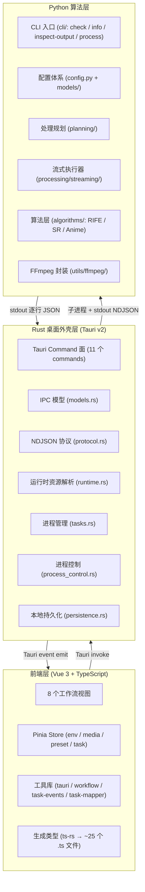

# 总体架构概览

## 项目定位

VP Workbench 是一款基于 Tauri v2 的桌面视频处理工作台，面向需要补帧、超分辨率、动漫优化等算法的用户。应用采用经典的三层架构，前端负责交互与配置，Rust 桌面外壳负责 IPC 桥接与进程调度，Python 后端负责算法推理与 FFmpeg 流式处理。

## 技术栈

| 层级 | 技术 | 版本 | 用途 |
|------|------|------|------|
| 前端 UI | Vue 3 + TypeScript | ^3.5 | 用户界面与交互 |
| 前端状态 | Pinia | ^3.0 | 全局状态管理 |
| 前端路由 | Vue Router | ^4.6 | 工作流视图切换 |
| 前端构建 | Vite | ^8.0 | 开发与生产构建 |
| 前端测试 | Vitest | ^3.2 | 单元测试 |
| 桌面外壳 | Tauri (Rust) | ^2.10 | 窗口管理、IPC、进程调度 |
| Rust 异步 | Tokio | ^1.48 | 异步运行时 |
| 后端算法 | Python | 3.12+ | 算法推理与流式处理 |
| 后端配置 | Pydantic v2 | ^2.9 | 配置校验与类型安全 |
| 后端推理 | ONNX Runtime GPU | ^1.18 | ONNX 模型推理（CUDA/TensorRT） |
| 媒体处理 | FFmpeg | — | 编解码、格式转换、音频处理 |

## 三层架构

## 各层职责边界

### 前端层（Vue 3）

- 负责全部用户界面渲染与交互
- 通过 Pinia 管理跨组件状态
- 通过 `@tauri-apps/api` 调用 Rust commands 和监听事件
- 不直接感知 Python 后端的存在

### Rust 桌面外壳层（Tauri）

- 作为前端的唯一后端接口（IPC 网关）
- 解析运行时资源路径（Python、FFmpeg、模型等）
- 管理 Python 子进程的生命周期（启动、取消、暂停、恢复）
- 解析 Python stdout 的 NDJSON 输出，转换为 Tauri 事件推送给前端
- 提供本地持久化（环境缓存、工作台预设）
- 不执行任何算法逻辑

### Python 算法层

- 作为纯 CLI 工具被 Rust 层通过子进程调用
- 接收四段 JSON 配置，执行视频处理流水线
- 负责 FFmpeg 命令构建与执行
- 负责 ONNX/PyTorch 模型推理
- 通过 stdout 逐行输出 NDJSON 事件汇报进度
- 不直接感知前端或 Tauri 的存在

## 关键技术特征

### 内存流式管道

解码、算法处理、编码全部走内存中的流式链路，不再经过临时帧目录。解码器和编码器通过 FFmpeg `rawvideo` 管道完成，中间只保留有界队列中的少量帧（decode queue maxsize=100，encode queue maxsize=8）。详见 [backend-architecture.md](backend-architecture.md) 的流式执行器章节。

### NDJSON 行协议

Rust 与 Python 之间的通信采用子进程 stdout 的 NDJSON（Newline Delimited JSON）格式。Python 每完成一个处理步骤或进度更新，输出一行 JSON；Rust 的 `tasks.rs` 通过 `BufReader` 按行读取并解析。协议常量集中定义在 [`frontend/src-tauri/src/protocol.rs`](../frontend/src-tauri/src/protocol.rs)。详见 [ipc-protocol.md](ipc-protocol.md)。

### ts-rs 类型同步

Rust 的 `models.rs` 是 IPC schema 的唯一可信源。通过 `ts-rs` 派生宏，编译时自动生成对应的 TypeScript 类型到 `frontend/src/types/generated/`（约 25 个文件）。前端直接使用这些类型，保证前后端字段名、类型、可选性严格一致。所有 Rust 结构体统一使用 `#[serde(rename_all = "camelCase")]`，NDJSON 线格式也已全面统一为 camelCase。

### 分段续传

当开启补帧且设置 `segmentFrames` 时，流式编码器按帧数阈值切分输出片段。片段文件名编码了输出帧范围和下一源帧索引，作为 filesystem-as-state 的续传依据。任务最终完成后通过 FFmpeg concat demuxer 拼接成单个成片，并回封音频。详见 [backend-architecture.md](backend-architecture.md) 的分段逻辑章节。

## 工作流视图映射

前端采用"配置先行"的单一工作流，共 8 个视图模块，通过左侧导航栏（StepRail）串联：

| 视图 | 路由 | 职责 | 对应 Rust Command |
|------|------|------|-------------------|
| Home | `/home` | 启动探测、能力缓存与运行时概览 | `check_environment` |
| Input | `/input` | 批量导入素材、去重、元数据探测 | `pick_inputs`, `inspect_video` |
| Decode | `/decode` | 解码方案选择、硬件加速、解码器配置 | — |
| Preprocess | `/preprocess` | 解码后帧级滤镜链配置 | — |
| Enhance | `/enhance` | 补帧 / 超分 / 动漫优化算法配置 | — |
| Postprocess | `/postprocess` | 增强后帧级滤镜链配置 | — |
| Encode | `/encode` | 编码器、容器、码率控制、输出目录 | `pick_output_directory` |
| Render | `/render` | 批处理队列执行、任务日志、进度展示 | `start_task`, `cancel_task`, `pause_task`, `resume_task` |

工作流模块定义集中在前端 [`frontend/src/lib/workflow.ts`](../frontend/src/lib/workflow.ts:25-82) 的 `WORKBENCH_MODULES` 数组中。

## 核心文件索引

### 前端层

| 文件 | 职责 |
|------|------|
| [`frontend/src/main.ts`](../frontend/src/main.ts) | Vue 应用入口，注册 Pinia 和 Router |
| [`frontend/src/router/index.ts`](../frontend/src/router/index.ts) | 8 个视图路由配置 |
| [`frontend/src/lib/workflow.ts`](../frontend/src/lib/workflow.ts) | 工作流模块定义、RIFE 模型列表 |
| [`frontend/src/lib/tauri.ts`](../frontend/src/lib/tauri.ts) | Tauri invoke 统一封装与事件监听 |
| [`frontend/src/lib/task-mapper.ts`](../frontend/src/lib/task-mapper.ts) | 配置映射、默认预设生成、TaskRequest 构建 |
| [`frontend/src/lib/task-events.ts`](../frontend/src/lib/task-events.ts) | 任务事件状态变换（纯函数） |
| [`frontend/src/stores/env.ts`](../frontend/src/stores/env.ts) | 环境检查状态管理 |
| [`frontend/src/stores/media.ts`](../frontend/src/stores/media.ts) | 素材列表与元数据管理 |
| [`frontend/src/stores/preset.ts`](../frontend/src/stores/preset.ts) | 工作台预设编辑与持久化 |
| [`frontend/src/stores/task.ts`](../frontend/src/stores/task.ts) | 批处理队列与任务生命周期 |

### Rust 层

| 文件 | 职责 |
|------|------|
| [`frontend/src-tauri/src/lib.rs`](../frontend/src-tauri/src/lib.rs) | Tauri command 面与 Builder 配置 |
| [`frontend/src-tauri/src/models.rs`](../frontend/src-tauri/src/models.rs) | IPC 数据模型（schema 唯一可信源） |
| [`frontend/src-tauri/src/protocol.rs`](../frontend/src-tauri/src/protocol.rs) | NDJSON 协议常量与事件枚举 |
| [`frontend/src-tauri/src/runtime.rs`](../frontend/src-tauri/src/runtime.rs) | 运行时资源路径解析 |
| [`frontend/src-tauri/src/tasks.rs`](../frontend/src-tauri/src/tasks.rs) | 子进程启动、NDJSON 解析、任务控制 |
| [`frontend/src-tauri/src/process_control.rs`](../frontend/src-tauri/src/process_control.rs) | 跨平台进程暂停/恢复 |
| [`frontend/src-tauri/src/persistence.rs`](../frontend/src-tauri/src/persistence.rs) | 环境缓存与预设本地持久化 |
| [`frontend/src-tauri/src/services/environment_service.rs`](../frontend/src-tauri/src/services/environment_service.rs) | 环境检查服务（缓存优先策略） |

### Python 层

| 文件 | 职责 |
|------|------|
| [`backend/app/cli/`](../backend/app/cli/) | CLI 包 - parser/defaults/probes + commands/{check,info,process,inspect_output} |
| [`backend/app/config.py`](../backend/app/config.py) | 环境变量配置加载 |
| [`backend/app/models/__init__.py`](../backend/app/models/__init__.py) | Pydantic 配置模型 |
| [`backend/app/planning/`](../backend/app/planning/) | 处理步骤规划与续传 sidecar(stage_plan + manifest) |
| [`backend/app/processing/streaming/`](../backend/app/processing/streaming/) | 流式执行器(pipeline + decoder/processor/encoder workers) |
| [`backend/app/processing/interpolation.py`](../backend/app/processing/interpolation.py) | RIFE 补帧执行 |
| [`backend/app/utils/ffmpeg/`](../backend/app/utils/ffmpeg/) | FFmpeg 命令构建与执行 |
| [`backend/app/errors/`](../backend/app/errors/) | 统一异常体系 + 错误码 SSOT (_codes / _bootstrap) |
| [`backend/app/protocol/`](../backend/app/protocol/) | NDJSON emitter + CLI 进度上报 reporter |
