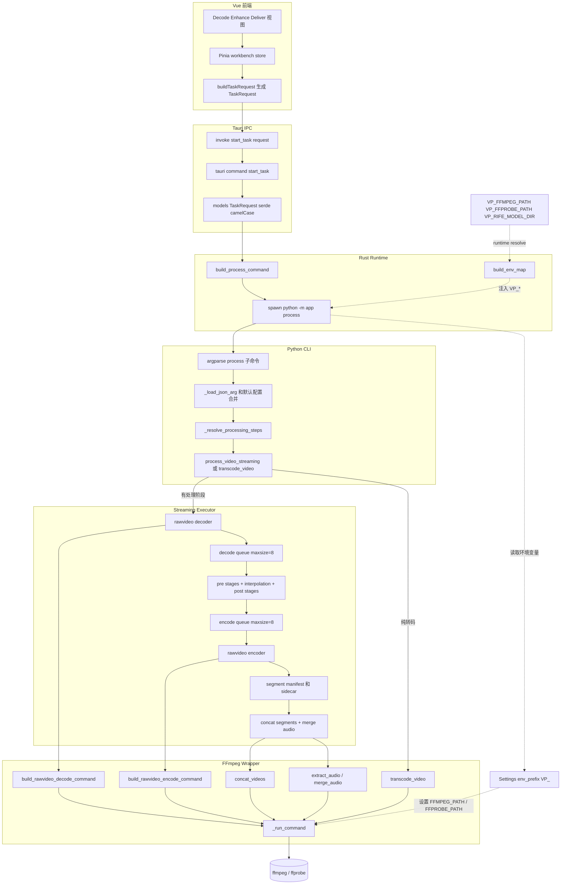

# 参数传递架构图

这张图描述当前流式处理链路中，前端配置如何经过 Tauri 和 Python CLI，最终驱动 `decoder -> processor -> encoder` 的内存管道与分段输出。

说明：

- 有帧处理阶段的任务统一走流式执行器，不再经过临时帧目录。
- 解码和编码都通过 FFmpeg `rawvideo` 管道完成，中间只保留有界队列中的少量帧。
- `segmentFrames` 控制分段输出，分段仅作为恢复缓存；任务最终完成后会拼接成单个成片。
- 纯 `format_conversion` 不走补帧流式处理，直接走 FFmpeg 转码/封装。
