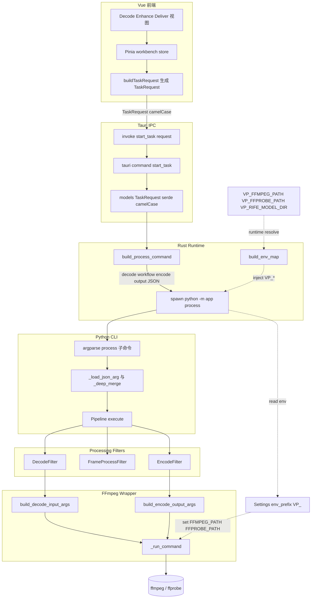

# 参数传递架构图

该图描述前端配置如何经由 Tauri 与 Rust Runtime 传递给 Python CLI，并最终生成 ffmpeg 命令。

```mermaid
graph TD
  subgraph FE[Vue 前端]
    FEView[Decode Enhance Deliver 视图]
    FEStore[Pinia workbench store]
    FEReq[buildTaskRequest 生成 TaskRequest]
  end

  subgraph IPC[Tauri IPC]
    FEInvoke[invoke start_task request]
    RSCommand[tauri command start_task]
    RSModel[models TaskRequest serde camelCase]
  end

  subgraph RT[Rust Runtime]
    RSBuild[build_process_command]
    RSEnv[build_env_map]
    RSPython[spawn python -m app process]
  end

  subgraph PY[Python CLI]
    PYParser[argparse process 子命令]
    PYLoad[_load_json_arg 与 _deep_merge]
    PYPipeline[Pipeline execute]
  end

  subgraph PF[Processing Filters]
    PFDecode[DecodeFilter]
    PFFrame[FrameProcessFilter]
    PFEncode[EncodeFilter]
  end

  subgraph FF[FFmpeg Wrapper]
    FFDecode[build_decode_input_args]
    FFEncode[build_encode_output_args]
    FFRun[_run_command]
  end

  ENV[VP_FFMPEG_PATH VP_FFPROBE_PATH VP_RIFE_MODEL_DIR]
  CFG[Settings env_prefix VP_]
  BIN[(ffmpeg / ffprobe)]

  FEView --> FEStore
  FEStore --> FEReq
  FEReq -->|TaskRequest camelCase| FEInvoke
  FEInvoke --> RSCommand
  RSCommand --> RSModel
  RSModel --> RSBuild
  RSBuild -->|decode workflow encode output JSON| RSPython
  RSPython --> PYParser
  PYParser --> PYLoad
  PYLoad --> PYPipeline

  PYPipeline --> PFDecode
  PYPipeline --> PFFrame
  PYPipeline --> PFEncode

  PFDecode --> FFDecode
  PFEncode --> FFEncode
  FFDecode --> FFRun
  FFEncode --> FFRun
  FFRun --> BIN

  RSEnv -. inject VP_* .-> RSPython
  ENV -. runtime resolve .-> RSEnv
  RSPython -. read env .-> CFG
  CFG -. set FFMPEG_PATH FFPROBE_PATH .-> FFRun
```

说明：实线表示主数据流，虚线表示运行时环境变量注入链路。
