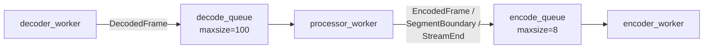
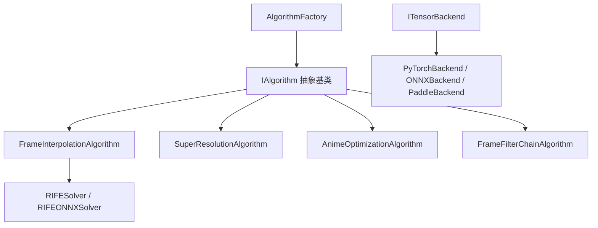

# Python 后端架构

Python 后端作为纯 CLI 工具被 Rust Tauri 层通过子进程调用，负责视频处理流水线的完整执行：配置解析、处理规划、流式执行、算法推理、FFmpeg 命令构建与执行。所有输出通过 stdout 的 NDJSON 行协议汇报给 Rust 层。

## CLI 入口

[`backend/app/cli.py`](../backend/app/cli.py) 是唯一的命令行入口，通过 `python -m app` 调用（由 [`__main__.py`](../backend/app/__main__.py) 转发）。提供 4 个子命令：

| 子命令 | 职责 | 典型调用方 |
|--------|------|-----------|
| `process` | 执行完整处理流水线（解码→处理→编码） | Rust `start_task` |
| `info` | 探测输入视频元数据（fps、帧数、分辨率、音频等） | Rust `inspect_video` |
| `inspect-output` | 预检查输出文件和续传 sidecar 状态 | Rust `check_resume_state` |
| `check` | 运行时环境自检（FFmpeg、GPU、模型、后端可用性） | Rust `check_environment` |

### process 子命令核心参数

```python
--input                    # 输入视频路径（必填）
--output                   # 显式输出路径（可选，默认自动生成）
--decode-config-json       # 解码配置 JSON
--encode-config-json       # 编码配置 JSON
--workflow-config-json     # 工作流配置 JSON
--output-config-json       # 输出配置 JSON
--resume-mode              # auto / force-fresh / force-resume
```

### 配置加载流程（`_load_json_arg`）

[`cli.py:114-132`](../backend/app/cli.py:114-132)：

1. 将命令行 JSON 字符串解析为 Python dict
2. 与默认配置进行深度合并（`_deep_merge`），用户值覆盖默认值
3. 用 Pydantic 模型校验合并后的配置
4. 返回 `model_dump(by_alias=True)`（字段名保持 camelCase，与 Rust 一致）

## 配置体系

### pydantic-settings（`config.py`）

[`backend/app/config.py`](../backend/app/config.py) 的 `Settings` 类通过 `pydantic-settings` 从环境变量加载配置，`env_prefix="VP_"`。

```python
class Settings(BaseSettings):
    APP_NAME: str = "Video Processing Workbench"
    FFMPEG_PATH: str = ""
    FFPROBE_PATH: str = ""
    RIFE_MODEL_DIR: str = ""
    RIFE_MODEL_VERSION: str = "4.25"
    TENSORRT_DIR: str = ""
    # ...
    model_config = SettingsConfigDict(env_prefix="VP_", env_file=".env", extra="ignore")
```

**路径解析策略**（`model_post_init`）：

1. 从环境变量读取显式路径
2. 若未设置，从 `runtime_root` 的候选位置查找（`resources/runtime/`、`runtime/`、`backend/resources/runtime/`）
3. 若仍未找到，FFmpeg/FFprobe 回退到 `shutil.which()`，Python 回退到 `sys.executable`
4. 所有解析结果通过 `object.__setattr__` 写回实例（绕过 Pydantic 的不可变性）

**运行时模式检测**：

- `bundled`：`runtime_root` 存在且有内容
- `external`：`runtime_root` 不存在，使用系统 PATH
- `expected-bundled`：`runtime_root` 被配置但不存在

### Pydantic 模型（`models/__init__.py`）

[`backend/app/models/__init__.py`](../backend/app/models/__init__.py) 定义了与 Rust `models.rs` 一一对应的 Pydantic 模型：

```python
class _CamelBase(BaseModel):
    model_config = ConfigDict(
        alias_generator=_to_camel,      # snake_case → camelCase 自动映射
        populate_by_name=True,          # 同时接受原始字段名和别名
        extra="forbid",                 # 拒绝未定义字段
    )
```

| 模型 | 字段 |
|------|------|
| `DecodeConfig` | `mode`, `hwaccel`, `hwaccel_device`, `decoder`, `options` |
| `InterpolationConfig` | `enabled`, `target_fps`, `multi`, `model`, `onnx_model`, `scale`, `fp16`, `tensor_backend`, `engine` |
| `SuperResolutionConfig` | `enabled`, `scale_factor`, `algorithm`, `onnx_model` |
| `AnimeConfig` | `enabled`, `profile`, `denoise`, `edge_boost` |
| `FilterStep` / `PreprocessConfig` / `PostprocessConfig` | 滤镜链步骤 |
| `WorkflowConfig` | `fps_mode`, `process_order`, `interpolation`, `super_resolution`, `anime`, `preprocess`, `postprocess` |
| `RateControlConfig` / `EncodeConfig` | `codec`, `family`, `container`, `keep_audio`, `rate_control(mode/value)`, `options` |
| `OutputConfig` | `output_dir`, `open_on_complete`, `segment_frames` |

## 处理步骤规划

[`backend/app/planning.py`](../backend/app/planning.py) 将配置转化为可执行的 `StagePlan`，并管理 filesystem-as-state 的续传 sidecar。

### StagePlan

```python
@dataclass(slots=True)
class StagePlan:
    pre_steps: list[dict]              # 预处理步骤
    interpolation_step: dict | None   # 补帧步骤（仅当启用时）
    post_steps: list[dict]             # 后处理步骤
    total_output_frames: int           # 总输出帧数
    total_encoded_frames: int          # 编码器写入帧数（考虑 resample）
    total_pairs: int                   # 源帧对数
```

`build_stage_plan()` 根据 `processing_steps` 和源视频元数据计算：

- 若启用补帧：`total_output_frames = source_frames + (source_frames - 1) * (multi - 1)`
- 若不启用补帧：`total_output_frames = source_frames`
- `total_encoded_frames` 考虑 `output_fps` 重采样

### 配置签名（`build_signature`）

SHA-256 哈希，输入包括：

- 输入/输出文件的绝对路径、大小、mtime
- `decode_config`、`encode_config`、`workflow_config`、`output_config`
- `processing_steps`
- 视频元数据（宽、高、fps、帧数）

签名用于判断两次运行是否使用完全相同的配置，决定是否允许续传。

### SegmentManifest（filesystem-as-state 续传）

[`planning.py:101-433`](../backend/app/planning.py:101-433)：`SegmentManifest` 是续传管理的核心，不依赖数据库，直接以文件系统为状态存储。

**目录结构**：

```
<output_path>.vp_segments/
├── manifest.json              # 配置签名和快照
├── chunk-tmp-0001.mp4         # 当前正在写入的片段（sentinel）
├── chunk-0001-out00000000-00000999-src00500.mp4   # 已完成片段 1
├── chunk-0002-out00001000-00001999-src01000.mp4   # 已完成片段 2
└── source_audio.aac           # 提取的音频（如启用）
```

**片段文件名编码**：

```
chunk-{index:04d}-out{start_output_frame:08d}-{end_output_frame:08d}-src{next_source_frame:08d}.{ext}
```

文件名直接编码了输出帧范围和下一源帧索引，scan 时无需打开文件即可恢复进度。

**续传决策（`prepare`）**：

| 场景 | `mode=auto` | `mode=force-fresh` | `mode=force-resume` |
|------|-------------|-------------------|---------------------|
| 输出不存在 + 无 sidecar | fresh | fresh | fresh |
| 输出不存在 + 有 sidecar + 签名匹配 | resume/fresh | fresh | resume/fresh |
| 输出不存在 + 有 sidecar + 签名不匹配 | fresh | fresh | fresh（重置） |
| 输出存在 + 签名匹配 | conflict_final_exists | fresh（删除） | resume |
| 输出存在 + 签名不匹配 | conflict_final_exists | fresh（删除） | fresh（重置） |

**片段扫描**：`scan_completed_chunks()` 按文件名正则解析所有 chunk，只保留从 index=1 开始的**连续前缀**。非连续的 chunk 被视为无效（可能是崩溃残留），通过 `cleanup_stale_chunks()` 清理。

## 流式执行器

[`backend/app/processing/streaming.py`](../backend/app/processing/streaming.py) 是核心处理模块，采用**三线程流水线**架构：



### 入口函数（`process_video_streaming`）

执行流程：

1. `resolve_video_info()` 探测视频元数据
2. `build_stage_plan()` 生成处理计划
3. `build_signature()` 生成配置签名
4. `SegmentManifest.prepare()` 决定续传策略
5. `_run_streaming_pipeline()` 执行三线程流水线
6. `_finalize_segmented_output()` 拼接片段 + 合并音频
7. `manifest.cleanup()` 清理 sidecar 目录

### decoder_worker

通过 `ffmpeg.open_rawvideo_decoder()` 启动 FFmpeg 子进程，输出 `rgb24` rawvideo 格式。逐帧读取后包装为 `DecodedFrame(source_index, frame)` 放入 `decode_queue`。

- 支持从 `resume_state.start_source_frame` 开始解码（跳过已完成的源帧）
- 使用 `select=gte(n\,start_frame)` 滤镜实现起始帧过滤
- 通过 `stop_event` 支持协作式取消

### processor_worker

根据 `stage_plan.interpolation_step` 是否存在，选择两种处理模式：

#### 单帧流（`_process_single_frame_stream`）

无补帧时使用，逐帧执行 pre_steps 后直接送入编码队列：

```
for each decoded frame:
    for each pre_step algorithm:
        frame = algorithm.process_frame(frame)
    encode_queue.put(EncodedFrame(frame))
    encode_queue.put(SegmentBoundary)
```

#### 插帧流（`_process_interpolated_stream`）

有补帧时使用，维护帧对，生成中间帧：

```
for each decoded frame:
    for each pre_step algorithm:
        frame = algorithm.process_frame(frame)

    if previous is None:
        previous = frame
        continue

    # 帧对插值
    group = [previous]
    for mid in 1..multi-1:
        timestep = mid / multi
        mid_frame = interpolation.process_frame_pair(prev, current, timestep)
        group.append(mid_frame)

    for frame in group:
        for each post_step algorithm:
            frame = algorithm.process_frame(frame)
        encode_queue.put(EncodedFrame(frame))

    encode_queue.put(SegmentBoundary)
    previous = current
```

### encoder_worker

接收 `EncodedFrame`、`SegmentBoundary`、`StreamEnd` 三种消息：

- **`EncodedFrame`**：写入当前 FFmpeg 编码器。若编码器未启动，创建新的 `chunk-tmp` sentinel
- **`SegmentBoundary`**：检查当前片段是否达到 `segment_frames` 阈值，若达到则 `seal_chunk()`（关闭编码器、探测帧数、原子重命名为最终文件名）
- **`StreamEnd`**：关闭当前编码器、最终 seal、结束循环

**`seal_chunk` 原子重命名**：

```python
manifest.finalize_chunk(
    tmp_path,
    index=segment_index,
    start_output_frame=current_segment_start,
    end_output_frame=current_segment_start + segment_output_frames - 1,
    next_source_frame=next_source_frame,
)
# 内部使用 os.replace() 实现原子重命名
```

### 最终拼接（`_finalize_segmented_output`）

1. 读取所有已完成的 segment 路径
2. `ffmpeg.concat_videos()` 使用 concat demuxer 拼接（生成 `concat_noaudio.mp4`）
3. 若 `keep_audio=True` 且源视频有音频：
   - `ffmpeg.extract_audio()` 提取音频为 AAC
   - `ffmpeg.merge_audio()` 将音频合并到拼接结果
4. 否则直接 `os.replace(concat_path, output_path)`

### 队列协作机制

```python
# 带超时的阻塞 put（支持 cancel）
def _queue_put(target_queue, item, stop_event):
    while not stop_event.is_set():
        try:
            target_queue.put(item, timeout=0.1)
            return
        except queue.Full:
            continue

# 带超时的阻塞 get（支持 cancel）
def _queue_get(source_queue, stop_event):
    while not stop_event.is_set():
        try:
            return source_queue.get(timeout=0.1)
        except queue.Empty:
            continue
    return None
```

所有线程通过 `stop_event` 实现协作式取消。当任何线程发生异常时，设置 `stop_event` 并将异常放入 `error_queue`，主线程等待所有线程结束后检查 `error_queue`。

## 算法层

### 架构设计



### 算法工厂（`factory.py`）

[`backend/app/algorithms/factory.py`](../backend/app/algorithms/factory.py)：

```python
class AlgorithmFactory:
    _registry: dict[str, type[IAlgorithm]] = {}

    @classmethod
    def register(cls, algorithm_type: str, algorithm_class: type[IAlgorithm]):
        cls._registry[algorithm_type] = algorithm_class

    @classmethod
    def create(cls, algorithm_type: str, tensor_backend: ITensorBackend | None = None,
               tensor_backend_name: str = "pytorch", **kwargs) -> IAlgorithm:
        if tensor_backend is None:
            tensor_backend = get_tensor_backend(tensor_backend_name)
        return cls._registry[algorithm_type](tensor_backend=tensor_backend, **kwargs)
```

注册在 [`cli.py:48-59`](../backend/app/cli.py:48-59) 完成：

```python
AlgorithmFactory.register("frame_interpolation", FrameInterpolationAlgorithm)
AlgorithmFactory.register("super_resolution", SuperResolutionAlgorithm)
AlgorithmFactory.register("anime_optimization", AnimeOptimizationAlgorithm)
AlgorithmFactory.register("frame_filter_chain", FrameFilterChainAlgorithm)
```

### IAlgorithm 接口（`base.py`）

[`backend/app/algorithms/base.py`](../backend/app/algorithms/base.py)：

```python
class IAlgorithm(ABC):
    @abstractmethod
    def process_frame(self, frame: Any, **kwargs) -> Any: ...
    @abstractmethod
    def process_frame_batch(self, frames: list[Any], **kwargs) -> list[Any]: ...
    @abstractmethod
    def get_name(self) -> str: ...
    @abstractmethod
    def validate(self) -> bool: ...

    def needs_frame_pairs(self) -> bool:
        return False  # 补帧算法重写为 True

    def process_frame_pair(self, frame0, frame1, timestep=0.5, **kwargs) -> Any:
        raise NotImplementedError

    def get_interpolation_multi(self) -> int:
        return 2
```

### RIFE 补帧（`interpolation.py`）

[`backend/app/processing/interpolation.py`](../backend/app/processing/interpolation.py) 的 `FrameInterpolationAlgorithm`：

- `needs_frame_pairs()` → `True`
- `process_frame_pair(frame0, frame1, timestep)` → 调用 `RIFESolver.interpolate()` 或 `RIFEONNXSolver.interpolate()`
- **延迟初始化**：`_solver` 在首次调用 `_ensure_solver()` 时才创建

**后端选择**：

- `tensor_backend_name == "onnx"` → `RIFEONNXSolver`
- 其他 → `RIFESolver`（PyTorch）

**RIFE 模型族**（`algorithms/rife/`）：

`algorithms/rife/` 目录包含 40+ 个模型变体文件：`ifnet_v4_0.py` ~ `ifnet_v4_26.py`，以及 `_lite` 和 `_heavy` 变体。每个文件实现特定版本的 RIFE IFNet 架构。模型加载由 `algorithms/rife/model_loader.py` 统一管理。

### 张量后端抽象（`tensor_backend.py`）

`get_tensor_backend(name)` 返回对应的 `ITensorBackend` 实现：

- `"pytorch"` → PyTorch tensor 操作
- `"onnx"` → NumPy ndarray（ONNX Runtime 输入）
- `"paddle"` → Paddle tensor 操作

所有算法通过 `backend.numpy_to_tensor()` 和 `backend.tensor_to_numpy()` 进行帧数据格式转换。

## FFmpeg 封装

[`backend/app/utils/ffmpeg_wrapper.py`](../backend/app/utils/ffmpeg_wrapper.py) 的 `FFmpegWrapper` 类封装所有 FFmpeg/FFprobe 调用。

### 编码器/解码器候选表

```python
ENCODER_CANDIDATES = (
    {"name": "libx264", "family": "cpu", "codec": "h264"},
    {"name": "libx265", "family": "cpu", "codec": "hevc"},
    {"name": "libaom-av1", "family": "cpu", "codec": "av1"},
    {"name": "libsvtav1", "family": "cpu", "codec": "av1"},
    {"name": "h264_nvenc", "family": "nvidia", "codec": "h264"},
    {"name": "hevc_nvenc", "family": "nvidia", "codec": "hevc"},
    {"name": "av1_nvenc", "family": "nvidia", "codec": "av1"},
    {"name": "h264_qsv", "family": "intel", "codec": "h264"},
    {"name": "hevc_qsv", "family": "intel", "codec": "hevc"},
    {"name": "av1_qsv", "family": "intel", "codec": "av1"},
)
```

### 核心方法

| 方法 | 用途 |
|------|------|
| `build_rawvideo_decode_command()` | 构建解码为 rgb24 rawvideo 的命令 |
| `build_rawvideo_encode_command()` | 构建从 rgb24 rawvideo 编码的命令 |
| `open_rawvideo_decoder()` | 启动 FFmpeg 子进程，返回 `RawVideoReader` |
| `open_rawvideo_encoder()` | 启动 FFmpeg 子进程，返回 `RawVideoWriter` |
| `build_decode_input_args()` | 解析 DecodeConfig 为 `-hwaccel`/`-c:v`/`-i` 等 |
| `build_encode_video_args()` | 解析 EncodeConfig 为 `-c:v`/`-crf`/`-preset` 等 |
| `transcode_video()` | 格式转换快捷路径（直接 FFmpeg 转码，不走流式） |
| `concat_videos()` | concat demuxer 合并片段 |
| `extract_audio()` / `merge_audio()` | 音频提取与合并 |
| `discover_capabilities()` | 探测可用编码器/解码器/硬件加速 |

### RawVideoReader / RawVideoWriter

继承自 `_FFmpegPipeBase`，处理 FFmpeg 子进程的 stdin/stdout/stderr 管道：

- **`RawVideoReader`**：从 stdout 逐帧读取 `width * height * 3` 字节的 rgb24 数据，转为 `np.ndarray(shape=(h, w, 3), dtype=np.uint8)`
- **`RawVideoWriter`**：将 `np.ndarray` 写入 stdin，FFmpeg 负责编码
- **`_FFmpegPipeBase._collect_stderr()`**：独立线程解析 stderr，提取进度信息（`frame=`、`fps=`、`speed=`、`progress=continue/end`）

### 进度解析

FFmpeg 编码时输出 stderr 进度行，格式为 `key=value`：

```
frame=123
fps=23.5
speed=1.20x
progress=continue
```

`_parse_progress_snapshot()` 将键值对转换为结构化 dict，通过回调函数实时上报。

### 视频元数据探测缓存

`get_video_info()` 和 `get_frame_count()` 使用基于 `(abspath, mtime_ns)` 的缓存，避免对同一文件重复执行 ffprobe。

帧数探测优先级：

1. 容器元数据 `nb_frames`（O(1)，优先）
2. `-count_frames` 软解扫描（O(n)，大视频可能耗时数分钟）
3. `duration * fps` 估算（兜底）

## 异常体系

[`backend/app/errors.py`](../backend/app/errors.py)：

```python
class ProcessError(Exception):
    def __init__(self, code: str, message: str, *, details: dict[str, Any] | None = None):
        self.code = code
        self.message = message
        self.details = details or {}
```

### 异常捕获层级

```
__main__.py (最外层)
    └── 捕获所有异常 → 统一序列化为 NDJSON error 输出
        ├── 捕获 ProcessError → 直接转发 code/message/details
        └── 捕获其他 Exception → code="process_failed"，附带 traceback

cli.py:cmd_process() (处理边界)
    └── try/except 包裹处理逻辑
        ├── KeyboardInterrupt → ProcessError(CANCELLED)
        ├── ResumeConflictError → ProcessError(RESUME_CONFLICT) + details
        ├── 其他异常 → _infer_error_code() 推断错误码
        └── ProcessError 直接透传
```

### 错误码推断（`_infer_error_code`）

[`cli.py:154-176`](../backend/app/cli.py:154-176)：

| 异常特征 | 推断错误码 |
|---------|-----------|
| `FileNotFoundError` + 包含 "ffmpeg"/"ffprobe" | `missing_ffmpeg` |
| `FileNotFoundError` + 包含 "flownet_v"/"model" | `missing_model` |
| 消息包含 "torch"/"paddle"/"tensor backend" | `missing_tensor_backend` |
| 消息包含 "cancelled"/"canceled" | `cancelled` |
| 其他 | `process_failed` |

## 进度上报

### CliProgressReporter

[`cli.py:407-470`](../backend/app/cli.py:407-470)：`CliProgressReporter` 维护总帧数和当前帧数，提供两种输出：

**终端进度条**（stderr）：

```
[VP_PROGRESS] [####------------]  15.2%  152/1000 |  23.5 fps | 1.20x | ETA 00:00:35
```

**NDJSON 进度事件**（stdout）：

```json
{"type":"progress","current":152,"total":1000,"percent":15.2,"stage":"Encoding","stageIndex":1,"stageTotal":1}
```

**节流策略**：进度变化小于 1% 且不是结束时跳过，避免每帧都刷新 stdout。

**ETA 估算**：优先使用 FFmpeg 报告的 fps，若无则使用观察到的平均 fps（`current_frame / elapsed_time`）。

### 编码器实时进度

`FFmpegWrapper.open_rawvideo_encoder()` 返回的 `RawVideoWriter` 通过 `_FFmpegPipeBase._collect_stderr()` 实时解析 FFmpeg stderr 进度。编码器进度回调的帧号偏移当前 segment 的起始帧，累加到全局进度中：

```python
def _make_segment_progress_callback(segment_start_frame, encode_progress_callback):
    def callback(progress):
        encode_progress_callback(
            segment_start_frame + progress["frame"],  # 累加偏移
            progress["fps"],
            progress["speed"],
            progress["out_time_seconds"],
            progress["progress"],
        )
    return callback
```
