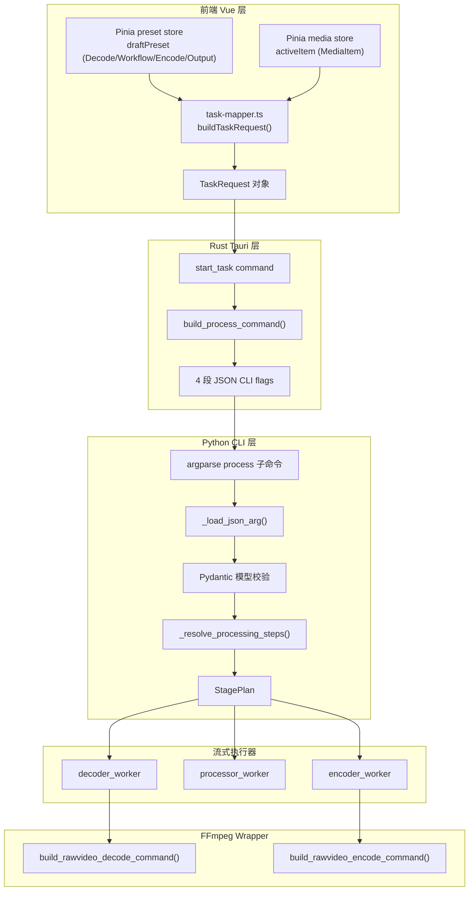
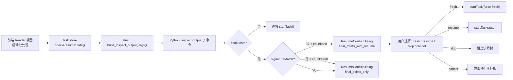

# 配置数据流与参数映射

本文档描述一条完整的视频处理任务中，用户配置如何从前端界面流转到底层 FFmpeg 执行参数，涵盖序列化、校验、规划、执行的完整链路。

## 总体数据流



## 前端层：配置构建

### 配置存储模型

前端有两套配置存储：

1. **工作台预设**（`presetStore.draftPreset`）：用户当前编辑的通用配置，自动保存到本地。包含 `decodeConfig`、`workflowConfig`、`encodeConfig`、`outputConfig`。
2. **素材级配置**（`mediaItem.decodeConfig` 等）：每个素材可以覆盖预设中的部分配置。当素材被激活编辑时，`editor` computed 属性优先返回素材级配置，否则回退到预设。

### TaskRequest 构建

`task-mapper.ts:158-167` 的 `buildTaskRequest()` 将 `MediaItem` 转换为 `TaskRequest`：

```typescript
export function buildTaskRequest(item: MediaItem, resumeMode?: ResumeMode): TaskRequest {
  return {
    inputPath: item.inputPath,
    decodeConfig: item.decodeConfig,
    workflowConfig: item.workflowConfig,
    encodeConfig: item.encodeConfig,
    outputConfig: item.outputConfig,
    ...(resumeMode ? { resumeMode } : {}),
  }
}
```

### 默认预设生成

`task-mapper.ts:169-192` 的 `createDefaultWorkbenchPreset()` 根据环境检查结果生成智能默认配置：

- **解码器**：优先选择 NVIDIA（cuda）→ Intel（qsv）→ 软件解码
- **编码器**：优先选择 NVIDIA NVENC → Intel QSV → CPU 编码（hevc > h264 > av1）
- **推理引擎**：NVIDIA GPU 默认 `tensorrt`（如果可用），Hygon GPU 默认 `dcu`，其他默认 `cuda`
- **码率控制**：CPU 用 CRF，NVIDIA 用 CQ，Intel 用 QP
- **ONNX 模型**：从环境检查结果的 `onnxModels.interpolation` 和 `onnxModels.super_resolution` 中选取第一个可用模型

## Rust 层：序列化与命令构建

### build_process_command

[`tasks.rs:159-186`](../frontend/src-tauri/src/tasks.rs:159-186) 将 `TaskRequest` 序列化为 CLI 参数：

```rust
fn build_process_command(paths, request) -> Command {
    command.args(["-m", "app", "process"]);
    command.args(["--input", &request.input_path]);

    let decode_json = serde_json::to_string(&request.decode_config)?;
    let workflow_json = serde_json::to_string(&request.workflow_config)?;
    let encode_json = serde_json::to_string(&request.encode_config)?;
    let output_json = serde_json::to_string(&request.output_config)?;

    command.args(["--decode-config-json", &decode_json]);
    command.args(["--workflow-config-json", &workflow_json]);
    command.args(["--encode-config-json", &encode_json]);
    command.args(["--output-config-json", &output_json]);

    if let Some(mode) = request.resume_mode.as_deref() {
        command.args(["--resume-mode", mode]);
    }
}
```

四段 JSON 通过命令行参数直接传递，避免文件 I/O 和路径编码问题。`serde_json::to_string` 会自动将 Rust 的 snake_case 字段名转换为 camelCase（因为结构体上标注了 `#[serde(rename_all = "camelCase")]`）。

### inspect-output 命令构建

[`tasks.rs:188-205`](../frontend/src-tauri/src/tasks.rs:188-205) 的 `build_inspect_output_args()` 用于续传状态预检查，结构与 `process` 命令类似但调用 `inspect-output` 子命令。

## Python 层：解析与规划

### 配置解析

Python CLI 在 `cli.py` 中定义 `process` 子命令的参数解析器：

```python
parser.add_argument("--input", required=True)
parser.add_argument("--decode-config-json", type=str, default="{}")
parser.add_argument("--workflow-config-json", type=str, default="{}")
parser.add_argument("--encode-config-json", type=str, default="{}")
parser.add_argument("--output-config-json", type=str, default="{}")
parser.add_argument("--resume-mode", choices=["auto", "force-fresh", "force-resume"])
```

内部通过 `_load_json_arg()` 将 JSON 字符串解析为 Python dict，再用 Pydantic 模型校验。

### Pydantic 模型校验

[`backend/app/models/__init__.py`](../backend/app/models/__init__.py) 定义了与 Rust `models.rs` 一一对应的 Pydantic 模型。所有模型继承 `_CamelBase`，自动支持 snake_case 和 camelCase 字段名的双向映射：

```python
class _CamelBase(BaseModel):
    model_config = ConfigDict(alias_generator=to_camel, populate_by_name=True)
```

这意味着 Rust 传来的 camelCase JSON 可以被正确解析，而 Python 内部仍使用 snake_case 命名。

### 处理步骤规划

[`backend/app/planning.py`](../backend/app/planning.py) 的 `_resolve_processing_steps()` 根据配置生成执行计划：

1. 解析 `workflowConfig.process_order`（`super_resolution_then_interpolation` 或 `frame_interpolation_then_super_resolution`）
2. 检查各算法是否启用（`interpolation.enabled`、`super_resolution.enabled`、`anime.enabled`）
3. 构建阶段列表：pre_steps → interpolation_step / super_resolution_step（按顺序）→ post_steps
4. 若没有任何处理步骤启用，则走 `format_conversion` 快捷路径（直接 FFmpeg 转码，不走流式）

## FFmpeg 参数落点映射

### 解码参数映射

| 前端字段 | Rust 字段 | Python 字段 | FFmpeg 参数 |
|----------|----------|-------------|------------|
| `decodeConfig.mode` | `decode_config.mode` | `decode_config.mode` | 决定硬件/软件解码路径 |
| `decodeConfig.hwaccel` | `decode_config.hwaccel` | `decode_config.hwaccel` | `-hwaccel` |
| `decodeConfig.hwaccelDevice` | `decode_config.hwaccel_device` | `decode_config.hwaccel_device` | `-hwaccel_device` |
| `decodeConfig.decoder` | `decode_config.decoder` | `decode_config.decoder` | `-c:v`（硬件解码器） |
| `decodeConfig.options` | `decode_config.options` | `decode_config.options` | 解码器附加参数 |

`utils/ffmpeg/` 的 `build_decode_input_args()` 将 `DecodeConfig` 转换为 FFmpeg 输入参数：

- `mode == "software"`：不添加 `-hwaccel`，使用软件解码
- `mode == "hardware"`：添加 `-hwaccel <cuda|qsv|...>` 和 `-hwaccel_device <device>`
- `decoder` 映射到具体的解码器名称（如 `hevc_cuvid`、`h264_qsv`）

### 工作流参数映射

| 前端字段 | Rust 字段 | Python 字段 | 执行落点 |
|----------|----------|-------------|---------|
| `workflowConfig.fpsMode` | `workflow_config.fps_mode` | `workflow_config.fps_mode` | 决定 target_fps 或 multi 模式 |
| `workflowConfig.processOrder` | `workflow_config.process_order` | `workflow_config.process_order` | 阶段执行顺序 |
| `workflowConfig.interpolation.enabled` | `workflow_config.interpolation.enabled` | `interpolation.enabled` | 是否启用补帧阶段 |
| `workflowConfig.interpolation.targetFps` | `workflow_config.interpolation.target_fps` | `interpolation.target_fps` | 目标帧率计算 |
| `workflowConfig.interpolation.multi` | `workflow_config.interpolation.multi` | `interpolation.multi` | 倍率计算 |
| `workflowConfig.interpolation.model` | `workflow_config.interpolation.model` | `interpolation.model` | RIFE 模型版本选择 |
| `workflowConfig.interpolation.fp16` | `workflow_config.interpolation.fp16` | `interpolation.fp16` | ONNX 推理半精度开关 |
| `workflowConfig.interpolation.tensorBackend` | `workflow_config.interpolation.tensor_backend` | `interpolation.tensor_backend` | 推理后端（pytorch/paddle/onnx） |
| `workflowConfig.interpolation.engine` | `workflow_config.interpolation.engine` | `interpolation.engine` | 推理引擎（cuda/tensorrt/dcu） |
| `workflowConfig.superResolution.enabled` | `workflow_config.super_resolution.enabled` | `super_resolution.enabled` | 是否启用超分阶段 |
| `workflowConfig.superResolution.scaleFactor` | `workflow_config.super_resolution.scale_factor` | `super_resolution.scale_factor` | 超分缩放因子 |
| `workflowConfig.anime.enabled` | `workflow_config.anime.enabled` | `anime.enabled` | 是否启用动漫优化 |
| `workflowConfig.preprocess.enabled` | `workflow_config.preprocess.enabled` | `preprocess.enabled` | 预处理滤镜链开关 |
| `workflowConfig.preprocess.filters` | `workflow_config.preprocess.filters` | `preprocess.filters` | 预处理滤镜步骤 |
| `workflowConfig.postprocess.enabled` | `workflow_config.postprocess.enabled` | `postprocess.enabled` | 后处理滤镜链开关 |
| `workflowConfig.postprocess.filters` | `workflow_config.postprocess.filters` | `postprocess.filters` | 后处理滤镜步骤 |

### 编码参数映射

| 前端字段 | Rust 字段 | Python 字段 | FFmpeg 参数 |
|----------|----------|-------------|------------|
| `encodeConfig.codec` | `encode_config.codec` | `encode_config.codec` | `-c:v` |
| `encodeConfig.family` | `encode_config.family` | `encode_config.family` | 用于 UI 分组，不直接映射到 FFmpeg |
| `encodeConfig.container` | `encode_config.container` | `encode_config.container` | 输出文件扩展名 |
| `encodeConfig.keepAudio` | `encode_config.keep_audio` | `encode_config.keep_audio` | 是否提取/合并音频 |
| `encodeConfig.rateControl.mode` | `encode_config.rate_control.mode` | `rate_control.mode` | 决定使用 `-crf`/`-cq`/`-qp`/`-b:v` |
| `encodeConfig.rateControl.value` | `encode_config.rate_control.value` | `rate_control.value` | 码率控制值 |
| `encodeConfig.options` | `encode_config.options` | `encode_config.options` | 编码器附加参数（如 `-preset`） |

`utils/ffmpeg/` 的 `build_encode_video_args()` 将 `EncodeConfig` 转换为 FFmpeg 编码参数：

- `rate_control.mode == "crf"` → `-crf <value>`
- `rate_control.mode == "cq"` → `-cq <value>`
- `rate_control.mode == "qp"` → `-qp <value>`
- `rate_control.mode == "bitrate"` → `-b:v <value>`

编码器候选表覆盖：

- **CPU**：`libx264`、`libx265`、`libaom-av1`、`libsvtav1`
- **NVIDIA**：`h264_nvenc`、`hevc_nvenc`、`av1_nvenc`
- **Intel QSV**：`h264_qsv`、`hevc_qsv`、`av1_qsv`

### 输出参数映射

| 前端字段 | Rust 字段 | Python 字段 | 执行落点 |
|----------|----------|-------------|---------|
| `outputConfig.outputDir` | `output_config.output_dir` | `output_config.output_dir` | 输出目录 |
| `outputConfig.openOnComplete` | `output_config.open_on_complete` | `output_config.open_on_complete` | 完成后自动打开开关 |
| `outputConfig.segmentFrames` | `output_config.segment_frames` | `output_config.segment_frames` | 分段阈值帧数 |

## 续传状态流转



### 续传冲突检测

前端 [`task.ts:171-179`](../frontend/src/stores/task.ts:171-179) 的 `_classifyConflict()` 根据 `inspect-output` 结果判断冲突类型：

```typescript
function _classifyConflict(inspection: ResumeInspectionResult): ResumeConflictKind | null {
  if (!inspection.finalExists) {
    return null  // 输出不存在，无冲突
  }
  if (inspection.signatureMatch && inspection.completedChunks > 0) {
    return 'final_exists_with_resume'  // 可以续传
  }
  return 'final_exists_only'  // 文件存在但无法续传
}
```

### 运行时续传冲突

如果 `check_resume_state` 的预检查通过但 `start_task` 执行时文件系统发生变化，Python 后端可能在运行时抛出 `RESUME_CONFLICT` 错误。前端 `task.ts:399-427` 的 `onError` 回调会将这种运行时冲突同样转化为 `ResumeConflictDialog`，保持 UX 一致性。

## 进度数据流

```
FFmpeg stderr progress 解析
    → Python CliProgressReporter（1% 节流阈值）
    → stdout NDJSON: {"type":"progress","current":152,"total":1000,"percent":15.2,"stage":"Encoding","stageIndex":1,"stageTotal":2}
    → Rust stdout_reader: serde_json::from_str::<NdjsonEnvelope>()
    → app.emit("task-progress", TaskProgressPayload)
    → 前端 task-events.ts: applyTaskProgress()
    → Pinia task store: item.taskState.percent/current/stage...
    → Vue 组件: 进度条 / 阶段标签 / ETA 更新
```

Python 同时输出终端进度条（`[VP_PROGRESS] [####------------] 15.2% 152/1000 | 23.5 fps | 1.20x | ETA 00:00:35`），Rust 的 stderr_reader 将其作为 `TaskLog` 事件转发。前端 `task-events.ts:31-46` 的 `appendTaskLog()` 会识别 `TERMINAL_PROGRESS_PREFIX`，实现进度条行的覆盖更新（保留最近 300 条日志，进度行替换而非追加）。
