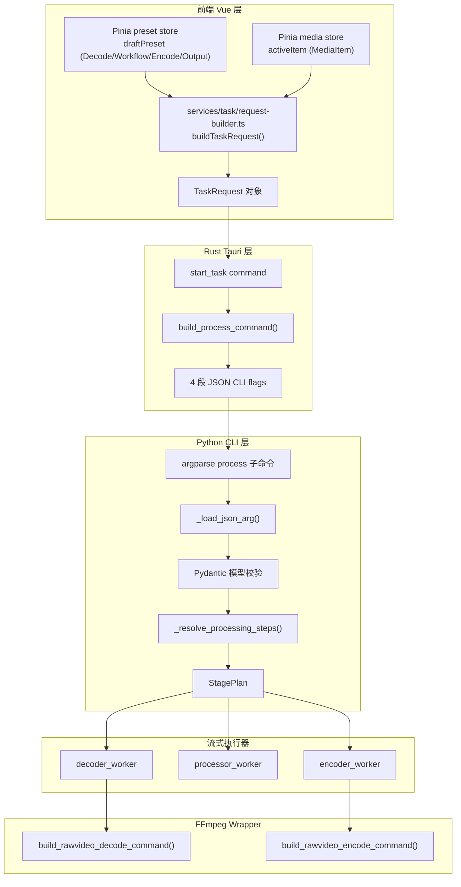
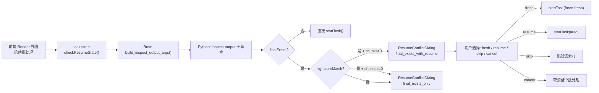

# 配置数据流与参数映射

本文档描述一条完整的视频处理任务中，用户配置如何从前端界面流转到底层 FFmpeg 执行参数，涵盖序列化、校验、规划、执行的完整链路。

## 总体数据流



## 前端层：配置构建

### 配置存储模型

前端有两套配置存储：

1. **工作台预设**（`presetStore.draftPreset`）：用户当前编辑的通用配置，自动保存到本地。包含 `decodeConfig`、`workflowConfig`、`encodeConfig`、`outputConfig`。
2. **素材级配置**（`mediaItem.decodeConfig` 等）：每个素材可以覆盖预设中的部分配置。当素材被激活编辑时，`editor` computed 属性优先返回素材级配置，否则回退到预设。

### TaskRequest 构建

[`services/task/request-builder.ts`](../frontend/src/services/task/request-builder.ts) 的 `buildTaskRequest()` 将 `MediaItem` 转换为 `TaskRequest`:

```typescript
export function buildTaskRequest(item: MediaItem, resumeMode?: ResumeMode): TaskRequest {
  return {
    inputPath: item.inputPath,
    decodeConfig: item.decodeConfig,
    workflowConfig: item.workflowConfig,
    encodeConfig: item.encodeConfig,
    outputConfig: item.outputConfig,
    ...(resumeMode ? { resumeMode } : {}),
  }
}
```

### 默认预设生成

[`services/preset/defaults.ts`](../frontend/src/services/preset/defaults.ts) 的 `createDefaultWorkbenchPreset()` 根据环境检查结果生成智能默认配置:

- **解码器**：优先选择 NVIDIA（cuda）→ Intel（qsv）→ 软件解码
- **编码器**：优先选择 NVIDIA NVENC → Intel QSV → CPU 编码（hevc > h264 > av1）
- **推理引擎**：NVIDIA GPU 默认 `tensorrt`（如果可用），Hygon GPU 默认 `dcu`，其他默认 `cuda`
- **码率控制**：CPU 用 CRF，NVIDIA 用 CQ，Intel 用 QP
- **ONNX 模型**：从环境检查结果的 `onnxModels.interpolation` 和 `onnxModels.super_resolution` 中选取第一个可用模型

## Rust 层：序列化与命令构建

### build_process_command

[`tasks/builder.rs`](../frontend/src-tauri/src/tasks/builder.rs) 的 `build_process_command()` 把 `TaskRequest` 拆成两份:

- 命令行参数:`-m app process --input <path> --config-stdin [--resume-mode <mode>]`
- stdin payload:单个 JSON 对象 `{decode, workflow, encode, output}`

```rust
pub fn build_process_command(paths, request) -> (Command, String) {
    command.args(["-m", "app", "process"]);
    command.args(["--input", &request.input_path]);
    command.arg("--config-stdin");
    if let Some(mode) = &request.resume_mode {
        command.args(["--resume-mode", mode]);
    }
    command.stdin(Stdio::piped());

    let stdin_payload = serde_json::to_string(&json!({
        "decode":   &request.decode_config,
        "workflow": &request.workflow_config,
        "encode":   &request.encode_config,
        "output":   &request.output_config,
    }))?;
    (command, stdin_payload)
}
```

Phase D.3.1 把 4 段配置从命令行参数移到了 stdin。原因是 Windows 命令行
长度上限约 32 KiB,而 `workflowConfig` 的 preprocess/postprocess filter
链在用户加多滤镜后非常容易溢出。stdin 没有大小限制,`serde_json::to_string`
仍然把 Rust snake_case 自动转 camelCase(`#[serde(rename_all = "camelCase")]`)。

旧的 `--decode-config-json` / `--workflow-config-json` 等参数仍被 Python
parser 保留为兼容入口,手动 CLI 调用和已有测试不需要改动;Rust 端永远走
stdin 通道。

### spawn 后立即写 stdin

[`tasks/runner.rs::spawn_task`](../frontend/src-tauri/src/tasks/runner.rs) 在
`spawn_no_window_group(&mut command)` 之后,先把 payload 写入子进程
stdin 并 drop 句柄(EOF),再开始读 stdout/stderr。顺序很重要 — Python
子进程启动后立刻 `sys.stdin.read()`,如果不先写 stdin 就开始等 stdout,
父子进程会互相 deadlock。

### inspect-output 命令构建

[`tasks/builder.rs::build_inspect_output_args()`](../frontend/src-tauri/src/tasks/builder.rs)
返回 `(Vec<String>, String)`,同样把 4 段配置打成 JSON 走 stdin。
Tauri 端的 `check_resume_state` 命令通过 `run_single_cli_command(.., Some(payload))`
触发 stdin 模式。

## Python 层：解析与规划

### 配置解析

[`backend/app/cli/parser.py`](../backend/app/cli/parser.py) 的 `_add_shared_planning_args` 注册以下参数:

```python
parser.add_argument("--input", required=True)
parser.add_argument("--config-stdin", action="store_true")
parser.add_argument("--decode-config-json", default=None)
parser.add_argument("--workflow-config-json", default=None)
parser.add_argument("--encode-config-json", default=None)
parser.add_argument("--output-config-json", default=None)
parser.add_argument("--resume-mode", choices=["auto", "force-fresh", "force-resume"])
```

[`_process_validation.py::collect_config_sections`](../backend/app/cli/commands/_process_validation.py)
是 wire 格式抽象层:

- `--config-stdin` 设置 → 从 `sys.stdin.read()` 读 JSON 对象,拆出 4 段
- 否则 → 从 `--*-config-json` 各自读

两种路径都汇聚到 `_load_json_arg`,通过 Pydantic 模型校验,得到 4 个
camelCase dict。Tauri host 永远走 stdin 路径;手动 CLI 与现有 spec 仍走
旧路径。

### Pydantic 模型校验

[`backend/app/models/__init__.py`](../backend/app/models/__init__.py) 定义了与 Rust `models.rs` 一一对应的 Pydantic 模型。所有模型继承 `_CamelBase`，自动支持 snake_case 和 camelCase 字段名的双向映射：

```python
class _CamelBase(BaseModel):
    model_config = ConfigDict(alias_generator=to_camel, populate_by_name=True)
```

这意味着 Rust 传来的 camelCase JSON 可以被正确解析，而 Python 内部仍使用 snake_case 命名。

### 处理步骤规划

[`backend/app/cli/defaults.py`](../backend/app/cli/defaults.py) 的 `_resolve_processing_steps()` 根据配置生成执行计划:

1. 解析 `workflowConfig.process_order`（`super_resolution_then_interpolation` 或 `frame_interpolation_then_super_resolution`）
2. 检查各算法是否启用（`interpolation.enabled`、`super_resolution.enabled`、`anime.enabled`）
3. 构建阶段列表：pre_steps → interpolation_step / super_resolution_step（按顺序）→ post_steps
4. 若没有任何处理步骤启用，则走 `format_conversion` 快捷路径（直接 FFmpeg 转码，不走流式）

## FFmpeg 参数落点映射

### 解码参数映射

| 前端字段 | Rust 字段 | Python 字段 | FFmpeg 参数 |
|----------|----------|-------------|------------|
| `decodeConfig.mode` | `decode_config.mode` | `decode_config.mode` | 决定硬件/软件解码路径 |
| `decodeConfig.hwaccel` | `decode_config.hwaccel` | `decode_config.hwaccel` | `-hwaccel` |
| `decodeConfig.hwaccelDevice` | `decode_config.hwaccel_device` | `decode_config.hwaccel_device` | `-hwaccel_device` |
| `decodeConfig.decoder` | `decode_config.decoder` | `decode_config.decoder` | `-c:v`（硬件解码器） |
| `decodeConfig.options` | `decode_config.options` | `decode_config.options` | 解码器附加参数 |

`utils/ffmpeg/` 的 `build_decode_input_args()` 将 `DecodeConfig` 转换为 FFmpeg 输入参数：

- `mode == "software"`：不添加 `-hwaccel`，使用软件解码
- `mode == "hardware"`：添加 `-hwaccel <cuda|qsv|...>` 和 `-hwaccel_device <device>`
- `decoder` 映射到具体的解码器名称（如 `hevc_cuvid`、`h264_qsv`）

### 工作流参数映射

| 前端字段 | Rust 字段 | Python 字段 | 执行落点 |
|----------|----------|-------------|---------|
| `workflowConfig.fpsMode` | `workflow_config.fps_mode` | `workflow_config.fps_mode` | 决定 target_fps 或 multi 模式 |
| `workflowConfig.processOrder` | `workflow_config.process_order` | `workflow_config.process_order` | 阶段执行顺序 |
| `workflowConfig.interpolation.enabled` | `workflow_config.interpolation.enabled` | `interpolation.enabled` | 是否启用补帧阶段 |
| `workflowConfig.interpolation.targetFps` | `workflow_config.interpolation.target_fps` | `interpolation.target_fps` | 目标帧率计算 |
| `workflowConfig.interpolation.multi` | `workflow_config.interpolation.multi` | `interpolation.multi` | 倍率计算 |
| `workflowConfig.interpolation.model` | `workflow_config.interpolation.model` | `interpolation.model` | RIFE 模型版本选择 |
| `workflowConfig.interpolation.fp16` | `workflow_config.interpolation.fp16` | `interpolation.fp16` | ONNX 推理半精度开关 |
| `workflowConfig.interpolation.tensorBackend` | `workflow_config.interpolation.tensor_backend` | `interpolation.tensor_backend` | 推理后端（pytorch/paddle/onnx） |
| `workflowConfig.interpolation.engine` | `workflow_config.interpolation.engine` | `interpolation.engine` | 推理引擎（cuda/tensorrt/dcu） |
| `workflowConfig.superResolution.enabled` | `workflow_config.super_resolution.enabled` | `super_resolution.enabled` | 是否启用超分阶段 |
| `workflowConfig.superResolution.scaleFactor` | `workflow_config.super_resolution.scale_factor` | `super_resolution.scale_factor` | 超分缩放因子 |
| `workflowConfig.anime.enabled` | `workflow_config.anime.enabled` | `anime.enabled` | 是否启用动漫优化 |
| `workflowConfig.preprocess.enabled` | `workflow_config.preprocess.enabled` | `preprocess.enabled` | 预处理滤镜链开关 |
| `workflowConfig.preprocess.filters` | `workflow_config.preprocess.filters` | `preprocess.filters` | 预处理滤镜步骤 |
| `workflowConfig.postprocess.enabled` | `workflow_config.postprocess.enabled` | `postprocess.enabled` | 后处理滤镜链开关 |
| `workflowConfig.postprocess.filters` | `workflow_config.postprocess.filters` | `postprocess.filters` | 后处理滤镜步骤 |

### 编码参数映射

| 前端字段 | Rust 字段 | Python 字段 | FFmpeg 参数 |
|----------|----------|-------------|------------|
| `encodeConfig.codec` | `encode_config.codec` | `encode_config.codec` | `-c:v` |
| `encodeConfig.family` | `encode_config.family` | `encode_config.family` | 用于 UI 分组，不直接映射到 FFmpeg |
| `encodeConfig.container` | `encode_config.container` | `encode_config.container` | 输出文件扩展名 |
| `encodeConfig.keepAudio` | `encode_config.keep_audio` | `encode_config.keep_audio` | 是否提取/合并音频 |
| `encodeConfig.rateControl.mode` | `encode_config.rate_control.mode` | `rate_control.mode` | 决定使用 `-crf`/`-cq`/`-qp`/`-b:v` |
| `encodeConfig.rateControl.value` | `encode_config.rate_control.value` | `rate_control.value` | 码率控制值 |
| `encodeConfig.options` | `encode_config.options` | `encode_config.options` | 编码器附加参数（如 `-preset`） |

`utils/ffmpeg/` 的 `build_encode_video_args()` 将 `EncodeConfig` 转换为 FFmpeg 编码参数：

- `rate_control.mode == "crf"` → `-crf <value>`
- `rate_control.mode == "cq"` → `-cq <value>`
- `rate_control.mode == "qp"` → `-qp <value>`
- `rate_control.mode == "bitrate"` → `-b:v <value>`

编码器候选表覆盖：

- **CPU**：`libx264`、`libx265`、`libaom-av1`、`libsvtav1`
- **NVIDIA**：`h264_nvenc`、`hevc_nvenc`、`av1_nvenc`
- **Intel QSV**：`h264_qsv`、`hevc_qsv`、`av1_qsv`

### 输出参数映射

| 前端字段 | Rust 字段 | Python 字段 | 执行落点 |
|----------|----------|-------------|---------|
| `outputConfig.outputDir` | `output_config.output_dir` | `output_config.output_dir` | 输出目录 |
| `outputConfig.openOnComplete` | `output_config.open_on_complete` | `output_config.open_on_complete` | 完成后自动打开开关 |
| `outputConfig.segmentFrames` | `output_config.segment_frames` | `output_config.segment_frames` | 分段阈值帧数 |

## 续传状态流转



### 续传冲突检测

前端 [`services/task/resume-classifier.ts`](../frontend/src/services/task/resume-classifier.ts) 的 `classifyConflict()` 根据 `inspect-output` 结果判断冲突类型:

```typescript
export function classifyConflict(inspection: ResumeInspectionResult): ResumeConflictKind | null {
  if (!inspection.finalExists) {
    return null  // 输出不存在,无冲突
  }
  if (inspection.signatureMatch && inspection.completedChunks > 0) {
    return 'final_exists_with_resume'  // 可以续传
  }
  return 'final_exists_only'  // 文件存在但无法续传
}
```

调用方在 [`services/task/batch-runner.ts`](../frontend/src/services/task/batch-runner.ts) 检查 `inspection.signatureMatch` 决定 conflict kind 后,挂载到 `task store.pendingConflict`,由 `ResumeConflictDialog` 组件消费。

### 运行时续传冲突

如果 `check_resume_state` 的预检查通过但 `start_task` 执行时文件系统发生变化,Python 后端可能在运行时抛出 `RESUME_CONFLICT` 错误。前端 [`services/task/batch-runner.ts`](../frontend/src/services/task/batch-runner.ts) 的 `onError` 回调会将这种运行时冲突同样转化为 `ResumeConflictDialog`,保持 UX 一致性。

## 进度数据流

```
FFmpeg stderr progress 解析
    → Python CliProgressReporter(1% 节流阈值)
    → stdout NDJSON: {"type":"progress","current":152,"total":1000,"percent":15.2,"stage":"Encoding","stageIndex":1,"stageTotal":2}
    → Rust tasks/runner.rs::spawn_stdout_reader: serde_json::from_str::<NdjsonEnvelope>()
        ↳ 每收到一行,更新 progress_beat: Arc<Mutex<Instant>>(用于 watchdog)
    → app.emit("task-progress", TaskProgressPayload)
    → 前端 lib/ipc/events.ts: handlers.onProgress(payload)
    → services/task/events.ts::applyTaskProgress → MediaTaskState
    → Pinia task store → MediaItem.taskState 更新
    → Vue 组件:进度条 / 阶段标签 / ETA
```

Python 同时输出终端进度条(`[VP_PROGRESS] [####------------] 15.2% 152/1000 | 23.5 fps | 1.20x | ETA 00:00:35`),Rust 的 stderr_reader 将其作为 `TaskLog` 事件转发。前端 [`services/task/events.ts::appendTaskLog`](../frontend/src/services/task/events.ts) 识别 `TERMINAL_PROGRESS_PREFIX`,实现进度条行的覆盖更新(保留最近 300 条日志,进度行替换而非追加)。

### 多阶段进度的当前实现

`stage_index` / `stage_total` 用于让前端展示"超分 1/2 → 补帧 2/2"这类多阶段进度。Phase C.1.3 引入 [`backend/app/cli/commands/_process_planning.py::_make_stage_progress_callback`](../backend/app/cli/commands/_process_planning.py),为 ``ProcessingPlan.progress_callbacks`` 里的每一项 stage 单独闭包持有 ``(stage_name, stage_index, stage_total)``,并在 ``update`` 之前先调 [`CliProgressReporter.set_stage`](../backend/app/protocol/reporter.py),NDJSON ``progress`` 帧因此能正确反映当前阶段位置。修复前所有阶段共享一个 callback,使 ``stage_index`` 永远是 ``1``。

## 超时与卡顿处理

为了避免子进程死循环 / 死锁让用户无限期等待,Rust 在 [`tasks/controller.rs`](../frontend/src-tauri/src/tasks/controller.rs) 启用一条 watchdog,在子进程长时间无 stdout 输出时把任务标记为 `Stalled`。

### Watchdog 数据流

```
Rust tasks/runner.rs::spawn_stdout_reader
    │  每读到一行 stdout 都 *progress_beat.lock() = Instant::now()
    ▼
Rust tasks/controller.rs::spawn_watchdog (单独的 tokio task)
    │  每秒 tick:
    │    if Instant::now().duration_since(*progress_beat.lock()) > timeout {
    │        cancel_token.cancel(CancelReason::Stalled)
    │    }
    ▼
Rust tasks/controller.rs::spawn_controller
    │  tokio::select! 中接到 cancel_token.cancelled()
    │  → child.kill() (经 process_control 唤醒被暂停的子进程后再杀)
    ▼
子进程退出 → controller 根据 cancel_token.reason() 分发终止事件
    │  CancelReason::Stalled → emit "task-error" with code=runtime_panic + details={ stalled: true, traceback: StderrCapture.summary() }
    │  CancelReason::User    → emit "task-cancelled" (无 payload)
    ▼
前端 services/task/events.ts → MediaTaskState.status = 'error' | 'cancelled'
```

### 配置项

| 环境变量 | 默认 | 含义 |
|----------|------|------|
| `VP_TASK_STALL_TIMEOUT_SECS` | `600` | 子进程无 stdout 进度超过这么多秒就触发 Stalled |
| `VP_TASK_STALL_TIMEOUT_SECS=0` | — | 关闭 watchdog(开发调试时可用) |

`parse_stall_timeout()` 在 [`tasks/controller.rs`](../frontend/src-tauri/src/tasks/controller.rs) 解析这个变量:`0` 关闭 watchdog;无效值回退到默认 600s;有效正整数直接采用。

### StderrCapture 兜底

`task-error{code: runtime_panic, stalled: true}` 的 `details.traceback` 来自 [`tasks/stderr.rs::StderrCapture`](../frontend/src-tauri/src/tasks/stderr.rs):

- stderr reader 把每行 stderr 推入滚动缓冲(最多 400 行 / 8 KB,先入先出)
- `StderrCapture.summary()` 在子进程退出时被 controller 调用,优先返回最后一段以 `Traceback (most recent call last):` 开头的内容;若无 traceback 标记,则返回最后 20 行
- 如果子进程在 NDJSON `error` 帧发出**之前**就崩溃(import-time、SIGSEGV 等),`traceback` 就是 stderr 里的真实 Python 调用栈
- 如果子进程因为 stall 被 watchdog 杀掉,`traceback` 就是 stall 触发前最后一段 stderr,通常能反映"卡在哪儿"

错误事件的语义区分见 [`docs/ipc-protocol.md` 任务终止事件区分](./ipc-protocol.md#任务终止事件区分)。
