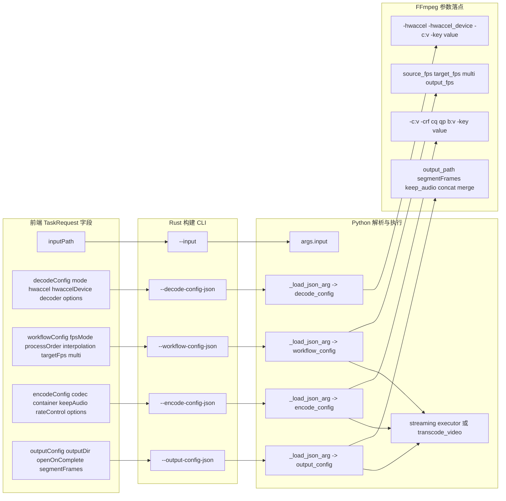

# 字段级映射图

这张图聚焦关键字段如何从前端对象映射到后端执行参数，以及它们在流式执行和分段输出中的落点。

关键映射示例：

- `decodeConfig.hwaccelDevice` -> `decode_config.hwaccelDevice` -> `-hwaccel_device`
- `decodeConfig.options` -> `decode_config.options` -> 解码器附加参数
- `encodeConfig.rateControl.mode/value` -> `rateControl` -> `-crf` / `-cq` / `-qp` / `-b:v`
- `encodeConfig.options` -> `encode_config.options` -> 编码器附加参数
- `workflowConfig.interpolation.targetFps` 与 `workflowConfig.interpolation.multi` -> 流程内部计算 -> 流式编码 `fps/output_fps`
- `outputConfig.segmentFrames` -> 分段 sidecar / manifest -> 分段拼接与断点恢复
