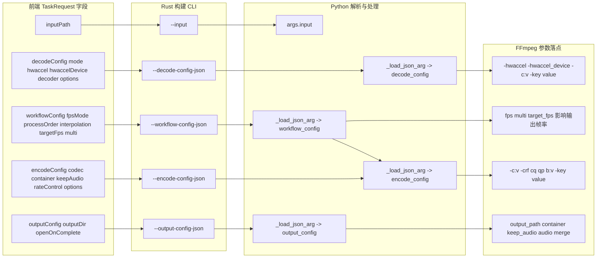

# 字段级映射图

该图聚焦关键字段如何从前端对象映射到后端解析结果，以及最终 ffmpeg 参数落点。

关键示例：

- decodeConfig.hwaccelDevice -> decode_config hwaccelDevice -> -hwaccel_device
- encodeConfig.rateControl.mode value -> rateControl -> -crf 或 -cq 或 -qp 或 -b:v
- decodeConfig.options 与 encodeConfig.options -> options -> -key value
- workflowConfig.interpolation.targetFps multi -> 流程内部计算 -> encode_from_frames fps output_fps
