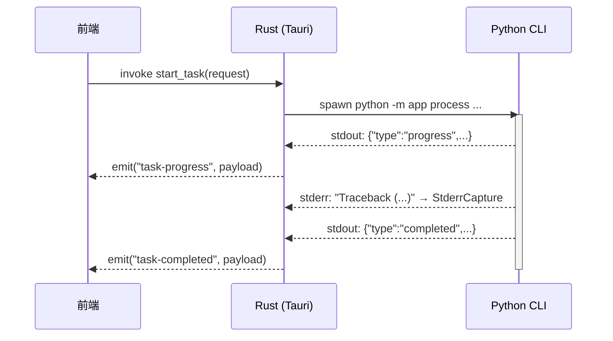

# IPC 通信协议

VP Workbench 的跨层通信分为两个区间:前端与 Rust 之间通过 Tauri 的 IPC 机制交互;Rust 与 Python 之间通过子进程 stdout 的 NDJSON(Newline Delimited JSON)行协议交互。

> **Phase B 状态(2026 起):** 所有 Tauri 命令均返回 `Result<T, ShellError>`,前端通过 `InvokeError { code, message, details }` 路由错误;Python `Traceback` 通过 `StderrCapture` 兜底,即使在 NDJSON 终止事件发出前崩溃也能到达前端;watchdog 在 600s 无 stdout 进度时把任务标记为 `Stalled`。本节描述的就是 Phase B 之后的当前契约。

## 前端 ↔ Rust:Tauri Command

### Command 清单

Rust 层通过 `tauri::command` 暴露 12 个命令,前端通过 `@tauri-apps/api/core` 的 `invoke()` 调用。命令注册在 [`frontend/src-tauri/src/lib.rs`](../frontend/src-tauri/src/lib.rs),命令体下沉到 `dialogs.rs` / `tasks/commands.rs` / `persistence/commands.rs` / `services/environment_service.rs`。

| Command | 签名 | 职责 |
|---------|------|------|
| `pick_inputs` | `() -> Result<Vec<String>, ShellError>` | 打开原生文件对话框(`AsyncFileDialog`),选择视频文件 |
| `pick_output_directory` | `() -> Result<Option<String>, ShellError>` | 打开原生目录对话框,选择输出目录 |
| `check_environment` | `(forceRefresh: bool) -> Result<EnvironmentCheckPayload, ShellError>` | 执行或读取环境检查(带 fingerprint 缓存) |
| `load_workbench_preset` | `() -> Result<Option<WorkbenchPreset>, ShellError>` | 从本地加载工作台预设 |
| `save_workbench_preset` | `(preset: WorkbenchPreset) -> Result<(), ShellError>` | 保存工作台预设(原子写) |
| `inspect_video` | `(inputPath: String) -> Result<VideoInfo, ShellError>` | 探测输入视频元数据 |
| `check_resume_state` | `(request: TaskRequest) -> Result<Value, ShellError>` | 预检查输出文件和续传 sidecar 状态 |
| `start_task` | `(request: TaskRequest) -> Result<(), ShellError>` | 启动 Python 处理子进程 |
| `cancel_task` | `() -> Result<(), ShellError>` | 取消当前运行任务(协作式) |
| `pause_task` | `() -> Result<(), ShellError>` | 暂停当前运行任务 |
| `resume_task` | `() -> Result<(), ShellError>` | 恢复当前暂停任务 |
| `open_output_location` | `(path: String) -> Result<(), ShellError>` | 用系统默认程序打开输出目录 |

所有命令体均为 `async fn`;对话框命令使用 `rfd::AsyncFileDialog` 避免阻塞 tokio runtime。

### 权限清单

Tauri v2 的权限系统要求每个 command 在 ACL 中显式声明。权限文件 [`frontend/src-tauri/permissions/default.toml`](../frontend/src-tauri/permissions/default.toml) 中对应每个命令都有 `allow-<command>` 条目。`lib.rs::tests` 模块通过 `include_str!` 反向断言:

- 所有活跃命令都出现在默认权限中
- 已移除的旧命令(`pick-input`、`pick-output`、`open-file-or-directory`、`resolved-runtime`)不出现在权限清单中
- `gen/schemas/acl-manifests.json` 与 `permissions/default.toml` 同源

### 前端封装:`safeInvoke` 与 `InvokeError`

所有 `invoke()` 调用统一封装在 [`frontend/src/lib/ipc/client.ts`](../frontend/src/lib/ipc/client.ts)。该文件提供两个关键功能:

1. **运行时检测**:`isTauriRuntime()` 检查 `window.__TAURI_INTERNALS__`,用于区分桌面运行和浏览器预览模式
2. **错误规范化**:`normalizeInvokeError()` 把 Rust 序列化的 `{ code, message }` 包装为 `InvokeError` 类实例,保留 `code` / `message` / `details` 三个字段供调用方路由

```typescript
// client.ts:23-33
export class InvokeError extends Error {
  readonly code: string                                  // 来自 ShellError::code() 的 snake_case
  readonly details: Record<string, unknown> | null       // ShellError 当前未填充;NDJSON error 事件会填
  constructor(code, message, details = null) { ... }
}

// client.ts:60-69
export async function safeInvoke<T>(command, args?): Promise<T> {
  if (!isTauriRuntime()) throw new Error(BROWSER_RUNTIME_MESSAGE)
  try {
    return await invoke<T>(command, args)
  } catch (error) {
    throw normalizeInvokeError(error)  // 把 { code, message } 转 InvokeError
  }
}
```

调用方可以这样路由:

```typescript
try {
  await taskIpc.start(request)
} catch (error) {
  if (error instanceof InvokeError && error.code === 'schema_mismatch') {
    // 表单字段与 Rust 模型漂移,提示重置草稿
  } else if (error instanceof InvokeError && error.code === 'persistence_failed') {
    // 落盘失败,记到 operation issue
  } else {
    // 通用兜底
  }
}
```

### 事件监听

任务执行期间,Rust 通过 Tauri 的 `Emitter::emit()` 向前端推送事件。前端通过 [`frontend/src/lib/ipc/events.ts`](../frontend/src/lib/ipc/events.ts) 的 `listenTaskEvents()` 一次性注册 6 类事件的监听器,返回 `UnlistenFn` 用于批量取消。

```typescript
export interface TaskEventHandlers {
  onProgress: (payload: TaskProgressPayload) => void
  onLog: (payload: TaskLogPayload) => void
  onCompleted: (payload: TaskCompletedPayload) => void
  onError: (payload: TaskError) => void           // 含 traceback / stderrTail
  onCancelled: () => void
  onResumeStatus?: (payload: ResumeStatus) => void
}
```

事件名常量集中定义在 [`frontend/src-tauri/src/protocol.rs`](../frontend/src-tauri/src/protocol.rs) 的 `TaskEventName` 枚举,通过 `ts-rs` 导出为前端 `TASK_EVENT_NAMES`,保证字符串一致。

## Rust ↔ Python:NDJSON 行协议

### 通信模式

Rust 启动 Python 子进程时,将 stdout 和 stderr 重定向为管道。Python 通过 `print()` 向 stdout 输出 JSON 行,Rust 通过 `tokio::io::AsyncBufReadExt` 按行读取。



### 协议常量

事件名称和错误码在 Rust 层集中定义,避免魔法字符串分散在各处。

**事件名称**([`protocol.rs:8-31`](../frontend/src-tauri/src/protocol.rs)):

```rust
#[derive(Serialize, Deserialize, JsonSchema, TS)]
#[serde(rename_all = "kebab-case")]
pub enum TaskEventName {
    TaskProgress,      // "task-progress"
    TaskCompleted,     // "task-completed"
    TaskError,         // "task-error"     <- Python NDJSON error / Rust watchdog stall / runtime panic
    TaskCancelled,     // "task-cancelled" <- 仅用户主动 cancel_task
    TaskLog,           // "task-log"
    TaskResumeStatus,  // "task-resume-status"
}
```

**进度前缀**([`protocol.rs:33`](../frontend/src-tauri/src/protocol.rs)):

```rust
pub const TERMINAL_PROGRESS_PREFIX: &str = "[VP_PROGRESS]";
```

前端用这个前缀识别终端进度条行,实现进度条的覆盖更新(新进度行替换旧进度行,而不是追加)。

### NDJSON Envelope

Python stdout 的每一行 JSON 必须包含 `type` 字段,Rust 在 [`tasks/envelope.rs`](../frontend/src-tauri/src/tasks/envelope.rs) 中定义对应的 envelope:

```rust
#[derive(Deserialize)]
#[serde(tag = "type", rename_all = "snake_case")]
pub enum NdjsonEnvelope {
    #[serde(rename = "progress")]
    Progress(TaskProgressPayload),
    #[serde(rename = "completed")]
    Completed(TaskCompletedPayload),
    #[serde(rename = "error")]
    Error(TaskErrorPayload),
    #[serde(rename = "resume_status")]
    ResumeStatus(ResumeStatusPayload),
}
```

如果一行无法解析为上述 envelope,则被视为普通日志行,通过 `TaskLog` 事件转发给前端。

### 事件载荷结构

所有载荷结构定义在 [`models/task.rs`](../frontend/src-tauri/src/models/task.rs),并通过 `ts-rs` 自动生成 TypeScript 类型到 `frontend/src/types/generated/`。

#### TaskProgressPayload

```rust
pub struct TaskProgressPayload {
    pub current: u64,        // 当前处理帧数
    pub total: u64,          // 总帧数
    pub percent: f64,        // 进度百分比
    pub stage: String,       // 当前阶段名称(如 "Frame Interpolation")
    pub stage_index: u64,    // 当前阶段索引(从 1 开始)
    pub stage_total: u64,    // 总阶段数
}
```

#### TaskCompletedPayload

```rust
pub struct TaskCompletedPayload {
    pub output_path: String,
    pub processed_frames: u64,
    pub time_seconds: f64,
}
```

#### TaskErrorPayload

```rust
pub struct TaskErrorPayload {
    pub code: TaskErrorCode,                  // 错误码枚举(下表)
    pub message: String,                      // 错误描述
    pub details: Option<serde_json::Value>,   // 附加详情(含 traceback / stderrTail / stalled)
}
```

`details` 字段的常见键:

| 字段 | 含义 | 来源 |
|------|------|------|
| `traceback` | Python 异常调用栈 | `ProcessError.from_exception` 在 `__main__.py` 兜底时附;Rust `StderrCapture.summary()` 在 watchdog/RuntimePanic 路径兜底 |
| `stalled` | `true` 表示 watchdog 触发 | `tasks/controller.rs` 的 `CancelReason::Stalled` 分支 |
| `outputPath` / `completedChunks` / `completedOutputFrames` / `sidecarSignatureMatch` | 续传冲突上下文 | Python `ResumeConflictError.to_details()` |

#### ResumeStatusPayload

```rust
pub struct ResumeStatusPayload {
    pub resumed: bool,
    pub completed_chunks: u64,
    pub completed_output_frames: u64,
    pub start_source_frame: u64,
    pub total_output_frames: u64,
}
```

### 字段命名约定

| 层级 | 源定义 | 序列化规则 | 示例字段名 |
|------|--------|-----------|-----------|
| Rust 模型 | `models/*.rs` | `#[serde(rename_all = "camelCase")]` | `hwaccel_device` |
| NDJSON 输出 | Python stdout | camelCase(`_CamelBase`) | `hwaccelDevice` |
| TypeScript 类型 | `ts-rs` 自动生成 | camelCase | `hwaccelDevice` |
| Python Pydantic | `models/__init__.py` | `_CamelBase` 自动映射 | 同时接受 snake_case 与 camelCase |

## 错误码体系

### 三层一致的 TaskErrorCode

错误码在三层有同名的枚举,且字符串值(`snake_case`)逐字对齐。

- **Rust**: [`models/task.rs::TaskErrorCode`](../frontend/src-tauri/src/models/task.rs) — 14 个 variant,`#[serde(rename_all = "snake_case")]`
- **Python**: [`backend/app/errors/_codes.py::TaskErrorCode`](../backend/app/errors/_codes.py) — `str, Enum`,值为 snake_case
- **TypeScript**: `frontend/src/types/generated/TaskErrorCode.ts` — 由 `ts-rs` 从 Rust 派生

| 错误码 | 触发场景 | 典型 details |
|--------|----------|--------------|
| `missing_ffmpeg` | FFmpeg/FFprobe 未找到 | — |
| `missing_model` | RIFE 模型文件缺失 | — |
| `missing_tensor_backend` | 指定的张量后端未安装(torch/paddle/onnxruntime) | — |
| `missing_python_dependency` | Python import 阶段缺包 | `traceback` |
| `cancelled` | 用户调 `cancel_task` 后子进程退出 | — |
| `process_failed` | 处理过程未预期错误(兜底码) | `traceback` |
| `spawn_failed` | Rust 启动 Python 子进程失败 | — |
| `runtime_panic` | 子进程非零退出,但未发出 NDJSON 终止事件 | `traceback` 来自 StderrCapture |
| `invalid_input` | 输入文件不存在 / 格式不支持 / 命令参数非法 | — |
| `invalid_config` | 配置参数非法(Pydantic 校验失败) | — |
| `resume_conflict` | 最终输出已存在,需要用户决策 | `outputPath` / `completedChunks` / `sidecarSignatureMatch` |
| `io_error` | 通用 IO 错误 | — |
| `schema_mismatch` | NDJSON 解析失败 / TaskRequest 反序列化失败 | — |
| `persistence_failed` | 工作台预设 / 环境缓存落盘失败 | — |

### Rust 侧的 ShellError → TaskErrorCode 映射

Rust 命令体抛出 [`ShellError`](../frontend/src-tauri/src/error.rs)(具名 enum),通过自定义 `Serialize` 实现序列化为 `{ code, message }`(camelCase)被前端 `safeInvoke` 接住。映射关系:

| `ShellError` variant | `TaskErrorCode` | 典型来源 |
|----------------------|-----------------|---------|
| `RuntimeResolution(String)` | `process_failed` | `resolve_runtime_paths` 找不到 Python/FFmpeg |
| `Spawn(io::Error)` | `spawn_failed` | `command-group` 启动失败 |
| `BackendExit(String)` | `runtime_panic` | 子进程非零退出无 NDJSON 终止事件 |
| `NdjsonDecode(serde_json::Error)` | `schema_mismatch` | stdout 行结构与 envelope 不匹配 |
| `SchemaValidation(String)` | `schema_mismatch` | TaskRequest 校验失败 |
| `Persistence(String)` | `persistence_failed` | `tempfile.persist` 失败、目录创建失败 |
| `Io(io::Error)` | `io_error` | 通用 IO |
| `InvalidInput(String)` | `invalid_input` | 命令参数缺字段 |
| `NoActiveTask` | `invalid_input` | 调 `cancel/pause/resume_task` 时无活动任务 |
| `Other(String)` | `process_failed` | 兜底(Phase C.2.3 计划移除) |

### Python 侧的 ProcessError

Python 在 [`backend/app/errors/__init__.py`](../backend/app/errors/__init__.py) 定义统一的 `ProcessError`:

```python
class ProcessError(Exception):
    def __init__(self, code: TaskErrorCode | str, message: str, *, details: dict | None = None):
        ...
    @classmethod
    def from_exception(cls, exc: BaseException) -> "ProcessError":
        # 用 _bootstrap.infer_error_code 推断 code,自动附 traceback
```

`__main__.py` 是顶层兜底:任何到达 Python 边界的未捕获异常都会被包装为 `ProcessError`,通过 NDJSON `{"type":"error","code":...,"message":...,"details":{"traceback":...}}` 发出,然后以 `SystemExit(1)` 退出。

### 跨层错误传播

```
                  Python ProcessError
                          │
                          ▼
       stdout NDJSON: {"type":"error","code":"...","message":"...","details":{}}
                          │
                          ▼
       Rust tasks/envelope.rs: NdjsonEnvelope::Error
                          │
                          ▼
       app.emit("task-error", TaskErrorPayload)
                          │
                          ▼
       前端 lib/ipc/events.ts: handlers.onError(payload)
                          │
                          ▼
       Pinia task store → MediaItem.taskState.status = 'error'
```

若 Python 在 NDJSON `error` 帧发出**之前**就崩溃(例如 import-time 失败、SIGSEGV),则走以下兜底链路:

```
       Python sys.stderr: "Traceback (most recent call last):\n..."
                          │
                          ▼
       Rust tasks/stderr.rs: StderrCapture.record(line)
                          │
                          ▼
       子进程退出 (exit_status.success() == false)
                          │
                          ▼
       tasks/controller.rs: ShellError::BackendExit + StderrCapture.summary()
                          │
                          ▼
       app.emit("task-error", { code: "runtime_panic", details: { traceback } })
```

## 任务终止事件区分

进程退出后,controller 根据状态分发**有且仅有一个**终止事件:

| 事件 | 何时发出 | 语义 |
|------|---------|------|
| `task-completed` | NDJSON `completed` 帧已发,exit_status 为 0 | 成功 |
| `task-cancelled` | `cancel_token.reason() == User` | 用户主动取消 |
| `task-error` | `cancel_token.reason() == Stalled` | watchdog 判定卡顿(附 `stalled: true`) |
| `task-error` | exit_status 非 0 且无 NDJSON 终止事件 | RuntimePanic(附 StderrCapture 摘要) |
| `task-error` | NDJSON `error` 帧已发 | Python 显式失败(transport 直接转发) |

`task-cancelled` 与 `task-error{code: cancelled}` 不同:前者无 payload,仅在用户主动取消时出现;后者只在 Python 自己抛出 `ProcessError(CANCELLED)` 时出现(罕见)。

## 进程生命周期

任务进程的生命周期由 [`tasks/controller.rs`](../frontend/src-tauri/src/tasks/controller.rs) 管理,涉及三类并发 task:

```mermaid
graph LR
    A[start_task] --> B[spawn_stdout_reader]
    A --> C[spawn_stderr_reader]
    A --> D[spawn_watchdog]
    A --> E[spawn_controller]
    E --> F{tokio::select!}
    F -->|Cancel/Pause/Resume mpsc| G[处理控制消息]
    F -->|cancel_token.cancelled| H[kill 子进程]
    F -->|child.wait| I[退出,清理 state,分发终止事件]
    B -->|NDJSON 解析| J[emit progress/completed/error/resume_status]
    B -->|进度心跳| K[更新 progress_beat]
    C -->|逐行转发| L[emit TaskLog]
    C -->|StderrCapture| M[滚动缓冲 traceback]
    D -->|每秒比较 progress_beat| N{超时?}
    N -->|是| O[cancel_token.cancel(Stalled)]
```

### 启动流程(`start_task` → `spawn_task`)

1. 检查 `TaskState.current`,若已有运行任务则返回 `ShellError::InvalidInput`(单任务并发限制)
2. 调用 `resolve_runtime_paths()` 获取运行时路径
3. 调用 `build_process_command()` 构建 CLI 命令(4 段 JSON + `--resume-mode`)
4. 通过 `command-group::AsyncGroupChild` 启动进程组(确保取消时整棵树被清理)
5. 创建 `TaskHandle`(封装 `CancellationToken` + pause/resume mpsc + terminal-sent 标志)
6. Spawn 4 个异步 task:stdout reader、stderr reader、watchdog、controller
7. 将 `RunningTask` 存入 `TaskState.current`

### Watchdog(stall 检测)

[`tasks/controller.rs`](../frontend/src-tauri/src/tasks/controller.rs) 的 `spawn_watchdog`:

- 每秒读取 `progress_beat: Arc<Mutex<Instant>>`(由 stdout reader 在收到任何行时更新)
- 若距上次更新超过 `VP_TASK_STALL_TIMEOUT_SECS`(默认 600s),调 `cancel_token.cancel(CancelReason::Stalled)`
- 环境变量设为 `0` 时关闭 watchdog
- Cancel 后 controller 接管,kill 子进程并 emit `task-error{code:runtime_panic, details:{stalled:true, traceback:...}}`

### 控制流程(`spawn_controller`)

Controller 通过 `tokio::select!` 同时监听四个输入:

- **控制消息通道**:`Pause` / `Resume` 请求
- **`cancel_token.cancelled()`**:用户取消或 watchdog 触发
- **`child.wait()`**:子进程退出
- **进度心跳更新**:用于通过 `mpsc::watch` 重置 watchdog 超时

当子进程退出时,controller:

1. 从 lock 内清 `TaskState.current`
2. 根据 `cancel_token.reason()` + exit_status + 是否已收到 NDJSON 终止事件,分发对应终止事件(见上表)
3. `terminal_sent` 标志保证只发一次

### 取消流程

`cancel_task` 命令:

1. `state.current` 取 `CancellationToken` 克隆
2. `token.cancel(CancelReason::User)`(协作式,不直接 kill)
3. Controller 在 `select!` 中收到 `cancelled()` resolve,先 `resume()`(如处于暂停)再 `child.kill()`
4. 子进程退出后走终止事件分发,发出 `task-cancelled`

不再使用旧的 `was_cancelled: bool` 标志,而是通过 `TaskHandle` 与 `CancellationToken` 统一表达(Phase B.2 引入)。

## 跨层契约的同源机制

| 契约 | SSOT 位置 | 派生目标 |
|------|----------|---------|
| TaskRequest / DecodeConfig / EncodeConfig / WorkflowConfig / ... | Rust `models/*.rs`(`#[derive(TS, JsonSchema)]`) | TS `frontend/src/types/generated/*.ts`,Python schema 验证(`backend/app/schemas/*.schema.json` via `dump_schema` bin) |
| TaskErrorCode | 三处手维护,通过 `test_schema_drift.py` 比对 | — |
| TaskEventName | Rust `protocol.rs::TaskEventName`(`#[derive(TS)]`) | TS `frontend/src/types/generated/TaskEventName.ts` |
| `ShellError` 与 `{ code, message }` wire 格式 | Rust `error.rs::ShellError` 的 `Serialize` 实现 | 前端 `InvokeError` 类(手维护,字段对齐) |
| NDJSON `type` 字段 | Rust `tasks/envelope.rs::NdjsonEnvelope` + Python `protocol/__init__.py::NdjsonEmitter` | 测试 `test_protocol.py` 覆盖往返 |

Phase C.4 计划在 `pre-commit` 与 CI 加入 `scripts/check_error_code_drift.py`,自动比对三处 TaskErrorCode 成员名,防止再次出现 Phase A 之前的漂移。
