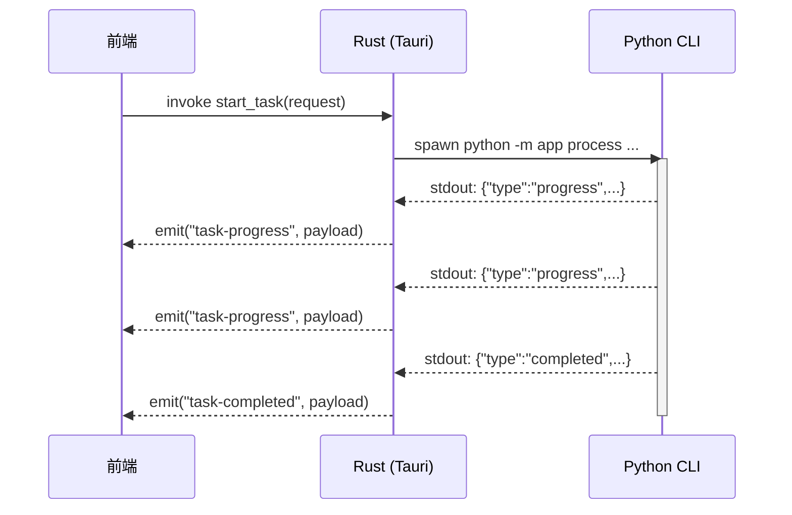
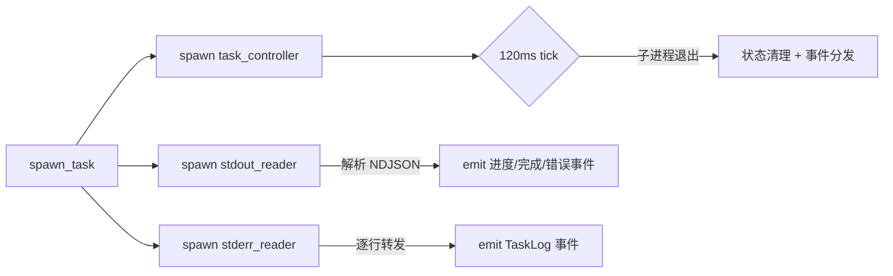

# IPC 通信协议

VP Workbench 的跨层通信分为两个区间：前端与 Rust 之间通过 Tauri 的 IPC 机制交互；Rust 与 Python 之间通过子进程 stdout 的 NDJSON（Newline Delimited JSON）行协议交互。

## 前端 ↔ Rust：Tauri Command

### Command 清单

Rust 层通过 `tauri::command` 暴露 11 个命令，前端通过 `@tauri-apps/api/core` 的 `invoke()` 调用。所有命令定义在 [`frontend/src-tauri/src/lib.rs`](../frontend/src-tauri/src/lib.rs:18-157)。

| Command | 签名 | 职责 |
|---------|------|------|
| `pick_inputs` | `() -> Result<Vec<String>, String>` | 打开原生文件对话框，选择视频文件 |
| `pick_output_directory` | `() -> Result<Option<String>, String>` | 打开原生目录对话框，选择输出目录 |
| `check_environment` | `(forceRefresh: bool) -> Result<EnvironmentCheckPayload, String>` | 执行或读取环境检查 |
| `load_workbench_preset` | `() -> Result<Option<WorkbenchPreset>, String>` | 从本地加载工作台预设 |
| `save_workbench_preset` | `(preset: WorkbenchPreset) -> Result<(), String>` | 保存工作台预设到本地 |
| `inspect_video` | `(input_path: String) -> Result<VideoInfo, String>` | 探测输入视频元数据 |
| `check_resume_state` | `(request: TaskRequest) -> Result<Value, String>` | 预检查输出文件和续传 sidecar 状态 |
| `start_task` | `(request: TaskRequest) -> Result<(), String>` | 启动 Python 处理子进程 |
| `cancel_task` | `() -> Result<(), String>` | 取消当前运行任务 |
| `pause_task` | `() -> Result<(), String>` | 暂停当前运行任务（仅 Windows） |
| `resume_task` | `() -> Result<(), String>` | 恢复当前暂停任务（仅 Windows） |
| `open_output_location` | `(path: String) -> Result<(), String>` | 用系统默认程序打开输出目录 |

### 权限清单

Tauri v2 的权限系统要求每个 command 在 ACL 中显式声明。权限文件 [`frontend/src-tauri/permissions/default.toml`](../frontend/src-tauri/permissions/default.toml) 中对应每个命令都有 `allow-<command>` 条目。`lib.rs` 的集成测试会验证：

- 所有活跃命令都出现在默认权限中
- 已移除的旧命令（如 `pick-input`、`pick-output`、`open-file-or-directory`、`resolved-runtime`）不出现在权限清单中

### 前端封装

所有 `invoke()` 调用统一封装在 [`frontend/src/lib/tauri.ts`](../frontend/src/lib/tauri.ts)。该文件提供两个关键功能：

1. **运行时检测**：`isTauriRuntime()` 检查 `window.__TAURI_INTERNALS__` 是否存在，用于区分桌面运行和浏览器预览模式
2. **错误规范化**：`normalizeInvokeError()` 将 Tauri 权限错误和缺失命令错误转换为友好的中文提示

```typescript
// tauri.ts:38-47
async function safeInvoke<T>(command: string, args?: Record<string, unknown>): Promise<T> {
  if (!isTauriRuntime()) {
    throw new Error(BROWSER_RUNTIME_MESSAGE)
  }
  try {
    return await invoke<T>(command, args)
  } catch (error) {
    throw normalizeInvokeError(error)
  }
}
```

### 事件监听

任务执行期间，Rust 通过 Tauri 的 `Emitter::emit()` 向前端推送事件。前端通过 `tauri.ts:112-133` 的 `listenTaskEvents()` 一次性注册 6 类事件的监听器，返回一个 `UnlistenFn` 用于批量取消监听。

```typescript
export interface TaskEventHandlers {
  onProgress: (payload: TaskProgressPayload) => void
  onLog: (payload: TaskLogPayload) => void
  onCompleted: (payload: TaskCompletedPayload) => void
  onError: (payload: TaskError) => void
  onCancelled: () => void
  onResumeStatus?: (payload: ResumeStatus) => void
}
```

## Rust ↔ Python：NDJSON 行协议

### 通信模式

Rust 启动 Python 子进程时，将子进程的 stdout 和 stderr 重定向为管道。Python 通过 `print()` 向 stdout 输出 JSON 行，Rust 通过 `tokio::io::AsyncBufReadExt` 按行读取。



### 协议常量

事件名称和错误码在 Rust 层集中定义，避免魔法字符串分散在各处。

**事件名称**（[`protocol.rs:8-31`](../frontend/src-tauri/src/protocol.rs:8-31)）：

```rust
#[derive(Debug, Clone, Copy, PartialEq, Eq, Serialize, Deserialize, JsonSchema, TS)]
#[serde(rename_all = "kebab-case")]
pub enum TaskEventName {
    TaskProgress,      // "task-progress"
    TaskCompleted,     // "task-completed"
    TaskError,         // "task-error"
    TaskCancelled,     // "task-cancelled"
    TaskLog,           // "task-log"
    TaskResumeStatus,  // "task-resume-status"
}
```

**进度前缀**（[`protocol.rs:33`](../frontend/src-tauri/src/protocol.rs:33)）：

```rust
pub const TERMINAL_PROGRESS_PREFIX: &str = "[VP_PROGRESS]";
```

前端 `task-events.ts` 用这个前缀来识别终端进度条行，实现进度条的覆盖更新（新进度行替换旧进度行，而不是追加）。

### NDJSON Envelope

Python stdout 的每一行 JSON 必须包含 `type` 字段，Rust 在 [`tasks.rs:21-32`](../frontend/src-tauri/src/tasks.rs:21-32) 中定义了对应的 envelope：

```rust
#[derive(Debug, Clone, Deserialize)]
#[serde(tag = "type", rename_all = "snake_case")]
enum NdjsonEnvelope {
    #[serde(rename = "progress")]
    Progress(TaskProgressPayload),
    #[serde(rename = "completed")]
    Completed(TaskCompletedPayload),
    #[serde(rename = "error")]
    Error(TaskErrorPayload),
    #[serde(rename = "resume_status")]
    ResumeStatus(ResumeStatusPayload),
}
```

如果一行无法解析为上述 envelope，则被视为普通日志行，通过 `TaskLog` 事件转发给前端。

### 事件载荷结构

所有载荷结构定义在 [`models.rs`](../frontend/src-tauri/src/models.rs)，并通过 `ts-rs` 自动生成 TypeScript 类型。

#### TaskProgressPayload

```rust
pub struct TaskProgressPayload {
    pub current: u64,        // 当前处理帧数
    pub total: u64,          // 总帧数
    pub percent: f64,        // 进度百分比
    pub stage: String,       // 当前阶段名称（如 "Frame Interpolation"）
    pub stage_index: u64,    // 当前阶段索引（从 1 开始）
    pub stage_total: u64,    // 总阶段数
}
```

#### TaskCompletedPayload

```rust
pub struct TaskCompletedPayload {
    pub output_path: String,     // 输出文件路径
    pub processed_frames: u64,   // 实际处理的帧数
    pub time_seconds: f64,       // 耗时（秒）
}
```

#### TaskErrorPayload

```rust
pub struct TaskErrorPayload {
    pub code: TaskErrorCode,          // 错误码枚举
    pub message: String,              // 错误描述
    pub details: Option<Value>,       // 附加详情（可选）
}
```

#### ResumeStatusPayload

```rust
pub struct ResumeStatusPayload {
    pub resumed: bool,                   // 是否处于续传模式
    pub completed_chunks: u64,           // 已完成的片段数
    pub completed_output_frames: u64,    // 已完成的输出帧数
    pub start_source_frame: u64,         // 续传起始源帧
    pub total_output_frames: u64,        // 总输出帧数
}
```

### 字段命名约定

| 层级 | 源定义 | 序列化规则 | 示例字段名 |
|------|--------|-----------|-----------|
| Rust 模型 | `models.rs` | `#[serde(rename_all = "camelCase")]` | `hwaccel_device` |
| NDJSON 输出 | Python stdout | camelCase | `hwaccelDevice` |
| TypeScript 类型 | ts-rs 生成 | camelCase | `hwaccelDevice` |
| Python Pydantic | `models/__init__.py` | `_CamelBase` 自动映射 | 同时接受 snake_case 和 camelCase |

## 错误码体系

### Rust 层错误码

[`models.rs:210-237`](../frontend/src-tauri/src/models.rs:210-237)：

```rust
pub enum TaskErrorCode {
    MissingFfmpeg,          // "missing_ffmpeg"
    MissingModel,           // "missing_model"
    MissingTensorBackend,   // "missing_tensor_backend"
    Cancelled,              // "cancelled"
    ProcessFailed,          // "process_failed"
    InvalidInput,           // "invalid_input"
    InvalidConfig,          // "invalid_config"
    ResumeConflict,         // "resume_conflict"
}
```

Rust 侧序列化为 snake_case（`#[serde(rename_all = "snake_case")]`），但错误码的字符串表示通过 `as_str()` 方法显式控制，确保与 Python 侧完全一致。

### Python 层错误码

Python 在 [`backend/app/errors.py`](../backend/app/errors.py) 定义统一的 `ProcessError`：

```python
class ProcessError(Exception):
    def __init__(self, code: str, message: str, *, details: dict[str, Any] | None = None)
```

Python CLI 在 `__main__.py` 中捕获所有未处理异常，统一序列化为 JSON 输出。`cli.py` 中映射的具体错误码与 Rust 枚举一一对应：

| Python 错误码 | Rust 枚举变体 | 触发场景 |
|--------------|--------------|---------|
| `MISSING_FFMPEG` | `MissingFfmpeg` | FFmpeg/FFprobe 未找到 |
| `MISSING_MODEL` | `MissingModel` | RIFE 模型文件缺失 |
| `MISSING_TENSOR_BACKEND` | `MissingTensorBackend` | 指定的张量后端未安装 |
| `INVALID_INPUT` | `InvalidInput` | 输入文件不存在或格式不支持 |
| `INVALID_CONFIG` | `InvalidConfig` | 配置参数非法 |
| `RESUME_CONFLICT` | `ResumeConflict` | 输出文件已存在且续传签名不匹配 |
| `CANCELLED` | `Cancelled` | 用户取消任务 |
| `PROCESS_FAILED` | `ProcessFailed` | 处理过程中发生未预期错误 |

### 跨层错误传播

```
Python ProcessError
    → stdout NDJSON: {"type":"error","code":"process_failed","message":"...","details":{}}
    → Rust tasks.rs: NdjsonEnvelope::Error
    → app.emit("task-error", TaskErrorPayload)
    → 前端 task-events.ts: applyTaskError()
    → Pinia task store: handleCurrentTaskErrored()
    → 更新 MediaItem.taskState.status = 'error'
```

## 进程生命周期

任务进程的生命周期由 [`tasks.rs`](../frontend/src-tauri/src/tasks.rs) 管理，涉及三个并发任务：



### 启动流程（`spawn_task`）

1. 检查 `TaskState.current`，若已有运行任务则拒绝（单任务并发限制）
2. 调用 `resolve_runtime_paths()` 获取运行时路径
3. 调用 `build_process_command()` 构建 CLI 命令（4 段 JSON + `--resume-mode`）
4. 通过 `command-group` 的 `group_spawn()` 启动进程组（确保取消时整棵树被清理）
5. 创建 `mpsc::channel(8)` 作为任务控制通道
6. Spawn 三个异步任务：stdout reader、stderr reader、task controller
7. 将 `RunningTask` 存入 `TaskState.current`

### 控制流程（`task_controller`）

Task controller 通过 `tokio::select!` 同时监听两个输入：

- **控制消息通道**：接收 `Cancel`/`Pause`/`Resume` 请求
- **120ms ticker**：轮询子进程退出状态

```rust
// tasks.rs:304-338
loop {
    tokio::select! {
        maybe_message = control_rx.recv() => {
            // 处理 Cancel / Pause / Resume
        }
        _ = ticker.tick() => {
            // 轮询 child.try_wait()
        }
    }
}
```

当子进程退出时，controller 清理 `TaskState.current`，并根据退出原因分发最终事件：

- `was_cancelled == true` → emit `task-cancelled`
- `exit_status.success() == false` 且未收到 terminal 事件 → emit `task-error`（`ProcessFailed`）
- `try_wait()` 返回错误 → emit `task-error`

### 取消流程

取消任务时，Rust 首先设置 `was_cancelled = true`，然后调用 `child.start_kill()` 发送 SIGKILL（或 Windows 等效信号）。`command-group` 保证进程组内所有子进程一并终止。若任务当前处于暂停状态，controller 会先 `resume()` 再 `kill()`，避免僵尸进程。
