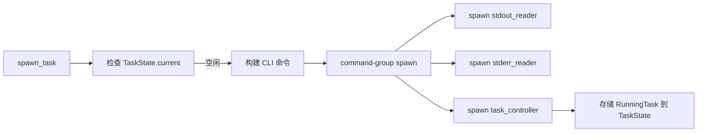
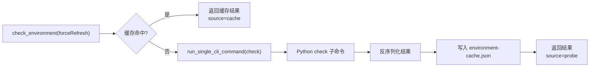

# Rust 运行时架构

Rust 桌面外壳层基于 Tauri v2 构建，承担三大核心职责：作为前端与 Python 之间的 IPC 网关、管理 Python 子进程的生命周期、提供本地持久化与环境缓存。本层不执行任何算法逻辑，所有计算密集型工作均委托给 Python 子进程。

## Tauri Command 面

全部 11 个 commands 定义在 [`frontend/src-tauri/src/lib.rs`](../frontend/src-tauri/src/lib.rs:18-157)，通过 `tauri::generate_handler!` 宏注册。

### 文件与目录操作

| Command | 实现位置 | 说明 |
|---------|----------|------|
| `pick_inputs` | `lib.rs:19-31` | `rfd::FileDialog` 打开多选文件对话框，过滤 `mp4/avi/mkv/mov/flv/webm/wmv/ts` |
| `pick_output_directory` | `lib.rs:34-39` | `rfd::FileDialog` 打开目录选择对话框 |
| `open_output_location` | `lib.rs:116-124` | `open::that_detached()` 用系统默认程序打开目录或文件所在目录 |

### 环境检查

| Command | 实现位置 | 说明 |
|---------|----------|------|
| `check_environment` | `lib.rs:43-48` | 委托 `services::environment_service::check_environment()`，支持缓存优先策略 |

### 预设管理

| Command | 实现位置 | 说明 |
|---------|----------|------|
| `load_workbench_preset` | `lib.rs:52-56` | 从本地 `workbench-preset.json` 加载 |
| `save_workbench_preset` | `lib.rs:59-65` | 保存到本地 `workbench-preset.json` |

### 视频处理

| Command | 实现位置 | 说明 |
|---------|----------|------|
| `inspect_video` | `lib.rs:68-79` | 同步调用 Python `info` 子命令，反序列化为 `VideoInfo` |
| `check_resume_state` | `lib.rs:92-98` | 同步调用 Python `inspect-output` 子命令 |
| `start_task` | `lib.rs:82-88` | 异步启动 Python `process` 子进程，委托 `tasks::spawn_task()` |
| `cancel_task` | `lib.rs:101-103` | 委托 `tasks::cancel_running_task()` |
| `pause_task` | `lib.rs:106-108` | 委托 `tasks::pause_running_task()` |
| `resume_task` | `lib.rs:111-113` | 委托 `tasks::resume_running_task()` |

### 集成测试

`lib.rs:162-212` 包含两项集成测试：

1. **`default_permissions_include_active_desktop_commands`**：验证 `default.toml` 中包含所有活跃命令的权限声明
2. **`default_permissions_exclude_removed_legacy_commands`**：验证已移除的旧命令不出现在权限清单中
3. **`generated_acl_manifest_tracks_active_commands_only`**：验证生成的 `acl-manifests.json` 中只包含活跃命令

## 运行时资源解析

[`runtime.rs`](../frontend/src-tauri/src/runtime.rs) 负责解析应用运行所需的全部外部资源路径，采用**四级解析优先级**：

```
1. 显式环境变量覆盖（VP_*）
2. 打包资源目录（resources/runtime/）
3. 开发环境源码布局（workspace_root/backend/）
4. 系统级 PATH 兜底
```

### ResolvedRuntimePaths

```rust
pub struct ResolvedRuntimePaths {
    pub backend_dir: PathBuf,           // Python 代码目录
    pub runtime_root: Option<PathBuf>,  // 运行时资源根目录
    pub python_executable: PathBuf,     // Python 可执行文件
    pub ffmpeg_path: Option<PathBuf>,   // FFmpeg 路径
    pub ffprobe_path: Option<PathBuf>, // FFprobe 路径
    pub model_dir: Option<PathBuf>,     // RIFE 模型目录
    pub tensorrt_dir: Option<PathBuf>,  // TensorRT 目录
    pub output_dir: PathBuf,            // 输出目录（app_local_data_dir/output）
    pub log_dir: PathBuf,               // 日志目录（app_local_data_dir/logs）
}
```

### 各资源查找策略

**Backend 目录**：

```rust
first_existing_dir([
    env_path("VP_BACKEND_DIR"),           // 环境变量
    resource_dir.map(|p| p.join("backend")), // 打包资源
    dev_backend_dir,                       // 开发源码 backend/
])
```

**Python 可执行文件**：

```rust
first_existing_file([
    env_path("VP_PYTHON_EXECUTABLE"),      // 环境变量
    runtime_root.map(|p| p.join("python").join("python.exe")), // bundled
    find_in_system_path("python.exe"),     // Windows PATH
    find_in_system_path("python3"),        // Linux/macOS PATH
])
```

Release 构建不强制要求 bundled Python；若系统 PATH 中有兼容的 Python 3.12+，可直接使用。

**FFmpeg / FFprobe**：

```rust
first_existing_file([
    env_path("VP_FFMPEG_PATH"),            // 环境变量
    runtime_root.map(|p| p.join("ffmpeg/bin/ffmpeg.exe")), // bundled
])
```

Release 构建**强制要求** FFmpeg 和 FFprobe 必须存在（通过 bundled 或环境变量），否则启动报错。

**模型目录**：

```rust
first_existing_dir([
    env_path("VP_RIFE_MODEL_DIR"),         // 环境变量
    runtime_root.map(|p| p.join("models")), // bundled
    dev_backend_dir.map(|p| p.join("models")), // 开发源码
])
```

Release 构建强制要求默认模型 `flownet_v4.25.pkl` 必须存在。

**TensorRT 目录**：

```rust
first_existing_dir([
    env_path("VP_TENSORRT_DIR"),           // 环境变量
    runtime_root.map(|p| p.join("tensorrt")), // bundled
])
```

未设置时引擎自动降级到 CUDA EP，不报错。

### 环境变量透传

`build_env_map()` 将解析到的路径转换为环境变量键值对，注入到 Python 子进程：

```rust
vec![
    ("PYTHONIOENCODING", "utf-8"),
    ("PYTHONUTF8", "1"),
    ("VP_PYTHON_EXECUTABLE", ...),
    ("VP_OUTPUT_DIR", ...),
    ("VP_FFMPEG_PATH", ...),      // 若存在
    ("VP_FFPROBE_PATH", ...),     // 若存在
    ("VP_RIFE_MODEL_DIR", ...),   // 若存在
    ("VP_TENSORRT_DIR", ...),     // 若存在（或从系统环境透传）
    ("VP_RUNTIME_ROOT", ...),     // 若存在
    ("VP_LOG_DIR", ...),
]
```

注意 `VP_TENSORRT_DIR` 有特殊处理：即使 `resolve_runtime_paths` 没找到本地目录，也会从系统环境变量透传，让用户可以通过系统级 PATH 配置 TensorRT。

## 进程管理

[`tasks.rs`](../frontend/src-tauri/src/tasks.rs) 是 Rust 层的核心模块，负责 Python 子进程的启动、NDJSON 解析、任务控制。

### 同步式 CLI 调用（`run_single_cli_command`）

用于 `check`、`info`、`inspect-output` 等需要等待完整输出的场景：

```rust
pub async fn run_single_cli_command(app, args) -> Result<Value, String> {
    // 1. 构建命令
    // 2. command.output().await 等待完成
    // 3. 解析最后一行非空 JSON（parse_last_json_line）
}
```

`parse_last_json_line()` 从 stdout 的最后一行非空行中解析 JSON，这是因为 Python 可能在输出探测日志后，最后一行才是结构化结果。

### 异步任务启动（`spawn_task`）

用于 `process` 等需要长时间运行的场景，涉及三个并发任务：



**关键设计点**：

- **单任务并发限制**：`TaskState.current` 是一个 `Mutex<Option<RunningTask>>`，已有任务时拒绝新请求
- **进程组管理**：使用 `command-group` crate 的 `group_spawn()`，确保取消时整棵进程树被清理（包括 Python 创建的 FFmpeg 子进程）
- **Windows 无窗口**：通过 `CREATE_NO_WINDOW` creation flag 避免弹出命令行窗口
- **控制通道**：`mpsc::channel(8)` 用于向前端的 controller 任务发送 `Cancel`/`Pause`/`Resume` 指令

### stdout 解析器（`spawn_stdout_reader`）

通过 `tokio::io::BufReader` 逐行读取 stdout，每行尝试 `serde_json::from_str::<NdjsonEnvelope>()`：

- 成功解析为 `Progress` → emit `task-progress`
- 成功解析为 `Completed` → 设置 `terminal_sent=true` → emit `task-completed`
- 成功解析为 `Error` → 设置 `terminal_sent=true` → emit `task-error`
- 成功解析为 `ResumeStatus` → emit `task-resume-status`
- 解析失败 → emit `task-log`（视为普通日志行）

### stderr 转发器（`spawn_stderr_reader`）

stderr 不尝试 JSON 解析，所有行直接作为 `task-log` 事件转发。Python 的终端进度条（`[VP_PROGRESS]`）和 FFmpeg 的日志都走 stderr。

### 任务控制器（`spawn_task_controller`）

通过 `tokio::select!` 同时监听：

- **控制消息通道**（`control_rx.recv()`）：处理 `Cancel`/`Pause`/`Resume`
- **120ms ticker**（`tokio::time::interval`）：轮询 `child.try_wait()` 检查子进程是否退出

当子进程退出后：

1. 清理 `TaskState.current = None`
2. 检查 `was_cancelled` → emit `task-cancelled`
3. 若未收到 terminal 事件且退出码非 0 → emit `task-error`（`ProcessFailed`）
4. 若 `try_wait()` 返回错误 → emit `task-error`

`ticker.set_missed_tick_behavior(MissedTickBehavior::Skip)` 避免积压定时回调。

## 进程控制

[`process_control.rs`](../frontend/src-tauri/src/process_control.rs) 实现跨平台的进程暂停/恢复功能。

### 架构设计

```rust
pub trait ProcessController: Send + Sync {
    fn suspend(&self, root_pid: u32) -> Result<(), String>;
    fn resume(&self, root_pid: u32) -> Result<(), String>;
}
```

`default_controller()` 返回 `Arc<dyn ProcessController>`，当前总是返回 `WindowsProcessController`（因为 Linux/macOS 未实现）。Trait 设计便于后续扩展其他平台实现。

### Windows 实现

Windows 通过 `windows-sys` 调用 Win32 API：

1. **`CreateToolhelp32Snapshot`** + **`Process32FirstW/Process32NextW`**：枚举系统中所有进程，构建进程树
2. **递归收集子进程**：从 root_pid 出发，递归查找所有后代进程 PID
3. **`CreateToolhelp32Snapshot(TH32CS_SNAPTHREAD)`** + **`Thread32First/Thread32Next`**：枚举系统中所有线程
4. **`OpenThread(THREAD_SUSPEND_RESUME)`** + **`SuspendThread/ResumeThread`**：对属于目标进程树的每个线程执行暂停/恢复

```rust
fn set_process_tree_suspended(root_pid, suspend) {
    let pids = collect_process_tree(root_pid)?;    // 收集进程树
    let touched = set_threads_suspended(&pids, suspend)?;  // 操作线程
    if touched == 0 { return Err("No live threads found") }
    Ok(())
}
```

### Linux/macOS 现状

非 Windows 平台当前直接返回错误：

```rust
pub fn set_process_tree_suspended(_root_pid: u32, _suspend: bool) -> Result<(), String> {
    Err("Task pause/resume is only supported on Windows.".to_string())
}
```

这意味着暂停/恢复按钮在 Linux/macOS 上点击后会显示错误提示，但不会导致程序崩溃。

### 取消流程中的暂停恢复

Task controller 处理 `Cancel` 请求时，若任务当前处于暂停状态，会先调用 `resume()` 解除暂停，再调用 `child.start_kill()`。这是为了避免在暂停状态下 kill 进程导致信号无法投递。

## 本地持久化

[`persistence.rs`](../frontend/src-tauri/src/persistence.rs) 提供基于本地 JSON 文件的持久化，存储位置使用 Tauri 的 `app_local_data_dir()`（Windows 下为 `%LOCALAPPDATA%/<app-name>`）。

### 环境检查缓存

**文件**：`environment-cache.json`

**结构**：

```rust
struct EnvironmentCacheEntry {
    schema_version: u32,       // 当前版本 = 1
    checked_at: String,        // RFC3339 时间戳
    fingerprint: String,       // 环境指纹（路径、模型版本、主机名等）
    result: Value,             // 环境检查 JSON 结果
}
```

**失效策略**：

- `force_refresh == true` → 跳过缓存
- `schema_version` 不匹配 → 忽略缓存
- `fingerprint` 不匹配 → 忽略缓存（如 FFmpeg 路径变更、模型更新、主机更换）

**指纹构建**（`build_environment_fingerprint`）：

```json
{
  "host": "COMPUTERNAME/HOSTNAME",
  "backendDir": "...",
  "runtimeRoot": "...",
  "outputDir": "...",
  "pythonExecutable": {"path": "...", "exists": true, ...},
  "ffmpeg": {"path": "...", "exists": true, ...},
  "ffprobe": {"path": "...", "exists": true, ...},
  "modelDir": {"path": "...", "exists": true, ...},
  "defaultModel": {"path": "...", "exists": true, ...},
  "modelVersion": "4.25"
}
```

指纹包含各路径的存在性、文件大小、修改时间、是否文件/目录等元数据，任何变化都会导致缓存失效。

### 工作台预设缓存

**文件**：`workbench-preset.json`

**结构**：

```rust
struct WorkbenchPresetEntry {
    schema_version: u32,       // 当前版本 = 1
    preset: WorkbenchPreset,   // 完整预设配置
}
```

**失效策略**：仅通过 `schema_version` 控制。版本不匹配时回退到默认预设。

### 路径描述辅助函数

`describe_path()` 将 `Option<&Path>` 转为 JSON 对象，包含 `path`/`exists`/`size`/`isFile`/`isDir`/`modified` 字段。这个函数同时用于指纹构建和日志输出。

## 环境检查服务

[`services/environment_service.rs`](../frontend/src-tauri/src/services/environment_service.rs) 封装环境检查的完整流程：



**缓存优先策略**：

1. 调用 `resolve_runtime_paths()` 获取路径
2. 构建 `fingerprint`
3. 尝试读取 `environment-cache.json`
4. 缓存命中 → 反序列化后直接返回 `EnvironmentCheckPayload { result, source: "cache", checked_at }`
5. 缓存未命中 → 调用 Python `check` → 反序列化 → 写入缓存 → 返回 `source: "probe"`

**Python `check` 子命令的输出**：

Python `check` 输出一个 JSON 对象，包含以下顶级字段：

- `type`: `"check"`
- `ffmpeg`: `FfmpegInfo`（可用性、版本、路径、支持的硬件加速、编码器/解码器配置档）
- `gpu`: `GpuInfo`（可用性、设备列表、适配器详情、CUDA 可用性）
- `tensorBackends`: `TensorBackends`（PyTorch/Paddle/ONNX 可用性）
- `tensorEngines`: `TensorEngines`（各后端支持的引擎列表）
- `backendDeviceSupport`: `BackendDeviceSupport`（各后端支持的设备类型）
- `onnxRuntime`: `OnnxRuntimeInfo`（ONNX Runtime 可用性、provider 列表）
- `onnxModels`: `OnnxModels`（可用的 ONNX 模型列表）
- `rifeModel`: `RifeModel`（默认 RIFE 模型可用性、版本、路径）
- `runtime`: `RuntimeInfo`（Python 运行模式、bundled 标识、可执行路径）
- `resources`: `JsonMap`（附加资源信息）

前端 `env.ts` 的 `normalizeCheckResult()` 对原始结果进行兼容性处理，例如处理 `gpu.adapters` 中 `vendor`/`deviceType` 的大小写和别名问题。
